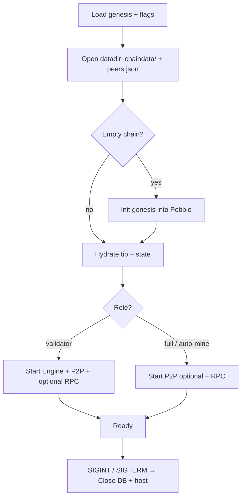

# Node Internals

## Process lifecycle



Default `--datadir` is `/var/lib/dew` ([Durable chaindata](../ops/durable-chaindata.md)).

## Core surfaces (conceptual)

```go
// ImportCommittedBlock is the single apply path for BFT commits and P2P sync.
func (n *Node) ImportCommittedBlock(block *types.Block) error

// SendRawTransaction admits to mempool; may auto-mine in dev / Path B mode.
func (n *Node) SendRawTransaction(raw []byte) (common.Hash, error)
```

- Sequential EVM (and optional Dew-PE) live under `core/vm`.
- Multi-process validator wiring uses `node.Stack` + `consensus.Runner` ([D3 scale](../scale/d3-scale.md)).

## Mempool

Package `mempool` — unified pool for EVM + DewTx:

- Admit with signature, chain ID, size, and fee floors
- Per-sender and global limits; optional replace-by-fee
- Feed proposer (`MempoolBlockBuilder`) and gossip
- Pending state is in-memory (lost on restart; acceptable)

See [Gas and fees](../execution/gas-and-fees.md) for C1 floors.

## Databases

| Store | Keys (illustrative) | Values | Location |
| :--- | :--- | :--- | :--- |
| Block + state | hash, height, `a`/`s`/`c` prefixes | header, body, receipts, accounts, storage | `<datadir>/chaindata` (**Pebble**) |
| Peer store | node ID | addresses, last seen | `<datadir>/peers.json` |
| Consensus | height/round meta | votes, valset | In-process today |
| Tests | temp dir | same schema | `db.OpenTest` / `node.OpenTest` |

There is **no** MemoryDB backend. Peer data stays out of the chain DB (different lifecycle).

## Configuration surfaces

| Input | Examples |
| :--- | :--- |
| `genesis.json` | chainId, alloc, initialValidators, consensus params |
| CLI flags | `--datadir`, `--http.*`, `--p2p.*`, `--validator`, `--bft.min-block-interval` |
| Env / compose | volume mount `/var/lib/dew`, feature flags |

No `config.toml` today — flags and genesis are the operator surface. See [Genesis](../economics/genesis.md).

## Observability (minimum)

- Structured logs for consensus rounds and RPC errors
- Counters: txs admitted, blocks committed, peer count
- PE conflict/rollback via `dew_getExecutionStats` ([Dew RPC extensions](../api/dew-extensions.md))
