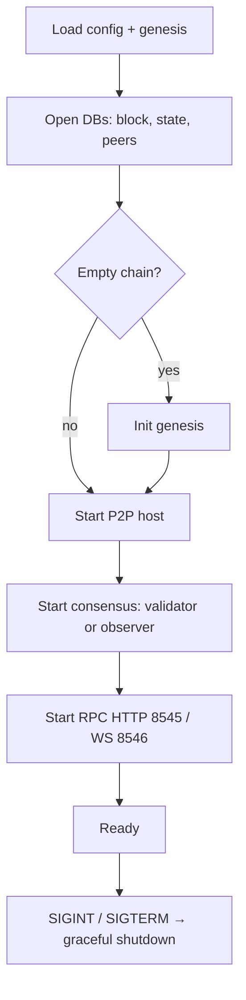

# Node Internals

## Process lifecycle



## Core interfaces (conceptual Go)

These are design-level interfaces, not frozen APIs:

```go
// Executor applies a block's transactions and returns results + new state root.
type Executor interface {
    Execute(block *types.Block, state State) (*types.BlockResult, error)
}

// State is the account/storage view used during execution.
type State interface {
    GetAccount(addr common.Address) (*types.Account, error)
    SetAccount(addr common.Address, acc *types.Account) error
    GetState(addr common.Address, key common.Hash) common.Hash
    SetState(addr common.Address, key, val common.Hash)
    Commit() (root common.Hash, err error)
    // ...
}

// ConsensusEngine drives height/round and talks to networking.
type ConsensusEngine interface {
    Start(ctx context.Context) error
    // ...
}
```

Phase A `Executor` is sequential EVM. Phase B swaps or wraps with Dew-PE while preserving `BlockResult` semantics.

## Mempool

Responsibilities:

- Admit txs with valid signature and chain ID
- Enforce nonce ordering per sender
- Reject grossly underpriced txs (base fee rules)
- Evict on replace (higher tip) or size limits
- Feed proposer and gossip

Phase A can use a simple in-memory pool. Do not over-design before multi-node testing.

## Databases

| Store      | Keys (illustrative) | Values                 | Status |
| :--------- | :------------------ | :--------------------- | :----- |
| Block DB   | hash, height        | header, body, receipts | `<datadir>/chaindata` (Pebble) when `--datadir` set — [Durable chaindata](../development/durable-chaindata.md) |
| State DB   | address             | account RLP/binary     | Flat keys `a`/`s`/`c` in same Pebble under `chaindata/` |
| Storage DB | address \|\| slot   | 32-byte value          | Same KV as state |
| Peer store | node ID             | addresses, last seen   | `<datadir>/peers.json` (not in chaindata) |
| Consensus  | height/round meta   | votes, valset          | In-process today |

Exact codec is implementation-defined but must be versioned. Peer data stays out of the chain DB (different lifecycle).

## Configuration surfaces

| Input                 | Examples                                            |
| :-------------------- | :-------------------------------------------------- |
| `genesis.json`        | chainId, alloc, initialValidators, consensus params |
| `config.toml` / flags | listen addrs, RPC, data dir, priv validator key     |
| Runtime               | log level, max peers                                |

See [Genesis](../economics/genesis.md).

## Observability (minimum)

- Structured logs for consensus rounds and RPC errors
- Counters: txs admitted, blocks committed, peer count
- Phase B: conflict/rollback rate for Dew-PE

Expose advanced stats later via `dew_getExecutionStats` ([Dew RPC extensions](../api/dew-extensions.md)).
