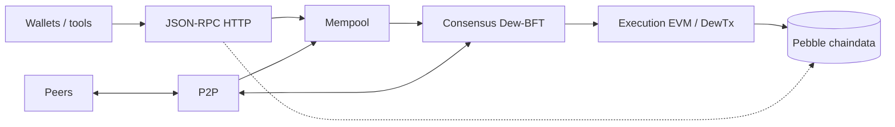
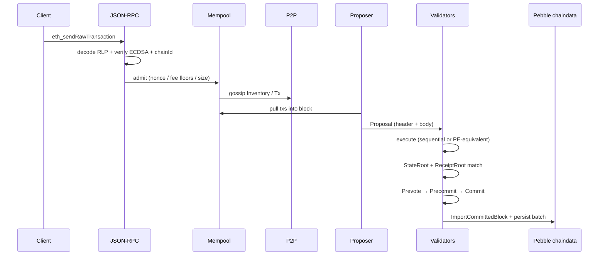
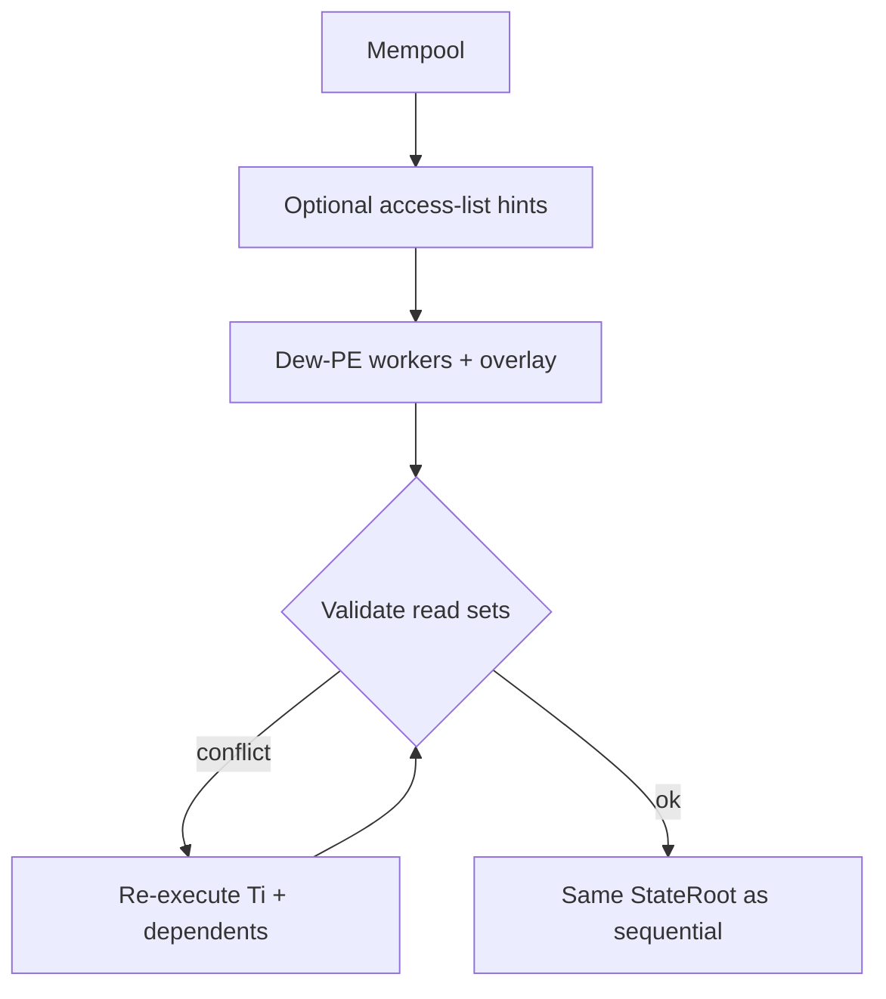
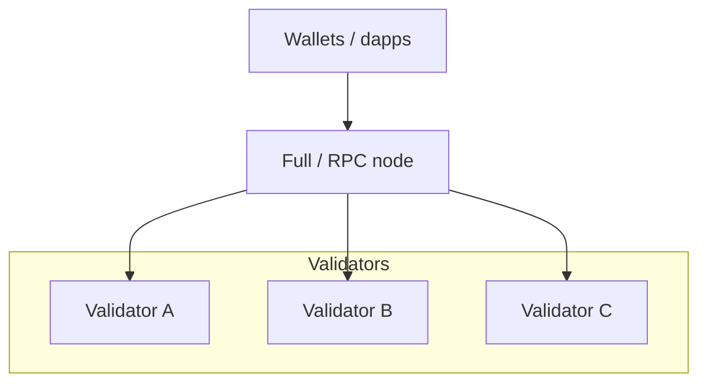

# Architecture Overview

Dew is a **monorepo**: the **Go** process is the chain node; **Node.js** builds the **docs website** and product SPAs and does **not** run consensus. See [Monorepo layout](../build/go-project-layout.md).

## Node at a glance

A full Dew node is a single Go process that:

1. Accepts transactions (RPC / P2P)
2. Holds them in a mempool
3. Participates in Dew-BFT (if validator) or follows commits (if full node)
4. Executes transactions against state
5. Persists blocks and state under `<datadir>/chaindata` (Pebble)
6. Serves JSON-RPC (HTTP) to wallets and dapps

## Component map

| Component | Package | Responsibility |
| :--- | :--- | :--- |
| CLI / node entry | `cmd/dew`, `cmd/dewcli`, `cmd/dewfaucet` | Process bootstrap, wallet, ops faucet |
| Types | `core/types` | Block, header, tx, receipt, DewTx |
| State | `core/state` | Flat KV hot path + SMT commit roots |
| VM | `core/vm` | EVM bridge, PE, precompiles |
| Native | `core/native` | DewTx executor, staking |
| Crypto | `crypto` | Keys, sign, verify, hashes |
| Database | `db` | **Pebble only** (`db.PebbleDB`) |
| Mempool | `mempool` | Unified admission for EVM + DewTx |
| Node backend | `node` | Genesis open, seal/import, Stack, chaindata |
| Consensus | `consensus` | Dew-BFT engine, builder, runner |
| P2P | `p2p` | Peers, gossip, sync, encrypted transport |
| RPC | `rpc` | HTTP JSON-RPC (`eth_*` / `net_*` / `web3_*` / `dew_*`) |
| Config / params | `config`, `params` | Genesis + chain constants / freeze |
| Ops faucet | `faucet` | Rate-limited drip (not consensus) |

## Critical data paths

### A. User transaction

### B. State commitment (normative)

Validators must agree on `StateRoot` at commit time:

1. Execute all txs in the block
2. Compute SMT `StateRoot` (and tx/receipt roots)
3. Header must contain those roots before votes that finalize the block

Flat KV remains the execution hot path; SMT is commit-time only. See [State](../protocol/state.md).

### C. Parallel execution (performance layer)

Parallel execution must not change the post-state root consensus votes on.

## Deployment roles

| Role | RPC | P2P | Propose | Vote |
| :--- | :---: | :---: | :---: | :---: |
| Validator (`--validator`) | optional | yes | when selected | yes |
| Full node (sync) | yes | yes | no | no (follows commits) |
| Dev / Path B auto-mine | yes | optional | pack ready pending (≤64) | n/a |

Multi-process BFT: [D3 scale](../scale/d3-scale.md). Disk layout: [Durable chaindata](../ops/durable-chaindata.md).

## Design boundaries

- **Consensus does not embed EVM logic** — it calls execution via builder / import path.
- **RPC does not talk to DB bypassing state layer** — queries go through chain/state APIs.
- **P2P does not interpret contract ABI** — only tx bytes, blocks, and consensus messages.
- **Peers are not in chaindata** — `<datadir>/peers.json` has a separate lifecycle.
