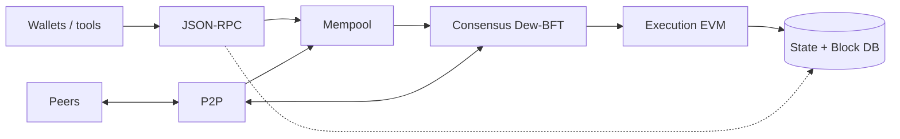
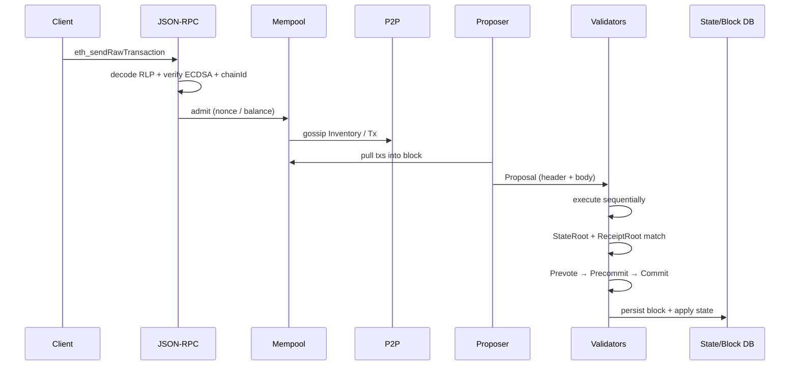
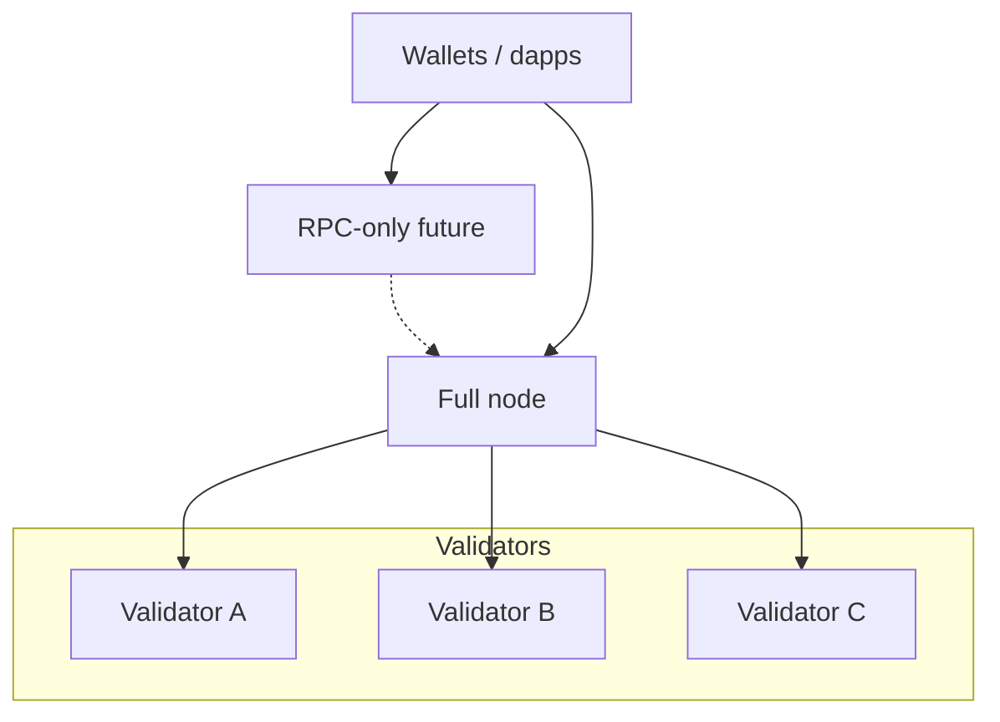

# Architecture Overview

Dew is developed as a **monorepo**: the **Go** process is the chain node; **Node.js** builds the **docs website** (and later tooling) and does **not** run consensus. See [Monorepo layout](../development/go-project-layout.md).

## Node at a glance

A full Dew node is a single Go process that:

1. Accepts transactions (RPC / P2P)
2. Holds them in a mempool
3. Participates in Dew-BFT (if validator) or follows commits (if full node)
4. Executes transactions against state
5. Persists blocks and state
6. Serves JSON-RPC to wallets and dapps

## Component map

| Component        | Package (target)             | Responsibility                      |
| :--------------- | :--------------------------- | :---------------------------------- |
| CLI / node entry | `cmd/dew`, `cmd/dewcli` | Process bootstrap, wallet utilities |
| Types            | `core/types`                 | Block, header, tx, receipt          |
| State            | `core/state`                 | Accounts, storage, commit, roots    |
| VM               | `core/vm`                    | EVM wrapper + StateDB bridge        |
| Crypto           | `crypto`                     | Keys, sign, verify, hashes          |
| Database         | `db`                         | KV backend (LevelDB/Pebble/RocksDB) |
| Consensus        | `consensus`                  | Dew-BFT state machine               |
| P2P              | `p2p`                        | Peers, gossip, sync                 |
| RPC              | `rpc`                        | HTTP/WS JSON-RPC                    |
| Config           | `config`                     | Genesis + node config               |

## Critical data paths

### A. User transaction (Phase A)

### B. State commitment (normative)

Unlike a pure “async root after the fact” design, **validators must agree on `StateRoot` at commit time**:

1. Execute all txs in the block (Phase A: sequential; Phase B: parallel with equivalent result)
2. Compute `StateRoot` (and tx/receipt roots)
3. Header must contain those roots before votes that finalize the block

Background SMT construction is an **implementation optimization** only if it does not change the hash validators vote on. If root calculation is slow, optimize the tree implementation — do not skip root in the header for Phase A.

### C. Phase B extension (not on critical path for v0)

Parallel execution is a **performance layer**. Consensus still verifies the same post-state root.

## Deployment roles

| Role              |   RPC    |   P2P   | Propose blocks |         Vote         |
| :---------------- | :------: | :-----: | :------------: | :------------------: |
| Validator         | optional |   yes   | when selected  |         yes          |
| Full node         |   yes    |   yes   |       no       | no (follows commits) |
| RPC-only (future) |   yes    | limited |       no       |          no          |

## Design boundaries

- **Consensus does not embed EVM logic** — it calls an `Executor` interface.
- **RPC does not talk to DB bypassing state layer** — queries go through chain/state APIs.
- **P2P does not interpret contract ABI** — only tx bytes, blocks, and consensus messages.

Clean interfaces keep Phase B (parallel, DewTx) from rewriting the whole node.
