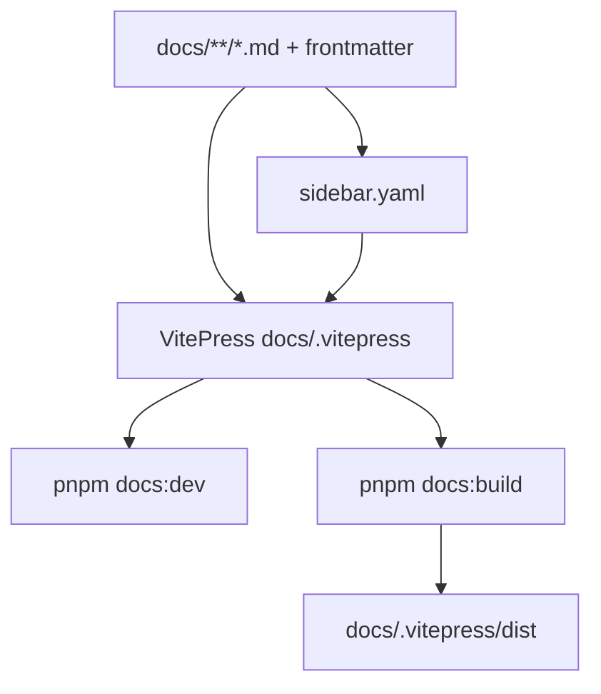

# Monorepo Layout

Dew is a **single monorepo**: one git repository, one product surface, shared docs and CI.

## Stack split

| Language | Responsibility | Package manager |
| :--- | :--- | :--- |
| **Go** | L1 node, consensus, P2P, state, EVM, RPC, `dewcli`, `dewfaucet` | `go.mod` / `go.sum` at repo root |
| **Node.js** | Docs website (VitePress from `docs/`); landing (`web/`); explorer + faucet-web SPAs; scripts | `package.json` + `pnpm-lock.yaml` at repo root |

### Rules of ownership

- **Canonical chain logic is Go.** Validators and full nodes run Go binaries only.
- **Node does not reimplement consensus or state transition.** It consumes the Go node via JSON-RPC.
- **Docs source is `docs/`.** Node only *builds and serves* the website from that tree.
- Prefer **one root** for each stack (`go.mod`, `package.json`) unless a future workspace split is justified.

## Repository tree (current)

```
dew/                            # monorepo root
├── cmd/
│   ├── dew/                    # full node (run, init, devnet)
│   ├── dewcli/                 # wallet CLI
│   └── dewfaucet/              # production faucet process
├── core/
│   ├── types/                  # Header, block, tx, receipt, DewTx
│   ├── state/                  # Flat state + SMT commit
│   ├── vm/                     # EVM bridge, PE, precompiles
│   └── native/                 # DewTx executor, staking
├── crypto/                     # secp256k1, keccak, keystore
├── db/                         # Database interface + Pebble only
├── mempool/                    # Unified EVM + DewTx admission pool
├── consensus/                  # Dew-BFT engine, builder, runner
├── p2p/                        # Host, gossip, sync, redial, peers.json
├── node/                       # Backend, Stack, Open/chaindata, import
├── rpc/                        # JSON-RPC HTTP server
├── config/                     # Genesis load
├── params/                     # Chain constants, fees, freeze, staking
├── version/                    # Software semver (ldflags inject) + web3_clientVersion
├── faucet/                     # Faucet library (ops HTTP)
├── devnet/                     # Multi-validator + multiproc BFT tests
├── tests/                      # load + security suites
├── deploy/                     # Docker Compose, systemd, nginx samples
├── examples/                   # Foundry + Hardhat samples + Guestbook SPA
├── scripts/                    # Node/shell helpers (smoke-rpc, build-site)
├── web/                        # Astro marketing landing
├── explorer/                   # Block explorer SPA (React/Vite)
├── faucet-web/                 # Faucet UI SPA
├── docs/                       # Protocol + engineering docs (this tree)
│   ├── build/ ops/ product/ scale/ …
│   ├── sidebar.yaml
│   └── .vitepress/             # VitePress config + theme
├── go.mod
├── package.json                # pnpm root scripts
└── README.md
```

Optional later (not present today): `packages/sdk`, `packages/localnet`.

## Go packages

| Rule | Why |
| :--- | :--- |
| `cmd/*` is thin | Business logic in libraries |
| No import cycles | Use interfaces at boundaries |
| `params` has no heavy deps | Constants only |
| Codecs versioned | Avoid silent fork of encodings |
| Disk via Pebble | Single `db.PebbleDB` backend; tests use `db.OpenTest` |

- Go **1.25+** (see root `go.mod`; `toolchain go1.25.12` for patched stdlib; CI uses `go-version: 1.25.x`)
- EVM via **go-ethereum v1.17.x** (`core/vm` Bridge implements geth `vm.StateDB`)
- Unit tests next to packages; multi-node / soak under `devnet/` and `tests/`

## Node packages

| Use | Role |
| :--- | :--- |
| **Docs website** | VitePress from `docs/**/*.md` |
| Landing | `web/` Astro site |
| Explorer / faucet UI | `explorer/`, `faucet-web/` |
| Scripts | `scripts/smoke-rpc.mjs`, `devnet-erc20.mjs`, `build-site.mjs` |
| Foundry sample | `examples/foundry/` — [Quick start](../ops/quickstart.md) · [Recipes](../ops/recipes.md) |
| Hardhat sample | `examples/hardhat/` — same Token/Guestbook · [Quick start §3b](../ops/quickstart.md#3b-hardhat) |
| Guestbook SPA | `examples/guestbook-web/` — [Guestbook product](../product/guestbook.md) · [Try public](../ops/try-public.md) |

### Docs web flow



Root scripts: `docs:dev` · `docs:build` · `docs:preview` · `site:build` (landing + docs → `dist/`) · `explorer:*` · `faucet:*` · `web:*`.

## Docs categories

| Category | Path | Audience |
| :--- | :--- | :--- |
| Overview … Economics | `docs/overview/` … `docs/economics/` | Protocol readers |
| [Build](./_category.md) | `docs/build/` | Contributors |
| [Networks & ops](../ops/_category.md) | `docs/ops/` | Operators |
| [Product surface](../product/_category.md) | `docs/product/` | Explorer / faucet / Guestbook demo |
| [Scale](../scale/_category.md) | `docs/scale/` | D3 workstreams |
| Security | `docs/security/` | Threat model / audits |

## CI (monorepo)

| Workflow | Trigger | What it runs |
| :--- | :--- | :--- |
| [`ci-go.yml`](../../.github/workflows/ci-go.yml) | PR + push `main` | `go vet`, `go test ./...`, security/load/freeze/chaos gates, build `dew` / `dewcli` / `dewfaucet` |
| [`ci-web.yml`](../../.github/workflows/ci-web.yml) | PR + push `main` | typecheck + `site:build`; explorer + faucet-web builds |
| [`security.yml`](../../.github/workflows/security.yml) | PR + push `main` + weekly | govulncheck, fuzz, pnpm audit, CodeQL, Trivy (HIGH/CRITICAL; SARIF limited to same severities) |
| [`pages.yml`](../../.github/workflows/pages.yml) | push `main` | GitHub Pages deploy of `dist/` |
| [`release-please.yml`](../../.github/workflows/release-please.yml) | push `main` | [Release Please](https://github.com/googleapis/release-please) PR + tag; attach Go binaries + GHCR images on release |
| [`release-binaries.yml`](../../.github/workflows/release-binaries.yml) | tag `v*` / manual | Re-upload cross-built `dew` / `dewcli` / `dewfaucet` + checksums |
| [`release-images.yml`](../../.github/workflows/release-images.yml) | tag `v*` / call / manual | Multi-arch Docker images → `ghcr.io/<owner>/dew*` |

Heavy multiproc soak (`DEW_HEAVY_INTEGRATION=1`) is not required on every PR.

## Release

Software versions are **semver** tags (`vX.Y.Z`), independent of the protocol freeze tag **`public-testnet-v1`** (see [Public testnet freeze](../ops/public-testnet.md)).

### Flow ([Release Please](https://github.com/googleapis/release-please))

1. Merge work to `main` using [Conventional Commits](https://www.conventionalcommits.org/) (`feat:`, `fix:`, `docs:`, …).
2. On each push to `main`, Release Please opens or updates a **Release PR** (version bump in [`.release-please-manifest.json`](../../.release-please-manifest.json) + [`CHANGELOG.md`](../../CHANGELOG.md)).
3. When you are ready to ship, **merge the Release PR**.
4. Release Please creates tag `vX.Y.Z` and a GitHub Release; the same workflow publishes:

   **Binaries**

   - `dew_vX.Y.Z_{linux,darwin}_{amd64,arm64}.tar.gz` (each archive: `dew`, `dewcli`, `dewfaucet`)
   - `checksums.txt` (SHA-256)

   **Container images** (`linux/amd64` + `linux/arm64` → GHCR)

   | Image | Dockerfile | Notes |
   | :--- | :--- | :--- |
   | `ghcr.io/<owner>/dew` | `deploy/node/Dockerfile` | Bakes `genesis.public.json` (path B) |
   | `ghcr.io/<owner>/dew-faucet` | `deploy/faucet/Dockerfile` | Go faucet |
   | `ghcr.io/<owner>/dew-faucet-web` | `deploy/faucet/Dockerfile.web` | SPA; path B URLs + captcha (`PUBLIC_CAPTCHA_*` from GitHub Environment **testnet** vars) |
   | `ghcr.io/<owner>/dew-explorer` | `deploy/explorer/Dockerfile` | SPA; RPC/base path B defaults |
   | `ghcr.io/<owner>/dew-guestbook` | `deploy/guestbook/Dockerfile` | SPA; guestbook + RPC path B defaults |

   Tags per image: `vX.Y.Z`, `X.Y.Z`, and `latest` (stable only, no `-rc`). Release asset `images.txt` lists refs.

Config: [`release-please-config.json`](../../release-please-config.json) (`release-type: go`, `bump-minor-pre-major: true`).

### Operator notes

| Item | Detail |
| :--- | :--- |
| Commit style | Prefer `feat(scope):`, `fix(scope):` — drives minor/patch under pre-1.0 |
| Optional PAT | Repo secret `RELEASE_PLEASE_TOKEN` (contents + PRs) so the Release PR runs CI and tag pushes can trigger other workflows; default `GITHUB_TOKEN` still cuts the release and publishes binaries + GHCR in-workflow |
| Repo setting | **Settings → Actions → General → Allow GitHub Actions to create and approve pull requests** |
| GHCR visibility | First push creates packages under the org/user; set **Public** if anonymous pull is required (**Packages → package → Package settings**) |
| Re-upload binaries | Actions → **Release binaries** → Run workflow → enter tag |
| Re-push images | Actions → **Release images** → Run workflow → enter tag |
| Path B deploy | `deploy/docker-compose.yml` pulls GHCR by default (`pull` + `up -d`); pin `*_IMAGE` in `deploy/.env` |
| Soak / private | Keep `docker-compose.soak.yml` local build (`dew:local`) — public GHCR bakes `genesis.public.json` |
| SPA rebuild | Path B URLs are **build-time** in GHCR images; other domains need `docker compose … --build` with `PUBLIC_*` |
| Faucet captcha (path B) | GitHub Environment **testnet** variables `PUBLIC_CAPTCHA_PROVIDER` + `PUBLIC_CAPTCHA_SITE_KEY` are baked into `dew-faucet-web` by `release-images.yml` (site key is public by design). Server still needs `FAUCET_CAPTCHA_SECRET` in `deploy/.env` only — never in the image. |

Pull example (after a release):

```bash
TAG=v0.2.0
docker pull ghcr.io/dewnetwork/dew:${TAG#v}
docker pull ghcr.io/dewnetwork/dew-faucet:${TAG#v}
docker pull ghcr.io/dewnetwork/dew-explorer:${TAG#v}
```

Local binary build (no release):

```bash
go build -o bin/dew ./cmd/dew
go build -o bin/dewcli ./cmd/dewcli
go build -o bin/dewfaucet ./cmd/dewfaucet
# default: dew version → "dew dev (public-testnet-v1)"
# inject software semver (also drives web3_clientVersion):
# go build -ldflags="-X github.com/dewnetwork/dew/version.Version=0.2.0" -o bin/dew ./cmd/dew
```

Release binaries and GHCR Go images inject `version.Version` from the tag (`vX.Y.Z` → `X.Y.Z`) via `-ldflags` / Docker `VERSION` build-arg. Protocol freeze tag **`public-testnet-v1`** is independent.

## What is not multi-repo

| Avoid | Prefer |
| :--- | :--- |
| Separate repos for node / docs / SDK | One monorepo |
| Duplicating markdown for the website | Single `docs/` source |
| Node “light client” that forks protocol rules | Node as RPC consumer only |

## Current status

Monorepo is production-shaped for **public-testnet-v1** (path B live): Go L1 with durable Pebble chaindata, multiproc BFT option, VitePress docs, explorer + faucet + landing SPAs, and deploy samples under `deploy/`.
