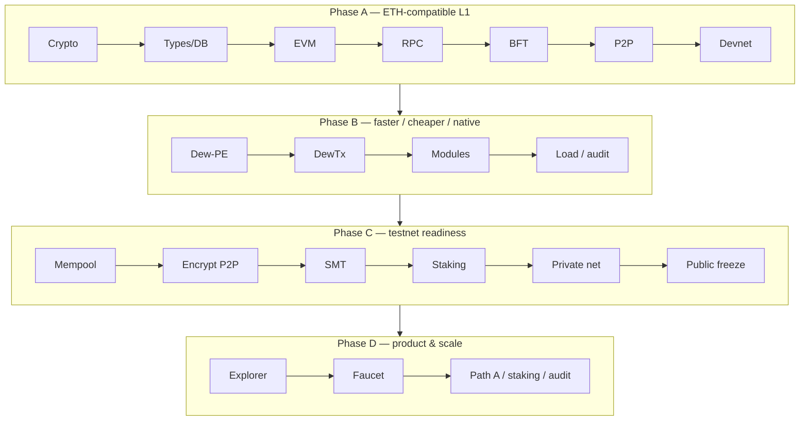

# Roadmap

All phases land in the **same monorepo** (Go core + Node for **web docs**, explorer, faucet UI, and tooling). See [Monorepo layout](./go-project-layout.md).

## Current status (July 2026)

| Band | Status |
| :--- | :--- |
| **A–C** | Done — ETH parity, Dew-PE / DewTx, testnet readiness, **`public-testnet-v1` freeze** |
| **D1–D2** | Done — [explorer](../product/block-explorer.md), [faucet](../product/faucet.md) |
| **DX demos** | Done — Foundry recipes, [Guestbook SPA](../product/guestbook.md), C1 multi-tx pack · [Try public](../ops/try-public.md) |
| **D3a / D3b / durable chaindata** | Done — multiproc BFT, peers.json redial, Pebble `chaindata/` |
| **D3c–D3e** | Pending on demand — staking residuals, Path A multi-host, external audit |
| **Product-v1** | Shipped through v1.1 — explorer ERC-20 + known tokens; faucet wallet paste; Guestbook `?author=` ([upgrades](../product/upgrades.md)) |

**Live path B:** [Public testnet freeze](../ops/public-testnet.md#live-network-path-b) · RPC · explorer · faucet · Guestbook.

Acceptance criteria live in [Phases](./phases.md). Scale workstreams: [D3 scale](../scale/d3-scale.md). Full upgrade map (product + protocol + ops + core): [Product & scale upgrades](../product/upgrades.md). Residuals: [agents/debt.md](../../agents/debt.md).

## Strategy

| Rule | Why |
| :--- | :--- |
| Ship A before optimizing B | Parallel execution on a broken sequential chain multiplies bugs |
| Ship B before exposing C | Public nets need spam controls, encryption, real state commitment |
| Ship C before D product claims | Explorer/faucet consume frozen RPC/chain ID — they must not invent wire formats |
| D3 on demand | Path A, staking residuals, audit are scale/mainnet gates |

## Mapping to docs

| Phase | Primary docs |
| :--- | :--- |
| A1 | [Cryptography](../protocol/cryptography.md), [Addresses](../protocol/addresses.md) |
| A2 | [State](../protocol/state.md), [Blocks](../protocol/blocks.md), [Transactions](../protocol/transactions.md) |
| A3 | [EVM](../execution/evm.md), [Gas](../execution/gas-and-fees.md) |
| A4 | [JSON-RPC](../api/json-rpc.md) |
| A5 | [Dew-BFT](../consensus/dew-bft.md), [Validators](../consensus/validators.md) |
| A6 | [P2P](../networking/p2p.md), [Gossip and sync](../networking/gossip-and-sync.md) |
| A7 | [Genesis](../economics/genesis.md), [Devnet](../ops/devnet.md) |
| B1 | [Parallel execution](../execution/parallel-execution.md) |
| B2–B3 | [Dew-native](../execution/dew-native.md), [Dew RPC](../api/dew-extensions.md) |
| B4 | [Gas and fees](../execution/gas-and-fees.md), [Phase B audit](../security/phase-b-audit.md) |
| C1 | [Gas and fees](../execution/gas-and-fees.md), [Threat model](../security/threat-model.md) |
| C2 | [P2P](../networking/p2p.md), [Security principles](../security/security-principles.md) |
| C3 | [State](../protocol/state.md) |
| C4 | [Validators](../consensus/validators.md), [Precompiles](../execution/precompiles.md) |
| C5–C6 | [Private testnet](../ops/private-testnet.md), [Public testnet freeze](../ops/public-testnet.md) |
| D1–D2 + DX demos | [Block explorer](../product/block-explorer.md), [Faucet](../product/faucet.md), [Guestbook](../product/guestbook.md), [Try public](../ops/try-public.md), [Launch checklist](../ops/launch-checklist.md) |
| D3 | [D3 scale](../scale/d3-scale.md), [Durable chaindata](../ops/durable-chaindata.md) |

## Definition of done

See [Phases](./phases.md) for per-phase acceptance checklists.
