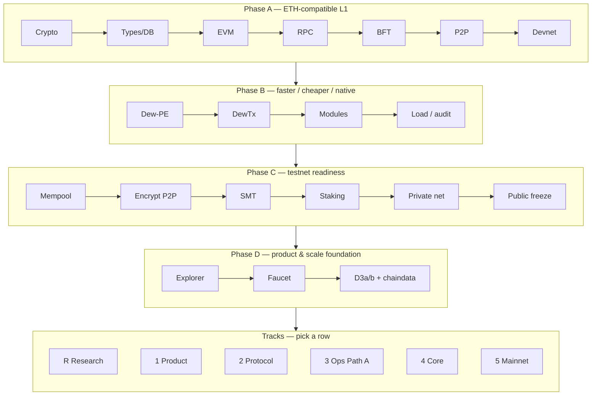

# Roadmap

All phases land in the **same monorepo** (Go core + Node for **web docs**, explorer, faucet UI, and tooling). See [Monorepo layout](./go-project-layout.md).

## Current status (July 2026)

### Phases A–D (foundation)

| Band | Status |
| :--- | :--- |
| **A–C** | Done — ETH parity, Dew-PE / DewTx, testnet readiness, **`public-testnet-v1` freeze** |
| **D1–D2** | Done — [explorer](../product/block-explorer.md), [faucet](../product/faucet.md) |
| **DX demos** | Done — Foundry recipes, [Guestbook SPA](../product/guestbook.md), C1 multi-tx pack · [Try public](../ops/try-public.md) |
| **D3a / D3b / durable chaindata** | Done — multiproc BFT, peers.json redial, Pebble `chaindata/` |
| **Product-v1** | Done through v1.2 + live path B rebuild (2026-07-13) — [upgrades](../product/upgrades.md) |

### Tracks (open — one row each)

| Track | Status | Theme |
| :--- | :--- | :--- |
| **R — Research lab** | Partial | H1 PE + H2 multiproc BFT done ([research-lab](../ops/research-lab.md)); state optional |
| **1 — Product** | Partial | v1 done; P1e–f / P3c deferred |
| **2 — Protocol (D3c)** | Partial | MVP + S4 actor docs; slash % / delegation open |
| **3 — Ops (D3d)** | Optional | Path A multi-host public |
| **4 — Core node** | Partial | Mempool telemetry + lazy hydrate done; PE upgrade open |
| **5 — Mainnet (D3e)** | Optional | Audit pack before production claims |
| **Plan S0–S6** | **Done** (Checkpoint C 2026-07-14) | Ordered path → [Precompile slots](./phases.md#recommended-sequence--research-lab--precompile-slots) |

**Shipped baseline:** A–C freeze, D1–D2, D3a/b + chaindata, product-v1. Open work is **tracks** (not a forced mainnet march). Checklists: [Phases — Tracks](./phases.md#tracks).

**Live path B (optional lab):** [Public testnet freeze](../ops/public-testnet.md#live-network-path-b) · RPC · explorer · faucet · Guestbook.

Acceptance criteria: [Phases](./phases.md). Scale workstreams: [D3 scale](../scale/d3-scale.md). Product map: [upgrades](../product/upgrades.md). Residuals: [agents/debt.md](../../agents/debt.md).

## Strategy

| Rule | Why |
| :--- | :--- |
| Ship A before optimizing B | Parallel execution on a broken sequential chain multiplies bugs |
| Ship B before exposing C | Public nets need spam controls, encryption, real state commitment |
| Ship C before D product claims | Explorer/faucet consume frozen RPC/chain ID — they must not invent wire formats |
| D3a/b + chaindata before long-lived ops | Multiproc BFT, peer redial, and durable tip are the scale *foundation* |
| Tracks are independent rows | Research, core, staking, product, Path A are **picks**; Track 5 only before mainnet *claims* |

## Tracks

Phase D foundation is done. Remaining work is **tracks** under freeze `public-testnet-v1` / chain ID **2205** (unless a hardfork is documented). Each row is independent unless noted.

| Track | When to pick | Checklist |
| :--- | :--- | :--- |
| **R — Research lab** | Want numbers (PE, BFT, state, staking economics); no real mainnet users | [Phases — Track R](./phases.md#track-r--research-lab) |
| **1 — Product** | Demo / DX depth (indexer, verified source, reactions) | [Phases — Track 1](./phases.md#track-1--product-surface) · [upgrades §1](../product/upgrades.md#track-1--product-surface) |
| **2 — Protocol (D3c)** | Intentional staking design / lab | [Phases — Track 2](./phases.md#track-2--protocol--d3c-staking) · [D3c](../scale/d3-scale.md#d3c--staking-residuals-c4) |
| **3 — Ops (D3d)** | Need multi-host *public* validators | [Phases — Track 3](./phases.md#track-3--ops--d3d-path-a) · [D3d](../scale/d3-scale.md#d3d--path-a-multi-host-public) |
| **4 — Core node** | Performance / node ergonomics (research-friendly features) | [Phases — Track 4](./phases.md#track-4--core-node) · [upgrades §4](../product/upgrades.md#track-4--core-node-upgrades) |
| **5 — Mainnet (D3e)** | **Only** before production / mainnet claims | [Phases — Track 5](./phases.md#track-5--mainnet-gate-d3e) · [D3e](../scale/d3-scale.md#d3e--external-audit-prep) |

**Research-friendly default rows:** Track **R** and/or Track **4**; Track **2** for staking lab. Defer Track **3** and Track **5**.

**Active ordered plan (crosses R + 4 + 2 → Precompile slots):**

| Step | Focus | Track |
| :--- | :--- | :--- |
| S0 | Lab baseline (`go test`, devnet) — **done** 2026-07-13 | — |
| S1 | Hypothesis + harness — **done** 2026-07-13 ([research-lab](../ops/research-lab.md)) | R |
| S2 | PE measurement matrix — **done** 2026-07-13 (Checkpoint A) | R · 4 |
| S3 | Mempool / fee telemetry RPC — **done** 2026-07-13 (`dew_getMempoolStats`) | 4 |
| S4 | `0x102` staking edges — **done** 2026-07-14 (fail-closed actor + deferred slash %) | 2 |
| S5 | Staking lab scenarios — **done** 2026-07-14 (Checkpoint B) | R · 2 |
| S6 | Precompile slots registry — **done** 2026-07-14 (Checkpoint C) | protocol docs + `core/vm` |

Full checkboxes: [Phases — Recommended sequence](./phases.md#recommended-sequence--research-lab--precompile-slots).

### Explicit non-goals until chosen

These are **not** open tasks (no checkboxes):

- Recruiting real mainnet users or freezing tokenomics issuance for production
- Path A multi-host public as a default next row (Track 3 is optional)
- External audit theater without intent to claim mainnet readiness (Track 5)
- Re-opening C6 wire formats without a hardfork doc

## Mapping to docs

| Band / track | Primary docs |
| :--- | :--- |
| A1 | [Cryptography](../protocol/cryptography.md), [Addresses](../protocol/addresses.md) |
| A2 | [State](../protocol/state.md), [Blocks](../protocol/blocks.md), [Transactions](../protocol/transactions.md) |
| A3 | [EVM](../execution/evm.md), [Gas](../execution/gas-and-fees.md) |
| A4 | [JSON-RPC](../api/json-rpc.md) |
| A5 | [Dew-BFT](../consensus/dew-bft.md), [Validators](../consensus/validators.md) |
| A6 | [P2P](../networking/p2p.md), [Gossip and sync](../networking/gossip-and-sync.md) |
| A7 | [Genesis](../economics/genesis.md), [Devnet](../ops/devnet.md) |
| B1 | [Parallel execution](../execution/parallel-execution.md) |
| B2–B3 | [Dew-native](../execution/dew-native.md), [Dew RPC](../api/dew-extensions.md) |
| B4 | [Gas and fees](../execution/gas-and-fees.md), [Phase B audit](../security/phase-b-audit.md) |
| C1 | [Gas and fees](../execution/gas-and-fees.md), [Threat model](../security/threat-model.md) |
| C2 | [P2P](../networking/p2p.md), [Security principles](../security/security-principles.md) |
| C3 | [State](../protocol/state.md) |
| C4 | [Validators](../consensus/validators.md), [Precompiles](../execution/precompiles.md) |
| C5–C6 | [Private testnet](../ops/private-testnet.md), [Public testnet freeze](../ops/public-testnet.md) |
| D1–D2 + DX demos | [Block explorer](../product/block-explorer.md), [Faucet](../product/faucet.md), [Guestbook](../product/guestbook.md), [Try public](../ops/try-public.md), [Launch checklist](../ops/launch-checklist.md) |
| D3a–b + chaindata | [D3 scale](../scale/d3-scale.md), [Durable chaindata](../ops/durable-chaindata.md) |
| **Track R** | [Phases — Track R](./phases.md#track-r--research-lab), [research-lab](../ops/research-lab.md) |
| **Track 1** | [upgrades §1](../product/upgrades.md#track-1--product-surface), [Phases — Track 1](./phases.md#track-1--product-surface) |
| **Track 2** | [D3c](../scale/d3-scale.md#d3c--staking-residuals-c4), [Phases — Track 2](./phases.md#track-2--protocol--d3c-staking) |
| **Track 3** | [D3d](../scale/d3-scale.md#d3d--path-a-multi-host-public), [Phases — Track 3](./phases.md#track-3--ops--d3d-path-a) |
| **Track 4** | [upgrades §4](../product/upgrades.md#track-4--core-node-upgrades), [Phases — Track 4](./phases.md#track-4--core-node) |
| **Track 5** | [D3e](../scale/d3-scale.md#d3e--external-audit-prep), [Phases — Track 5](./phases.md#track-5--mainnet-gate-d3e) |
| **Plan S0–S6** | [Phases — Recommended sequence](./phases.md#recommended-sequence--research-lab--precompile-slots) |

## Definition of done

See [Phases](./phases.md) for per-phase acceptance checklists. For open work, “done” is **per track row / slice**, not a single band checkbox.
