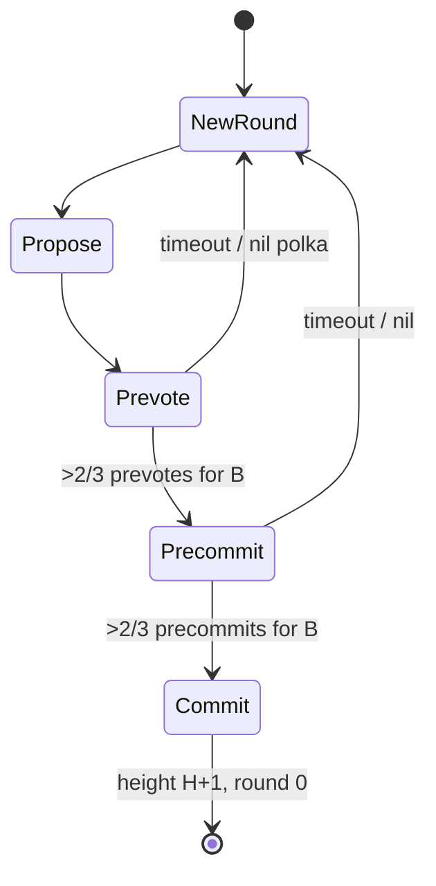

# Dew-BFT

Dew-BFT is a **Proof-of-Staked Authority (PoSA)** BFT engine: validators vote by voting power; commits are **final**.

## Goals

| Goal | Mechanism |
| :--- | :--- |
| Faster than ETH finality | 1-block finality on commit |
| Safety | \(> 2/3\) voting power quorums |
| Liveness | Round timeouts + proposer rotation |
| Accountability | Slashing / jail on double-sign (evidence path) |

## Parameters

| Parameter | public-testnet-v1 practice |
| :--- | :--- |
| Multiproc min block interval | **1s** default (`MinBlockInterval`) |
| Fault tolerance | \(N \ge 3F + 1\) |
| Quorum | strict \(> 2/3\) voting power |
| Active set size \(K\) | module default **100** (`DefaultActiveValidatorCap`); sample genesis may use smaller |
| Epoch length | **86,400 blocks** (module param) |
| Live valset source | Genesis `initialValidators` today; **ActiveSet → epoch rotation** is D3c residual |

## Round state machine

For each height \(H\), rounds \(R = 0, 1, \ldots\):

### Propose

- Proposer for \((H, R)\) chosen by **stake-weighted round-robin** (deterministic; same on all honest nodes).
- Proposer builds from the mempool (`BuildBlockFromPool`: fee auction, sim filter / re-select), fills roots + `BaseFee`, signs proposal, broadcasts `Proposal`.

### Prevote

- Validate header linkage, signatures, gas fields, full execution → expected roots.
- Valid → prevote for block hash; else prevote `nil`.
- Wait for \(> 2/3\) power of prevotes (block or nil) or timeout.

### Precommit

- If \(> 2/3\) prevotes for block \(B\) → precommit \(B\).
- Else → precommit `nil`, advance to round \(R+1\) after timeout rules.
- Wait for \(> 2/3\) precommits.

### Commit

- On \(> 2/3\) precommits for \(B\): persist block, apply state if not already, store quorum certificate, set height \(H+1\), round 0.

## Locking (Tendermint-style)

To prevent safety bugs across rounds, validators use **Tendermint-style locking** (PoLC): once precommitting \(B\) after a polka, do not prevote a conflicting block at the same height unless a newer polka justifies unlock. Treat CometBFT lock semantics as the reference for mainnet audit.

## Consensus messages (wire)

These are **separate** from block/tx gossip types:

| Message | Purpose |
| :--- | :--- |
| `Proposal` | Block for \((H,R)\) |
| `Prevote` | Vote for hash or nil |
| `Precommit` | Vote for hash or nil |
| `Evidence` | Double-sign proofs (path exists; full verify residual) |

Transport: encrypted P2P by default; consensus types `0x10`–`0x12`. See [P2P](../networking/p2p.md).

## Empty blocks

If the mempool is empty, proposers may still propose an empty block so height advances and finality continues.

## Full nodes

Non-validators execute committed blocks (after receiving commit cert + block) and update state. They do not vote.
