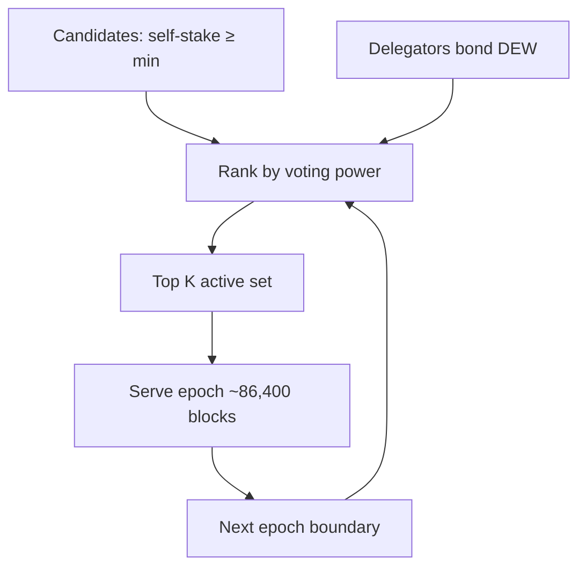

# Validators and Staking

## Roles

| Role                    | Description                                       |
| :---------------------- | :------------------------------------------------ |
| **Validator candidate** | Account that self-staked ≥ minimum and registered |
| **Active validator**    | Top \(K\) by voting power for the current epoch   |
| **Delegator**           | Bonds DEW to a candidate to increase its power    |

## Voting power

$$
VP_i = S_{\text{self},i} + \sum S_{\text{delegated},i}
$$

Quorum and proposer weight use \(VP_i\).

## Minimum self-stake

- **100,000 DEW** (public-testnet-v1 freeze; also genesis `minValidatorStake`)
- Denominated in wei in config: `100000 * 10^18`

## Epoch rotation

1. Epoch length: **86,400 blocks** (public-testnet-v1)
2. At epoch boundary, rank candidates by \(VP\)
3. Top \(K\) become active set for next epoch
4. In-epoch stake changes apply at next boundary (unless emergency jail)

## Proposer selection

**Stake-weighted round-robin**: higher \(VP\) proposes proportionally more often, but selection is deterministic from `(height, round, valset)`.

Exact algorithm should be one pure function in `consensus/` with unit tests for stability across nodes.

## Delegation economics

- Validators set a **commission rate** (e.g. 5%)
- Block rewards + tips: validator takes commission; remainder pro-rata to delegators
- See [Tokenomics](../economics/tokenomics.md)

## Unbonding

| Parameter        | Value       | Unit                 |
| :--------------- | :---------- | :------------------- |
| Unbonding period | **604,800** | **seconds** (7 days) |

Do **not** document this as “604,800 blocks” unless block time is guaranteed 1s forever. Implementation should use **time or block height consistently** — prefer **block height delta** derived from `ceil(604800 / blockTime)` at genesis freeze, stored as a single unit in code.

During unbonding:

- No rewards
- No transfer of bonded funds
- No governance voting power (_if_ governance exists)

## Genesis validators

Network starts from `initialValidators` in genesis — see [Genesis](../economics/genesis.md). Testnet recommendation: ≥ 3 validators (\(F=1\)).
