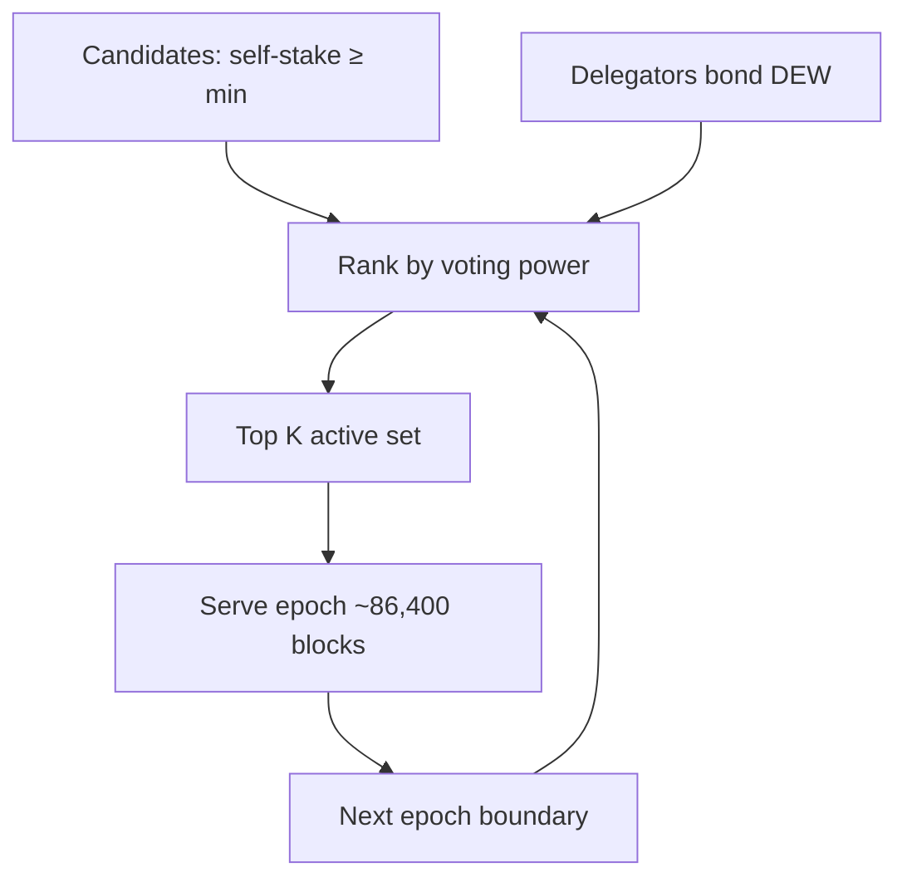

# Validators and Staking

## Roles

| Role | Description | Status |
| :--- | :--- | :--- |
| **Genesis / static validator** | Entry in genesis `initialValidators` | **Live** BFT set today |
| **Validator candidate** | Self-staked ≥ minimum via `0x102` bond | Module on; flag default **off** |
| **Active validator (module)** | Top \(K\) by voting power among candidates | `ActiveSet()` readable; **rotated into live BFT** at epoch boundaries when staking on and set non-empty (D3c) |
| **Delegator** | Bonds DEW to a candidate | **Not implemented** (D3c residual) |

## Voting power

Today (BFT): voting power from genesis `votingPower` (and equal weights on local `dew init` nets).

Target (module):

$$
VP_i = S_{\text{self},i} + \sum S_{\text{delegated},i}
$$

Quorum and proposer weight use \(VP_i\) once ActiveSet is wired each epoch.

## Minimum self-stake

- **100,000 DEW** (public-testnet-v1; `params.MinValidatorStakeWei`)
- Genesis field: `minValidatorStake` as wei string

## Epoch rotation (target; D3c)

1. Epoch length: **86,400 blocks**
2. At epoch boundary, rank candidates by \(VP\)
3. Top \(K\) (default **100**) become active set for next epoch
4. In-epoch stake changes apply at next boundary (unless emergency jail)

When staking is **off** (default public-testnet-v1), multiproc / Path A nets keep the **static** genesis set. With staking **on**, at each epoch boundary (`height % epochLength == 0`) `ActiveSet()` rebuilds BFT voting power if at least one candidate is bonded.

## Proposer selection

**Stake-weighted round-robin**: higher \(VP\) proposes proportionally more often, but selection is deterministic from `(height, round, valset)`.

Exact algorithm should be one pure function in `consensus/` with unit tests for stability across nodes.

## Delegation economics

**Deferred (D3c).** Design target: commission rate + pro-rata share of rewards/tips. See [Tokenomics](../economics/tokenomics.md) (issuance numbers still tentative).

## Unbonding

| Parameter | Value | Unit |
| :--- | :--- | :--- |
| Unbonding period (param) | **604,800** | **seconds** (7 days) |

Documented as seconds in genesis (`unbondingPeriodSeconds`). **Enforced (D3c):** `unbond` queues stake at unlock = `block.timestamp + period`; `withdraw` (`0x08`) pays only when `now ≥ unlockAt`. Single pending queue per address (stacked amounts use later unlock). Do not treat “604,800 blocks” as the unit.

## Genesis validators

Network starts from `initialValidators` in genesis — see [Genesis](../economics/genesis.md). Testnet recommendation: ≥ 3 validators (\(F=1\)).
