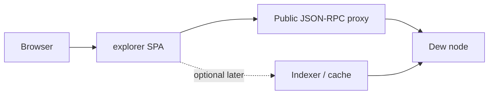

# Block explorer (web)

The **block explorer** is the public, read-only web UI for browsing Dew chain data: latest blocks, transactions, receipts, and account state. It is **ops / product surface**, not part of the consensus wire freeze.

| Item | Status |
| :--- | :--- |
| In-repo explorer app | **Not shipped** |
| Publish field `Explorer:` | Use `(none)` until a live URL exists |
| Wire / genesis impact | **None** — explorer only consumes JSON-RPC |
| UI bar | **Beautiful + dense detail** — information architecture inspired by [Etherscan](https://etherscan.io/), visual system from Dew brand (not a clone) |

Freeze tag and RPC limits: [Public testnet freeze](./public-testnet.md). Operator checklist: [Launch checklist](./launch-checklist.md).

## Why it exists

| Audience | Need |
| :--- | :--- |
| Wallet / dApp users | Paste a tx hash or address and see status without CLI |
| Operators | Share a single canonical link when publishing the network |
| Tooling | Deep-link from MetaMask “view on explorer”, faucet pages, and docs |

The explorer **must not** hold validator keys, faucet keys, or admin signing material. It is a client of public (or operator-proxied) JSON-RPC only.

---

## UI product bar (Etherscan-class detail)

**Reference:** [etherscan.io](https://etherscan.io/) for layout density, field completeness, search behavior, and detail-page structure.  
**Not a visual clone:** Dew uses maritime ink + dew cyan, Syne / Figtree / IBM Plex Mono (same tokens as [`web/`](../../web/README.md) and docs theme). No ad rails, no cluttered sponsor rows.

### Design principles

| Principle | Meaning |
| :--- | :--- |
| **Glanceable head** | Home answers “is the chain alive?” in &lt; 2s: height, gas, TPS/window, latest activity |
| **Scan → deep** | Cards and tables first; full field lists on detail pages; “More details” collapse for rare fields |
| **Every hash is actionable** | Truncate in tables; full value + **copy** on detail; always link to the right entity page |
| **Honest empty states** | Pending / not found / RPC error are distinct — never a blank white box |
| **Finality clarity** | Dew-BFT: committed block ≈ final. Prefer **Final** badge on inclusion; avoid Ethereum-style “N confirmations” theater unless useful |
| **Dense, not cramped** | Etherscan-level fields; Dew spacing, type scale, and card chrome so it still feels premium |
| **Mobile second layout** | Stack stats; horizontal-scroll tables only when necessary; sticky search |

### Visual system

| Token | Use |
| :--- | :--- |
| `ink` / `ink-soft` / `panel` | Page bg, cards, elevated panels |
| `cyan` / `mist` / `teal` | Links, focus, success accents, live pulse |
| `frost` / `slate` / `muted` | Primary text, secondary, labels |
| `gold` | Warnings, pending, non-success status |
| Display **Syne** | Page titles (“Transaction Details”) |
| Body **Figtree** | Labels, prose |
| Mono **IBM Plex Mono** | Hashes, addresses, numbers, input data |

Status colors:

| Status | Treatment |
| :--- | :--- |
| Success / Final | Soft green-teal pill (`cyan` tint) + check |
| Failed / Reverted | Soft red pill + X |
| Pending | Gold pill + pulse |
| Contract create | Distinct “Contract Creation” label on To |

### Global chrome

```
┌──────────────────────────────────────────────────────────────┐
│ Logo  Dew Explorer    [Search……………………………… ⌕]  Network ▾  │
│        Docs · RPC status · Theme (optional)                  │
├──────────────────────────────────────────────────────────────┤
│ Breadcrumb: Home / Txns / 0xabc…                             │
│ Page title + optional action strip (copy, prev/next)         │
│ … page body …                                               │
├──────────────────────────────────────────────────────────────┤
│ Chain ID · Network name · RPC latency · © / docs link        │
└──────────────────────────────────────────────────────────────┘
```

| Element | Spec |
| :--- | :--- |
| **Top bar** | Logo + product name, **global search**, network badge (`public-testnet-v1` · `2205`), link to docs |
| **Search** | Single field; auto-detect **tx hash** (66 hex), **address** (42 hex), **block number** (decimal), **block hash** (66 hex). Enter → navigate. Placeholder: `Search by Address / Txn Hash / Block` |
| **Network badge** | Always visible; wrong `eth_chainId` → error banner, do not render chain data as if correct |
| **Footer** | Chain ID, explorer version, link to [JSON-RPC](../api/json-rpc.md) / docs, “Data from public RPC” disclaimer |
| **Live feel** | Subtle head pulse or “Updated Xs ago” on home; poll every 3–5s when tab visible |

### Formatting & interaction primitives

| Pattern | Rule |
| :--- | :--- |
| **Address** | `0x` + 4…4 in tables (`0x4838…5f97`); full on detail; copy button; mono |
| **Hash** | Same truncate rules; copy full value |
| **Value** | Human DEW with up to 18 decimals trimmed trailing zeros; tooltip or secondary line in **wei** |
| **Gas price** | Gwei primary; wei secondary on detail |
| **Gas used / limit** | Absolute + **percent bar** (Etherscan-style), e.g. `21,000 / 21,000 (100%)` |
| **Time** | Relative primary (`18 secs ago`) + absolute UTC secondary; optional toggle Local / Unix later |
| **Copy** | Icon button; toast “Copied”; never silent |
| **External / raw** | Optional “View raw JSON” drawer from last RPC payload (dev-friendly) |
| **Pagination** | “Load more” or page size 25 for long tx lists in a block |

---

## Page inventory (detailed)

### 1. Home `/`

**Reference behavior:** Etherscan home — stats strip + dual columns **Latest Blocks** | **Latest Transactions**.

#### Stats strip (cards)

| Card | Source (MVP) | Notes |
| :--- | :--- | :--- |
| Latest block | `eth_blockNumber` | Link to `/block/{n}` |
| Chain ID | `eth_chainId` | Show decimal + hex (`2205` / `0x89d`) |
| Gas price | `eth_gasPrice` / fee fields | Gwei |
| Base fee (if present) | latest block `baseFeePerGas` | EIP-1559 |
| Tx count (window) | Count txs in last *N* blocks client-side | Label “in last N blocks”; not global historical TPS without indexer |
| Client | `web3_clientVersion` | Footer or small chip |

Skip ETH price / market cap / ads for Dew MVP.

#### Latest Blocks panel

| Column / row content | Detail |
| :--- | :--- |
| Block number | Link |
| Age | Relative time from `timestamp` |
| Tx count | Number; link can jump to block#transactions |
| Gas used | Optional mini bar vs `gasLimit` |
| Proposer / miner | `miner` / fee recipient address (truncated + link) |
| Base fee | If EIP-1559 block |

Show **8–12** recent blocks; “View all blocks” → `/blocks` (MVP may paginate home-only).

#### Latest Transactions panel

| Column / row content | Detail |
| :--- | :--- |
| Tx hash | Truncated link |
| Age | From containing block timestamp |
| From → To | Two address links; arrow; contract-create handling |
| Value | DEW amount |
| Status | Success / fail if receipt available (batch receipts carefully) |

Show **8–12** txs from recent blocks (expand full txs on `eth_getBlockByNumber`).

#### Home layout (desktop)

```
┌──────── stats cards (4–6) ────────┐
│  [Block] [Gas] [Chain] [Window]   │
├─────────────────┬─────────────────┤
│ Latest Blocks   │ Latest Txns     │
│  · · ·          │  · · ·          │
│ View all        │ View all        │
└─────────────────┴─────────────────┘
```

Mobile: stats 2×2 grid; blocks then txs stacked.

---

### 2. Block `/block/{n|hash}`

**Reference:** Etherscan [Block](https://etherscan.io/block/) — title + status + labeled field list + tx table.

#### Header

- Title: **Block** `#25507758` (or hash if lookup by hash)
- **Prev / next** block chevrons (`n-1` / `n+1`) when by number
- Status pill: **Final** (committed) — Dew default when block is canonical

#### Overview fields (always visible)

| Field | Source / notes |
| :--- | :--- |
| Block height | Number |
| Status | Final / Not found |
| Timestamp | Relative + absolute UTC |
| Transactions | Count + link/anchor to table |
| Fee recipient / miner | Address link |
| Total gas used | + % of limit + progress bar |
| Gas limit | From header |
| Base fee per gas | If present (Gwei + wei) |
| Burnt fees | `baseFee * gasUsed` when applicable |
| Extra data | UTF-8 if printable + hex |
| Hash | Full + copy |
| Parent hash | Link to parent block |
| State root | Full + copy |
| Receipts root | If available |
| Transactions root | If available |
| Size | Bytes if known / RLP size later |

#### Tabs (MVP → later)

| Tab | MVP | Content |
| :--- | :--- | :--- |
| Overview | **Yes** | Field list above |
| Transactions | **Yes** | Table of txs in block |
| Withdrawals / consensus / MEV | No | Ethereum-specific; skip |
| API | Optional | Link to docs method `eth_getBlockByNumber` |

#### Transactions table (in block)

| Column | Content |
| :--- | :--- |
| Index | Position in block |
| Hash | Truncated link |
| Method | First 4 bytes of input as selector if `data` non-empty; else `Transfer` |
| From | Address link |
| To | Address link or “Contract Creation” |
| Value | DEW |
| Tx fee | `gasUsed * effectiveGasPrice` when receipt known |
| Gas used | Number |

---

### 3. Transaction `/tx/{hash}`

**Reference:** Etherscan [Transaction Details](https://etherscan.io/tx/) — status first, then From/To, value, fee breakdown, gas, type, input, logs.

#### Header

- Title: **Transaction Details**
- Optional one-line **action summary**: e.g. `Transfer 1.5 DEW to 0x…` or `Contract call` / `Contract creation`

#### Overview fields

| Field | Source / notes |
| :--- | :--- |
| Transaction hash | Full + copy |
| Status | Success / Failed / Pending (receipt `status`) |
| Block | Number link + “Final” when included |
| Timestamp | From block |
| From | Address + copy |
| To | Address + copy; or contract created address from receipt |
| Value | DEW + wei secondary |
| Transaction fee | Effective fee in DEW |
| Gas price | Legacy or EIP-1559 effective |
| Gas limit & usage | `gas` vs `gasUsed` + % bar |
| Gas fees (EIP-1559) | Base / max / max priority when type 2 |
| Burnt fees | Base fee portion when applicable |
| Other attributes | Type (legacy / 1559 / DewTx), nonce, position in block |
| Input data | Hex; toggle **UTF-8** / **Decode** (selector + word rows later) |

#### Tabs

| Tab | MVP | Content |
| :--- | :--- | :--- |
| Overview | **Yes** | Fields above |
| Logs | **Yes** if receipt has logs | Index, address, topics\[0…\], data; link address |
| State | Later | State diff needs tracer |
| Internal txs | Later | Needs tracer / indexer |
| Raw | Optional | JSON of tx + receipt |

#### Logs panel (detail)

Etherscan-style cards or table rows:

- Log index  
- Address (contract)  
- Topics (each on own line; topic0 as event signature hex; decode later)  
- Data (hex, wrap)  

---

### 4. Address `/address/{addr}`

**Reference:** Etherscan address — balance hero, tabs for txns / token / code.

#### Header / hero

| Element | Spec |
| :--- | :--- |
| Identicon or monogram | Deterministic from address (no external API required) |
| Address | Full mono + copy + QR optional later |
| Account type chip | **EOA** vs **Contract** (`eth_getCode` empty or not) |
| Balance | Large DEW figure + wei tooltip |
| Nonce | `eth_getTransactionCount` |

#### Tabs

| Tab | MVP | Notes |
| :--- | :--- | :--- |
| Overview | **Yes** | Balance, nonce, code size, creator unknown without indexer |
| Transactions | Stretch | Without indexer: limited (recent blocks scan) or “requires indexer” empty state — **do not fake full history** |
| Token transfers | Later | `eth_getLogs` + ERC-20 ABI |
| Contract | **Yes** if contract | Bytecode (`eth_getCode`); verified source later |
| Analytics | Later | Charts |

Honest limitation banner when history is incomplete:

> Full address history needs an indexer. Showing on-chain balance, nonce, and code from JSON-RPC.

---

### 5. Lists (stretch / early)

| Route | Purpose |
| :--- | :--- |
| `/blocks` | Paginated blocks (by height descending) |
| `/txs` | Recent txs feed (from recent blocks) |

MVP may omit dedicated list routes if home + detail deep links are solid; MetaMask only needs base + `/tx/` + `/address/` + `/block/`.

---

### 6. Error & empty pages

| Case | UI |
| :--- | :--- |
| Invalid query | Search error: “Not a valid address, tx hash, or block” |
| Tx not found | Card: hash + “Not found or not yet indexed / pending” + retry |
| Block not found | Same pattern |
| RPC down | Full-width warning; last successful head if cached |
| Wrong chain ID | Blocking banner with expected vs actual |

---

## Component checklist (implementation)

Reusable pieces live under **`explorer/src/`** (not `web/`):

| Component | Responsibility |
| :--- | :--- |
| `ExplorerShell` | Nav, search, footer, network badge |
| `SearchBox` | Detect type → TanStack Router navigate |
| `StatCard` | Home metrics |
| `DataField` | Label + value + copy + help tooltip (Radix Tooltip) |
| `FieldList` | Stack of `DataField` (detail pages) |
| `HashLink` / `AddressLink` | Truncate + route + copy |
| `StatusPill` | Success / fail / pending / final |
| `GasBar` | used/limit percent |
| `TimeAgo` | Relative + absolute |
| `TxTable` / `BlockTable` | Dense mono tables |
| `Tabs` | Overview / Logs / … (Radix Tabs) |
| `JsonDrawer` | Raw RPC payload (Radix Dialog) |
| `EmptyState` / `ErrorBanner` | Honest failures |
| `Identicon` | Address avatar |

Respect `prefers-reduced-motion`. Prefer CSS transitions over heavy animation libraries unless needed.

---

## What we take from Etherscan vs skip

| Take (IA / detail) | Skip (for Dew MVP) |
| :--- | :--- |
| Global search by type | Ads / sponsored rows |
| Stats + dual latest lists | ETH price, market cap, BTC peg |
| Labeled Overview field lists | Beacon / MEV / blob tabs |
| Gas used % bars | Private notes / login |
| Tx status + fee breakdown | Name tags / labels DB (later) |
| Input data + logs sections | Token portfolio without indexer |
| Prev/next block | Multichain switcher (single chain first) |
| Copy everywhere | Light theme required (dark-first OK; optional light later) |

---

## Public URL (publish surface)

When a network goes public, operators publish an **Explorer base URL** next to RPC and chain ID.

### Publish template

```text
Network:     Dew public-testnet-v1
Chain ID:    2205
RPC:         https://rpc.example.com
Symbol:      DEW
Explorer:    https://explorer.example.com
Faucet:      none / allowlist only
Bootnodes:   … (path A) or n/a (path B single-host RPC)
```

Until an explorer is deployed:

```text
Explorer:    (none)
```

Do **not** invent a URL in public channels. Prefer `(none)` over a broken link.

### Hostname shapes

| Shape | Example | When to use |
| :--- | :--- | :--- |
| Dedicated host | `https://explorer.example.com` | Production / public testnet (recommended) |
| Path on marketing site | `https://example.com/explorer/` | Small staging; shares TLS with landing |
| GitHub Pages path | `https://dewnetwork.github.io/dew/explorer/` | Static demo against a public RPC only |

`SITE_BASE` / `SITE_URL` (landing + docs merge) are independent of the explorer hostname. If the explorer is path-hosted under the same origin as the [landing site](../../web/README.md), every asset and route must respect the same base prefix (same idea as `withBase()` on the marketing site).

### Environment

| Variable | Role | Example |
| :--- | :--- | :--- |
| `PUBLIC_RPC_URL` | JSON-RPC HTTP(S) endpoint the browser (or BFF) calls | `https://rpc.example.com` |
| `PUBLIC_CHAIN_ID` | Must match network | `2205` |
| `PUBLIC_EXPLORER_BASE` | Canonical origin + path for share links | `https://explorer.example.com` |

Local dev against [devnet](./devnet.md):

```bash
PUBLIC_RPC_URL=http://127.0.0.1:8545
PUBLIC_CHAIN_ID=2205
PUBLIC_EXPLORER_BASE=http://localhost:4321/explorer
```

## Deep-link URL map

Canonical **path** suffixes under the explorer base. Clients should join `PUBLIC_EXPLORER_BASE` + path (no double slash).

| Resource | Path | Notes |
| :--- | :--- | :--- |
| Home | `/` | Latest blocks / head summary |
| Block by number | `/block/{n}` | Decimal height, e.g. `/block/42` |
| Block by hash | `/block/{hash}` | `0x`-prefixed 32-byte header hash |
| Transaction | `/tx/{hash}` | `0x`-prefixed tx hash |
| Address | `/address/{addr}` | `0x`-prefixed 20-byte account |
| Token (optional later) | `/token/{addr}` | ERC-20 metadata when indexed |

Examples (base `https://explorer.example.com`):

```text
https://explorer.example.com/
https://explorer.example.com/block/100
https://explorer.example.com/block/0xabc…
https://explorer.example.com/tx/0xdef…
https://explorer.example.com/address/0x1234…
```

### Share-link rules

1. **Lowercase hex** for hashes and addresses in generated links (accept mixed case on input).  
2. Prefer **tx hash** over block+index when sharing a transfer.  
3. Block **number** links are stable only on the same chain ID / genesis; always publish chain ID next to explorer.  
4. MetaMask custom network “block explorer URL” should be the **base** (origin + optional `/explorer` prefix), not a deep path.

## Architecture (decided)



| Layer | Responsibility |
| :--- | :--- |
| **UI** (`explorer/`) | Routes, formatting, client state, polling via Query |
| **JSON-RPC** | Source of truth for MVP (`eth_*` on chain ID `2205`) |
| **Indexer** | Optional later for full-text search, token lists, internal txs |

### Placement in the monorepo

| App | Path | Role |
| :--- | :--- | :--- |
| **Landing** | `web/` | Astro marketing site only |
| **Docs** | `docs/` + VitePress | Protocol / eng docs |
| **Explorer** | **`explorer/`** (root-level package) | Block explorer SPA — **not** inside `web/` |

Do **not** add explorer routes under `web/`. Shared brand tokens may be **copied or imported carefully** (CSS variables); do not couple build pipelines so that landing and explorer must ship together.

Canonical chain logic stays **Go**. The explorer is Node/browser only and must not reimplement state transition. See [Monorepo layout](./go-project-layout.md).

### Frontend stack (frozen)

| Piece | Choice | Role |
| :--- | :--- | :--- |
| UI library | **React** | Components / pages |
| Bundler | **Vite** | Dev server + production build |
| Styling | **Tailwind CSS** | Utility layout; Dew `@theme` tokens (ink / cyan / mono) |
| Primitives | **Radix UI** | Accessible Tabs, Dialog, Tooltip, Dropdown, Toast, etc. |
| URL state | **nuqs** | Query-string UI state (tabs, pagination, filters) synced to URL |
| Server/async data | **TanStack Query** | RPC fetch, cache, stale-while-revalidate, polling head |
| Routing | **TanStack Router** | Typed routes: `/`, `/block/$id`, `/tx/$hash`, `/address/$addr` |
| Client state | **Zustand** | UI-only global state (prefs, recent searches, RPC health banner, layout) |

#### State ownership (avoid double sources of truth)

| Concern | Owner |
| :--- | :--- |
| Path params (block id, tx hash, address) | **TanStack Router** |
| Search params (active tab, page, sort) | **nuqs** (with Router adapter) |
| Chain data (blocks, txs, balances, receipts) | **TanStack Query** (`queryKey` includes RPC URL + chain ID + entity) |
| Ephemeral UI (sidebar open, toast queue, recent search history, theme preference) | **Zustand** (persist only prefs that should survive reload) |

Rules:

1. **Do not** put RPC responses in Zustand — cache lives in Query.  
2. **Do not** mirror route params into Zustand.  
3. Zustand stores stay small and serializable when using `persist`.  
4. Query `refetchInterval` for home head (~3–5s) only while the tab is visible.

### Suggested package layout

```
explorer/
├── package.json          # independent deps; pnpm --dir explorer
├── vite.config.ts
├── index.html
├── public/
├── src/
│   ├── main.tsx
│   ├── routes/           # TanStack Router file/code routes
│   ├── components/       # shell, tables, fields (Radix + Tailwind)
│   ├── lib/
│   │   ├── rpc.ts        # JSON-RPC client
│   │   ├── format.ts     # wei / gwei / address truncate
│   │   └── query-keys.ts
│   ├── hooks/            # useBlock, useTx, useAddress (Query)
│   ├── stores/           # Zustand stores
│   └── styles/           # Tailwind entry + Dew tokens
└── README.md
```

Root scripts (when scaffolded): `pnpm explorer:dev` / `explorer:build` / `explorer:preview`.

## RPC surface the explorer needs

MVP pages can be built from methods already required for wallets and tooling ([JSON-RPC](../api/json-rpc.md), [Ethereum compatibility](../overview/ethereum-compatibility.md)):

| Page | Primary methods |
| :--- | :--- |
| Home / head | `eth_blockNumber`, `eth_getBlockByNumber` |
| Block | `eth_getBlockByNumber` / `eth_getBlockByHash` (full txs when needed) |
| Transaction | `eth_getTransactionByHash`, `eth_getTransactionReceipt` |
| Address | `eth_getBalance`, `eth_getTransactionCount`, `eth_getCode` |
| Logs / token transfers (stretch) | `eth_getLogs` |

Public resource limits (C6): max body **1 MiB**, max batch **100**. Explorer clients should batch modestly and avoid hammering `eth_getLogs` without block ranges.

Dew-native:

| Concern | Guidance |
| :--- | :--- |
| `DewTx` / `dew_*` | Show when present; label type; do not require for ETH-path MVP |
| Finality | Under normal BFT, committed block ≈ final — UI can say “final” on inclusion (see [Dew-BFT](../consensus/dew-bft.md)) |

## Security and ops

| Rule | Why |
| :--- | :--- |
| Read-only | No `eth_sendRawTransaction` from explorer UI unless explicitly productized later |
| Use **proxied** public RPC | Same abuse bar as path B RPC ([deploy public RPC](../../deploy/public-rpc-single-host.md)) |
| CORS / rate limits on RPC | Browser origin will call RPC; proxy must allow explorer origin only if desired |
| No secrets in frontend env | Only public RPC URL and chain ID |
| HTTPS in production | Match wallet / MetaMask expectations |

Explorer outage must **not** take down validators. Stop or scale the static host / CDN independently of the node.

## MVP vs later

| MVP (enough to un-`(none)` publish) | Later |
| :--- | :--- |
| **Polished shell**: search, network badge, Dew dark theme | Light theme, multi-network |
| Home: stats + latest blocks + latest txs (Etherscan-like density) | 14-day charts, TPS history |
| Block detail: full field list + tx table + prev/next | Consensus / validator set tab |
| Tx detail: status, fees, gas bar, input, logs | Internal txs, state diff, ABI decode library |
| Address: balance, nonce, EOA/contract, code | Full history indexer, token tab, verified source |
| Copy, truncate links, relative time, honest empties | Name tags, watchlists |
| RPC-only against public-testnet-v1 (`2205`) | Dedicated indexer / API |
| No ads | Optional public goods sponsorship (never default) |

### UI acceptance (MVP)

Ship only when **all** are true:

1. Home looks intentional (brand tokens, not unstyled HTML tables).  
2. Block and tx pages expose **at least** the Overview fields listed above (not just raw JSON).  
3. Search resolves address / tx / block number correctly.  
4. Failed, pending, and not-found states are styled and readable.  
5. Mobile: search usable; detail fields stack without horizontal page overflow (tables may scroll).  
6. Lighthouse-ish basics: legible contrast on `ink` backgrounds; focus rings on interactive controls.

## Operator checklist snippet

When adding explorer to a live network:

1. Deploy UI with `PUBLIC_RPC_URL` → your public HTTPS RPC  
2. Confirm `eth_chainId` is `0x89d` (2205)  
3. Smoke: open `/`, a recent `/block/{n}`, a known `/tx/{hash}`, a funded `/address/{addr}`  
4. Visual smoke: stats cards render; copy buttons work; status pills correct on success/fail tx  
5. Set MetaMask “Block explorer URL” to the **base** URL  
6. Update public publish text: replace `Explorer: (none)` with the live base  
7. Link from landing / docs only after smoke passes  

## Related

- [Launch checklist](./launch-checklist.md) — publish template  
- [Public testnet freeze](./public-testnet.md)  
- [JSON-RPC](../api/json-rpc.md)  
- [Devnet](./devnet.md) — local RPC for explorer development  
- [deploy packaging](../../deploy/README.md)  
- Landing site notes: [`web/README.md`](../../web/README.md) (marketing only; explorer is separate)  
- UI reference: [Etherscan](https://etherscan.io/) (information architecture only)  

