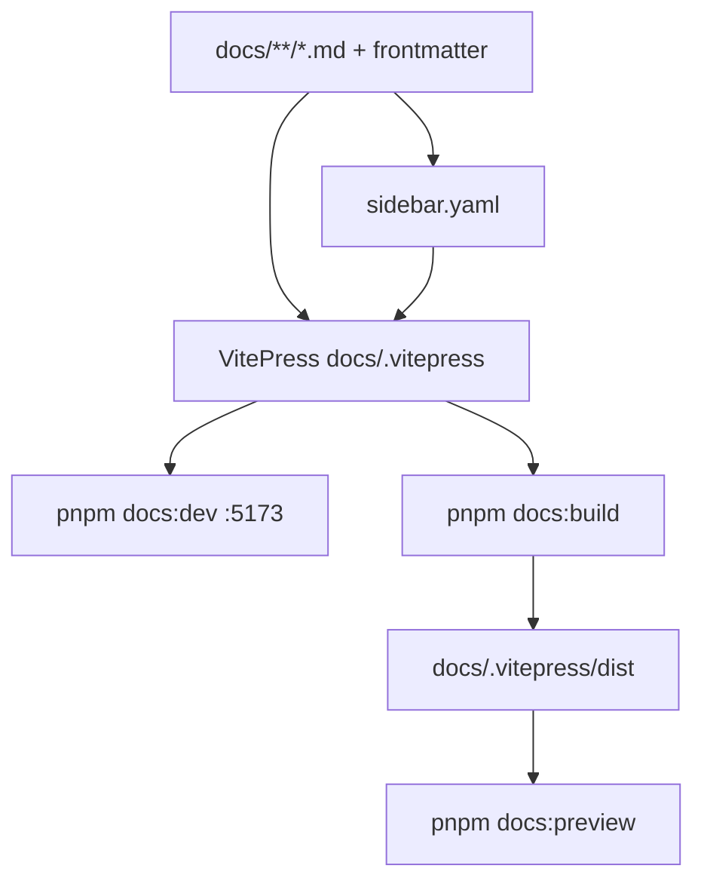

# Monorepo Layout

Dew is developed as a **single monorepo**: one git repository, one product surface, shared docs and CI.

## Stack split

| Language | Responsibility | Package manager |
| :--- | :--- | :--- |
| **Go** | L1 node, consensus, P2P, state, EVM, RPC server, `dewcli` | `go.mod` / `go.sum` at repo root |
| **Node.js** | **Documentation website** (build & preview from `docs/`); scripts, localnet, SDK/RPC tests, deploy helpers | `package.json` + `pnpm-lock.yaml` at repo root |

### Why Node is in the monorepo

1. **Web docs (primary DX for documentation)** — Markdown in `docs/` is authored for humans and for a static site generator. Building that site (dev server, production static export) is a **Node** job, not a Go job.
2. **Tooling later** — localnet orchestration, RPC smoke tests, optional TS SDK.

### Rules of ownership

- **Canonical chain logic is Go.** Validators and full nodes run Go binaries only.
- **Node does not reimplement consensus or state transition.** It consumes the Go node via JSON-RPC / process orchestration when used for tooling.
- **Docs source is `docs/`.** Node only *builds and serves* the website from that tree; it does not own protocol truth.
- Prefer **one root** for each stack (`go.mod`, `package.json`) unless a future workspace split is explicitly justified.
- Shared constants that both sides need (chain ID, ports) should be documented in genesis/docs and, when generated, emitted from a single source (e.g. Go `params` or a small JSON consumed by both).

## Target tree

```
dew/                          # monorepo root
├── cmd/
│   ├── dew/                       # Go: full node entrypoint
│   └── dewcli/                    # Go: wallet / util CLI
├── core/
│   ├── types/                     # Header, block, tx, receipt
│   ├── state/                     # Flat state, journal, roots
│   └── vm/                        # EVM wrapper + StateDB bridge
├── crypto/                        # secp256k1, keccak, keystore helpers
├── db/                            # KV backend abstraction
├── consensus/                     # Dew-BFT
├── p2p/                           # Networking
├── rpc/                           # JSON-RPC server
├── config/                        # Genesis + node config
├── params/                        # Chain constants, gas tables
├── tests/                         # Go integration / multi-node tests
├── scripts/                       # Shell + Node helper scripts
├── deploy/                        # Docker Compose, Dockerfile, systemd samples
├── web/                           # Astro landing (marketing only)
├── explorer/                      # Block explorer SPA (React/Vite; not under web/)
├── faucet/                        # D2 production faucet library (ops HTTP; not consensus)
├── cmd/dewfaucet/                 # Faucet process entry
├── packages/                      # Node workspaces (optional as we grow)
│   ├── sdk/                       # TS client for eth_* / dew_* (later)
│   └── localnet/                  # Spin up multi-validator devnet (later)
├── docs/                          # Protocol + engineering docs (markdown source)
│   ├── **/*.md                    # Pages + YAML frontmatter for the docs site
│   └── sidebar.yaml               # Sidebar map for the site generator
├── go.mod                         # Go module root
├── go.sum
├── package.json                   # Node root — docs site build + tooling (pnpm)
├── pnpm-lock.yaml                 # pnpm lockfile
└── README.md
```

Early phases may only have `docs/`, root `package.json`, and the first Go packages — the tree above is the **target monorepo shape**, not a claim that every folder exists today.

## Go packages

Layout follows [golang-standards/project-layout](https://github.com/golang-standards/project-layout) adapted for a blockchain node.

| Rule                       | Why                                                   |
| :------------------------- | :---------------------------------------------------- |
| `cmd/*` is thin            | Business logic in libraries                           |
| No import cycles           | `consensus` → `core` ok; use interfaces at boundaries |
| `params` has no heavy deps | Constants only                                        |
| Codecs versioned           | Avoid silent fork of encodings                        |

- Go **1.22+** (_tentative_)
- Unit tests next to packages; multi-node tests under `tests/`
- `golangci-lint` for static analysis

## Node packages

Node is the **docs website + tooling lane** of the monorepo:

| Use | Priority | Examples |
| :--- | :--- | :--- |
| **Docs website** | **Primary Node role** | VitePress dev server + production build from `docs/**/*.md` |
| Scripts | As needed | `localnet`, genesis helpers |
| Ops faucet | As needed | Go `faucet/` + `cmd/dewfaucet` (not Node) |
| Tests | As needed | RPC smoke tests against a running Go node |
| SDK | Later | TypeScript client for `eth_*` / `dew_*` |

### Docs web flow



- Authors edit markdown only under `docs/`.
- Site theme/config lives under `docs/.vitepress/`; **do not fork content** into a second copy.
- Navigation: `sidebar.yaml` is loaded by VitePress config; page titles come from frontmatter `title`.
- Frontmatter (`title`, `description`, `category`, `order`, `status`) remains portable if the generator ever changes.
- **Package manager: pnpm** (`packageManager` in `package.json`). Prefer `pnpm install` over npm/yarn.

Root scripts (wired):

```json
{
  "scripts": {
    "docs:dev": "vitepress dev docs",
    "docs:build": "vitepress build docs",
    "docs:preview": "vitepress preview docs"
  }
}
```

## CI (monorepo)

Workflows under [`.github/workflows/`](../../.github/workflows/):

| Workflow | Trigger | What it runs |
| :--- | :--- | :--- |
| [`ci-go.yml`](../../.github/workflows/ci-go.yml) | PR + push `main` | `go vet`, `go test ./...`, explicit security/load/freeze/chaos gates, build `dew` / `dewcli` / `dewfaucet` |
| [`ci-web.yml`](../../.github/workflows/ci-web.yml) | PR + push `main` | monorepo typecheck + `site:build` (landing + docs); `explorer` and `faucet-web` builds |
| [`security.yml`](../../.github/workflows/security.yml) | PR + push `main` + weekly schedule | `govulncheck`, short/long codec·RPC fuzz, `pnpm audit` (high+), CodeQL (Go+JS), Trivy FS (HIGH/CRITICAL) |
| [`pages.yml`](../../.github/workflows/pages.yml) | push `main` only | production GitHub Pages deploy of `dist/` |

Dependency PRs: [`.github/dependabot.yml`](../../.github/dependabot.yml) (gomod, npm workspaces, GitHub Actions) — weekly.

Pipeline lanes:

1. **Go**: `go vet ./...`, `go test ./...`, build `dew` / `dewcli` / `dewfaucet` (static analysis via `go vet` today; `golangci-lint` optional later)
2. **Node / docs / SPAs**: install deps, combined site build, explorer + faucet-web production builds
3. **Security**: vuln DB check, fuzz entrypoints (PR short / schedule longer), lockfile audit, CodeQL, Trivy
4. **Integration** (later / optional): start Go node → Node RPC smoke (`scripts/smoke-rpc.mjs`, `devnet-erc20.mjs`)

Failing Go, Web, or Security CI fails the monorepo build for that PR when required as checks. Heavy multiproc soak (`DEW_HEAVY_INTEGRATION=1`) is not required on every PR.


## What is not multi-repo

| Avoid (for now) | Prefer |
| :--- | :--- |
| Separate repos for node / docs site / SDK | One monorepo |
| Duplicating markdown for the website | Single `docs/` source; Node only builds it |
| Duplicate genesis constants in three places | One genesis schema + generated clients if needed |
| Node “light client” that forks protocol rules | Node as RPC consumer only (for chain tooling) |

## Current status

Monorepo established: markdown under `docs/`, **VitePress docs website** (`package.json` + `docs:dev` / `docs:build` / `docs:preview`), theme under `docs/.vitepress/`. Go module and packages land with Phase A.
