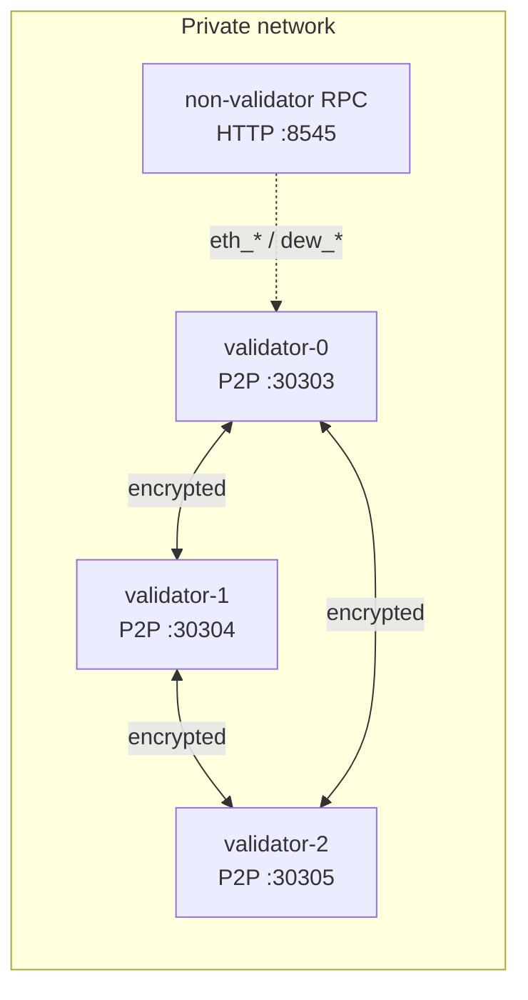

# Private multi-host testnet (Phase C5)

Local `dew devnet` remains the fastest DX path (one process). **Private testnet** means operators run **separate hosts** (machines or containers) with **encrypted P2P by default**, restart discipline, and a short runbook.

## Topology



| Role | Count | Notes |
| :--- | ----: | :---- |
| Validators | ≥ 3 | Dew-BFT; share genesis `initialValidators` |
| Non-validator RPC | 0–1 | MetaMask / Foundry / faucet; no validator key required |
| P2P transport | all | **C2 encrypt default**; cleartext only with explicit flags |

### In-process stand-in

```bash
go run ./cmd/dew devnet --http.port 8545
# 3 BFT validators + encrypted loopback P2P mesh + JSON-RPC
```

### Multi-process / multi-host sketch

1. `dew init --out genesis.json` once; distribute the same genesis.
2. On each validator host, run a node with that genesis, distinct P2P listen port, and bootnode list of the other validators (see `dew run` flags).
3. Point wallets at the RPC host (`http://<rpc-host>:8545`).
4. Feature flags (native path, precompiles, staking) must match across validators.

Minimum private bar (security principles): multi-validator + chaos restart — covered by `go test ./devnet/ -run Chaos`.

## Chaos expectations

| Event | Expected recovery |
| :---- | :---------------- |
| Process kill of one P2P host | Peer drops; after restart + re-dial, host syncs blocks from peers |
| Host restart (new listen port) | Update bootnode/peer addresses; encrypted handshake succeeds |
| RPC host restart | `eth_chainId` / ERC-20 deploy still work against fresh process with same genesis |

Smoke:

```bash
go test ./devnet/ -run Chaos -count=1 -v
go test ./devnet/ -run ERC20 -count=1 -v
node scripts/devnet-erc20.mjs http://127.0.0.1:8545
```

## Operator runbook stubs

### Key material

| Key | Location (convention) | Notes |
| :-- | :-------------------- | :---- |
| Validator consensus / P2P key | `keys/validator-N/priv.key` (operator-chosen path) | Devnet uses Anvil #0–#2 in-process — **never** reuse on public nets |
| Faucet / deployer | Documented Anvil #0 in [devnet](./devnet.md) | Dev only |
| Genesis | `genesis.json` | Same hash/chain ID on every host |

### Feature flags

| Flag / API | Default | Emergency |
| :--------- | :------ | :-------- |
| Native DewTx | on (`DefaultEnableNativePath`) | `Node.SetNativeEnabled(false)` |
| Dew precompiles 0x100+ | on | `SetPrecompilesEnabled(false)` |
| Staking 0x102 live methods | **off** | Keep off until ops opt in; `SetStakingEnabled(true)` to enable |
| P2P encrypt | **on** | Cleartext only with `AllowCleartext` (dev) |

### Emergency stop

1. Stop RPC listeners (SIGTERM on `dew` process) — stops user tx admission.
2. Disable native path + staking flags if a module bug is suspected.
3. Do **not** share validator keys across restarted processes without key hygiene.
4. Re-genesis is acceptable on private nets if state root / wire format drifts (e.g. pre-C3 flat root).

Full public faucet / incentive policy is **C6**, not C5.

## Related

- [Local devnet](./devnet.md)
- [P2P encrypted transport](../networking/p2p.md)
- [Security principles](../security/security-principles.md) — private testnet bar
- [Phases C5](./phases.md)
