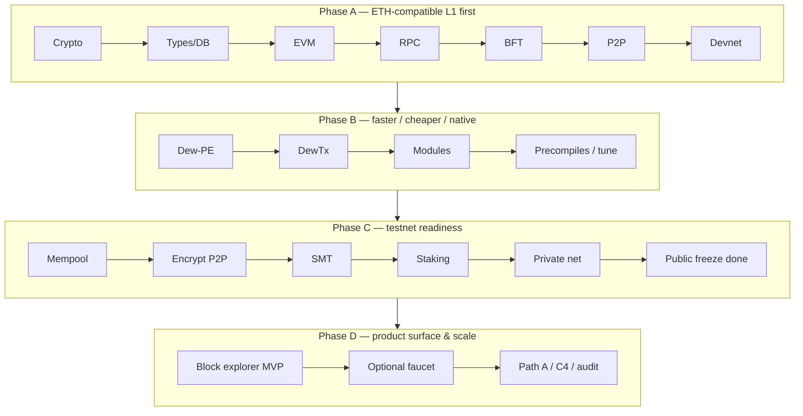
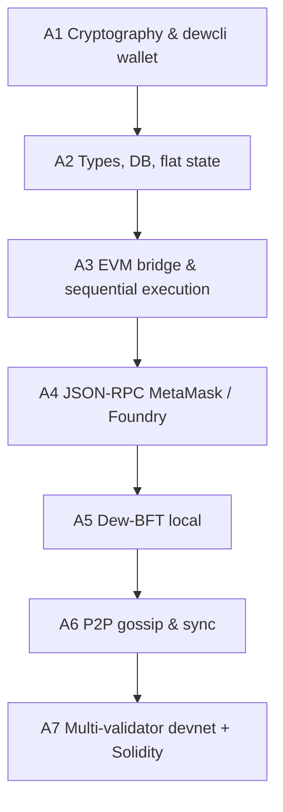
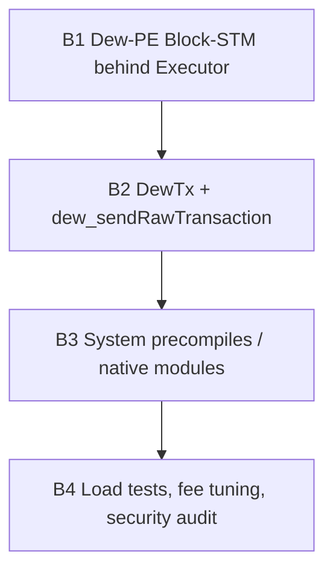
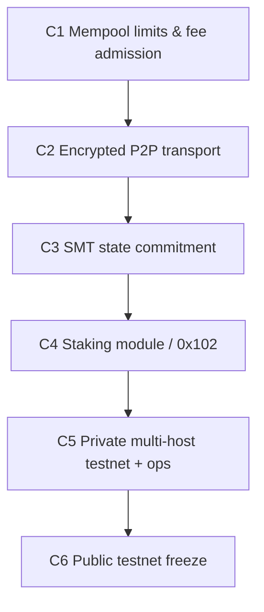
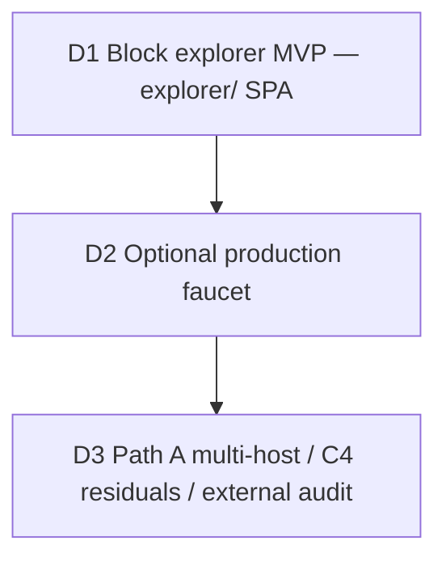

# Roadmap

All phases land in the **same monorepo** (Go core + Node for **web docs build**, explorer, and tooling). See [Monorepo layout](./go-project-layout.md).

## Strategy

**Ship A before optimizing B.** Parallel execution on a broken sequential chain only multiplies bugs.

**Ship B before exposing C.** Public or multi-host networks need spam controls, encrypted transport, and a real state commitment — not only a working local devnet.

**Ship C before D product claims.** Explorer and faucet consume frozen RPC/chain ID; they must not invent wire formats. Scale workstreams in D3 only when ops demand multi-host validators or mainnet audit.

## Phase A detail

## Phase B detail

## Phase C detail

## Phase D detail

**Ordering rationale**

| Step | Why this order |
| :--- | :------------- |
| C1 before any public RPC | Mempool spam is the cheapest attack once endpoints are reachable |
| C2 before multi-host public net | Cleartext P2P is acceptable only on private loopback/dev meshes |
| C3 before freeze | Docs already specify SMT for `header.StateRoot`; provisional flat root must not ship as frozen |
| C4 before product validator UX | Staking precompile is still a revert stub |
| C5 before C6 | Private chaos / runbooks catch ops bugs before public incentives |
| C6 last in band C | Wire formats, genesis, and docs status freeze only after the above land |
| D1 before faucet/UX polish | Public RPC without explorer leaves publish template at `Explorer: (none)` |
| D2 optional | Faucet is ops; allowlist may suffice |
| D3 on demand | Path A, staking residuals, and audit are scale/mainnet gates — not MVP for first public RPC |

Out of Phase C / into D3 or mainnet debt: full multi-version Block-STM upgrade, **external** security audit of consensus + VM bridge + crypto, C4/C5 residuals. See [Security principles](../security/security-principles.md) stage table, [Phases](./phases.md) D3, and `agents/debt.md`.

## Mapping to docs

| Phase | Primary docs                                                                                                |
| :---- | :---------------------------------------------------------------------------------------------------------- |
| A1    | [Cryptography](../protocol/cryptography.md), [Addresses](../protocol/addresses.md)                          |
| A2    | [State](../protocol/state.md), [Blocks](../protocol/blocks.md), [Transactions](../protocol/transactions.md) |
| A3    | [EVM](../execution/evm.md), [Gas](../execution/gas-and-fees.md)                                             |
| A4    | [JSON-RPC](../api/json-rpc.md)                                                                              |
| A5    | [Dew-BFT](../consensus/dew-bft.md), [Validators](../consensus/validators.md)                                |
| A6    | [P2P](../networking/p2p.md), [Gossip and sync](../networking/gossip-and-sync.md)                            |
| A7    | [Genesis](../economics/genesis.md), [Ethereum compatibility](../overview/ethereum-compatibility.md)         |
| B1    | [Parallel execution](../execution/parallel-execution.md)                                                    |
| B2–B3 | [Dew-native](../execution/dew-native.md), [Dew RPC](../api/dew-extensions.md)                               |
| B4    | [Gas and fees](../execution/gas-and-fees.md), [Phase B audit](../security/phase-b-audit.md)                 |
| C1    | [Transactions](../protocol/transactions.md), [Gas and fees](../execution/gas-and-fees.md), [Threat model](../security/threat-model.md) |
| C2    | [P2P](../networking/p2p.md), [Security principles](../security/security-principles.md)                      |
| C3    | [State](../protocol/state.md), [Blocks](../protocol/blocks.md)                                              |
| C4    | [Validators](../consensus/validators.md), [Slashing](../consensus/slashing.md), [Precompiles](../execution/precompiles.md) |
| C5–C6 | [Devnet](./devnet.md), [Private testnet](./private-testnet.md), [Public testnet freeze](./public-testnet.md), [Genesis](../economics/genesis.md) |
| D1    | [Block explorer](./block-explorer.md), [Launch checklist](./launch-checklist.md) |
| D2    | [Production faucet](./faucet.md), [Public testnet freeze](./public-testnet.md) (faucet policy) |
| D3    | [Launch checklist](./launch-checklist.md) path A, [Validators](../consensus/validators.md), [debt](../../agents/debt.md) |

## Milestone definition of done

See [Phases](./phases.md) for acceptance criteria per phase.
