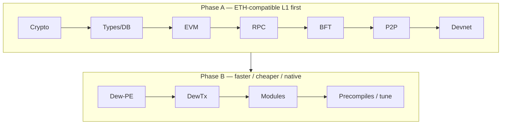
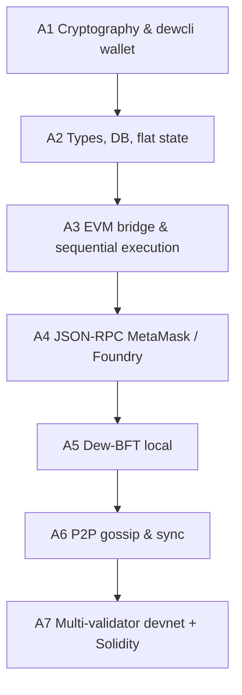
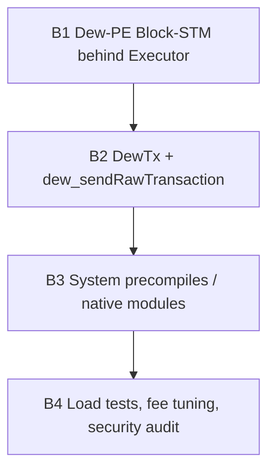

# Roadmap

All phases land in the **same monorepo** (Go core + Node for **web docs build** and tooling). See [Monorepo layout](./go-project-layout.md).

## Strategy

**Ship A before optimizing B.** Parallel execution on a broken sequential chain only multiplies bugs.

## Phase A detail

## Phase B detail

## Mapping to docs

| Phase | Primary docs                                                                                                |
| :---- | :---------------------------------------------------------------------------------------------------------- |
| A1    | [Cryptography](../protocol/cryptography.md), [Addresses](../protocol/addresses.md)                          |
| A2    | [State](../protocol/state.md), [Blocks](../protocol/blocks.md), [Transactions](../protocol/transactions.md) |
| A3    | [EVM](../execution/evm.md), [Gas](../execution/gas-and-fees.md)                                             |
| A4    | [JSON-RPC](../api/json-rpc.md)                                                                              |
| A5    | [Dew-BFT](../consensus/dew-bft.md), [Validators](../consensus/validators.md)                                |
| A6    | [P2P](../networking/p2p.md), [Gossip and sync](../networking/gossip-and-sync.md)                            |
| A7    | [Genesis](../economics/genesis.md), [Ethereum compatibility](../overview/ethereum-compatibility.md)         |
| B1    | [Parallel execution](../execution/parallel-execution.md)                                                    |
| B2–B3 | [Dew-native](../execution/dew-native.md), [Dew RPC](../api/dew-extensions.md)                               |

## Milestone definition of done

See [Phases](./phases.md) for acceptance criteria per phase.
