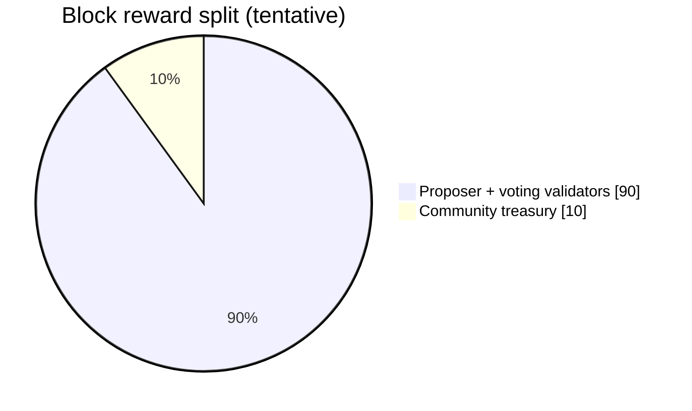
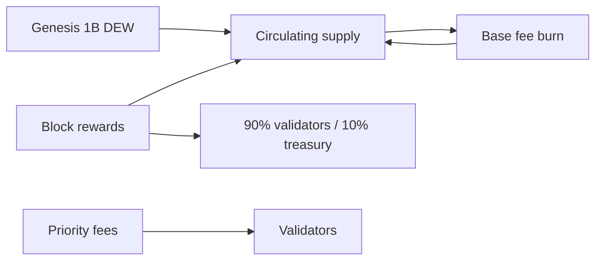

# Tokenomics

> **Status:** asset/fee structure is stable enough to document; **issuance / inflation / reward-split numbers remain tentative** and are not part of the public-testnet-v1 wire freeze. See `agents/debt.md`.

## Native asset

| Parameter      | Value                     |
| :------------- | :------------------------ |
| Name           | Dew Token                 |
| Ticker         | **DEW**                   |
| Decimals       | 18                        |
| Base unit      | wei (`1 DEW = 10^18 wei`) |
| Genesis supply | **1,000,000,000 DEW**     |

## Issuance / inflation (_tentative_)

- Start: **5%** annual inflation
- Decay: **10% relative reduction per year** until floor
- Floor: **1%** annual inflation (long-term security budget)

Block reward \(R\) is derived from the annual target and actual blocks produced.

### Reward split (_tentative_)

| Share | Destination                                                 |
| :---- | :---------------------------------------------------------- |
| 90%   | Proposer + voting validators (define exact split at freeze) |
| 10%   | Community treasury                                          |

## Fee market

EIP-1559 style — see [Gas and fees](../execution/gas-and-fees.md):

- **Base fee**: burned
- **Priority fee**: to proposer / validators

Net supply = genesis + issuance − burned base fees.

## Staking

| Parameter                | Value         | Notes                                                  |
| :----------------------- | :------------ | :----------------------------------------------------- |
| Min validator self-stake | 100,000 DEW   | Frozen candidate public-testnet-v1                     |
| Unbonding                | 7 days        | Prefer seconds or fixed block delta — one unit in code |
| Commission               | Validator-set | **Stored + applied** (0–10000 bps); tip/DewTx fee pro-rata when `--staking` — see [reward-slash design](../superpowers/specs/2026-07-15-0x102-reward-slash-design.md) |
| Slash burn % (double-sign) | **testnet provisional** | Self **100%** + delegated **5%** on verified evidence (`params.DoubleSign*BurnBps`); downtime still design-only — [slashing](../consensus/slashing.md) |

## Design goals vs Ethereum

| Lever             | Effect                                     |
| :---------------- | :----------------------------------------- |
| Higher throughput | Lower fee pressure for same demand         |
| Burn base fee     | User fees do not only enrich validators    |
| Bonded BFT        | Capital at risk for safety                 |
| Later micro-fees  | Cheap native actions without full EVM cost |

### Tip / fee split when staking on (_testnet provisional_)

With `EnableStaking` / `--staking`:

- Proposer tip (EVM priority fee) and DewTx flat fee split by self-stake \(S\) and **effective** delegated \(D\), commission \(c\) bps on the delegator pool.
- Validator immediate share \(V = T \cdot (S\cdot 10000 + D\cdot c) / ((S+D)\cdot 10000)\); remainder accrues to delegators via reward index + `claimRewards` (`0x12`).
- Staking **off**: 100% tip/fee to proposer (unchanged).
- **Block issuance / inflation mint** still not on-chain; same split helper can be reused when issuance freezes.

## Open items before mainnet

- Exact per-block reward / issuance formula + treasury 10% cut
- Treasury address / multisig policy
- Whether non-proposer voters share tips (today: proposer stake set only)
- Max supply vs perpetual inflation floor narrative
- Re-freeze slash bps after economics review
