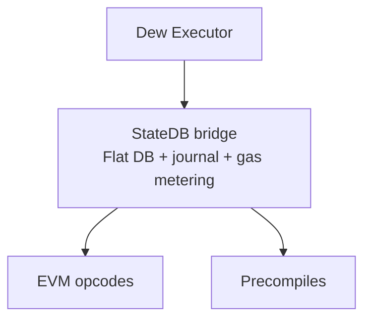

# EVM Integration

## Approach

Dew embeds a standard EVM interpreter via `go-ethereum` `core/vm` behind a thin adapter. Opcode semantics follow **Cancun-era** rules enabled from genesis (see [Genesis](../economics/genesis.md)).

Package: `core/vm` (executor, precompiles, parallel path) + `core/state` (StateDB bridge).

## StateDB bridge

Implement go-ethereum’s `vm.StateDB` (or equivalent) mapping:

| Method | Backend |
| :--- | :--- |
| `GetBalance` / `AddBalance` / `SubBalance` | Account in flat state |
| `GetNonce` / `SetNonce` | Account nonce |
| `GetCode` / `SetCode` | Code store |
| `GetState` / `SetState` | Storage DB |
| `Snapshot` / `RevertToSnapshot` | Journal |
| `AddLog` | Receipt logs |
| `Exist` / `Empty` / `CreateAccount` | Account lifecycle |
| `Selfdestruct` / `HasSelfdestructed` | Per Cancun / EIP-6780 rules |

## Block context

Provide block number, timestamp, coinbase/proposer, gas limit, base fee, and any fork-required fields. Coinbase receives priority tips under the active fee path.

## Contract deployment

1. `to == nil`
2. `data` = init code
3. EVM runs init code; returned bytes = runtime code
4. Address via CREATE / CREATE2 rules
5. Store code; set `CodeHash`

## Testing strategy

- Integration: deploy ERC-20, transfer, approve, emit events (`core/vm`, `devnet/`, examples)
- Toolchain: Foundry / Hardhat against local `dew devnet` or public RPC
- Parallel path must match sequential roots/receipts on fixtures

## What we do not fork early

Avoid custom opcodes. Performance comes from storage layout, block pace, gas schedule, and parallel scheduling — not a divergent VM dialect. External audit of the VM bridge remains a mainnet gate ([Phase B audit](../security/phase-b-audit.md)).
