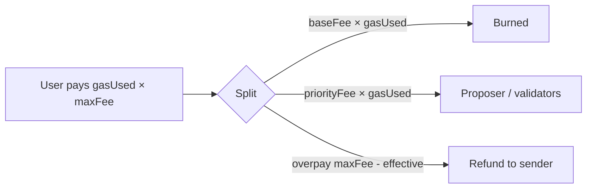

# Gas and Fees

Goals: **cheaper than Ethereum mainnet for users**, while retaining gas as the metering unit for EVM safety (halting problem / DoS).

## Gas metering

- Every EVM opcode consumes gas per the active schedule.
- Phase A baseline: **Ethereum Cancun schedule** as default.
- Optional Dew discount (_tentative_): `SLOAD` / `SSTORE` costs reduced (e.g. up to 50%) reflecting flat DB — must be a **fixed table**, not ad hoc.

Intrinsic gas for a simple transfer remains **21,000** unless a documented hardfork changes it.

## Block gas limit

| Parameter                     | Tentative value | Notes                                                                |
| :---------------------------- | :-------------- | :------------------------------------------------------------------- |
| `gasLimit`                    | `120_000_000`   | Higher than Ethereum; enabled by faster blocks + later parallel exec |
| Target utilization (EIP-1559) | 50% of limit    | Base fee adjustment                                                  |

## EIP-1559 fee market

$$
\text{txFee} = \text{gasUsed} \times (\text{baseFee} + \text{priorityFee})
$$

| Component              | Behavior                                                                                 |
| :--------------------- | :--------------------------------------------------------------------------------------- |
| **Base fee**           | Protocol-adjusted each block; **burned** (removed from supply)                           |
| **Priority fee (tip)** | User-selected; paid to **block proposer** (or validator reward pool — freeze one policy) |

Base fee update rule: follow Ethereum’s elasticity / denominator constants unless a Dew-specific config is set in genesis.

## Why cheaper than ETH (mechanism, not marketing)

1. More block space per wall-clock second (1s blocks × high gas limit)
2. Lower storage opcode costs (flat state)
3. Later: parallel execution increases effective capacity
4. Later: Dew-native micro-fees for non-EVM actions

Burning base fee still creates deflationary pressure under high load.

## Dew-native fees (Phase B)

`DewTx` uses a **flat fee in wei** (not EVM gas). Frozen Phase B constant:

| Parameter | Value | Notes |
| :-------- | ----: | :---- |
| `DefaultDewTxFeeWei` | `2_100_000_000_000` (2100 gwei) | 10% of a 21_000 gas transfer at 1 gwei base fee |
| `MinDewTxFeeWei` | same as default | Spam floor; `Fee=0` on wire still charges default |
| Domain tag | `DewTx:v1` | Mixed into signing hash (see [Transactions](../protocol/transactions.md)) |

Formula (normative for quoting; constant is what nodes charge today):

$$
\text{DefaultDewTxFeeWei} = \Big\lfloor 21\,000 \times 10^{9} \times \frac{1}{10} \Big\rfloor
$$

Defined in Go: `params.DefaultDewTxFeeWei`, `params.TargetDewTxFeeWei(baseFee)`. Fee is paid to the block proposer (fee sink).

## Dew system precompile gas (Phase B / C4)

| Address | Name | Gas |
| :------ | :--- | ---: |
| `0x100` | Native transfer | `3_000` |
| `0x102` | Staking bond | `50_000` |
| `0x102` | Staking unbond | `40_000` |
| `0x102` | Staking jail | `30_000` |
| `0x102` | Staking queries | `2_000` |

Rationale: `0x100` is a fixed-cost native balance move (no interpreter loop). It must stay well below 21_000 so contracts prefer it over spinning EVM transfers when bridging value. See [Precompiles](./precompiles.md).

## C1 mempool admission floors

Before inclusion, `mempool.Pool` rejects spam without stalling execution:

| Check | EVM | DewTx |
| :---- | :-- | :---- |
| Min gas price / fee cap | ≥ `MinGasPriceWei` (default 1 gwei) | — |
| Min tip (EIP-1559) | ≥ `MinTipWei` (default 1 wei) | — |
| Min flat fee | — | ≥ `params.MinDewTxFeeWei` |
| Max wire size | `MaxTxBytes` (default 128 KiB) | same |
| Global / per-sender caps | configurable | same pool |

Replace-by-fee: same sender+nonce requires ≥ `PriceBumpPercent` higher comparable price (default 10%). Set bump to 0 to disable RBF.

## B4 fee tuning notes

Load tests (`go test ./tests/load/`) and benches (`go test -bench=. ./core/vm/ ./core/native/`) inform the following freezes:

| Observation | Decision |
| :---------- | :------- |
| Native DewTx throughput ≫ EVM transfer for pure payments | Keep flat fee at **10%** of simple transfer reference, not lower — anti-spam |
| PE fork overhead can dominate for 21k gas transfers | PE is for **block capacity**, not micro-tx latency; do not raise gas to “force” PE wins |
| `0x100` gas 3_000 | Unchanged; still ≪ ERC-20 transfer |
| Block gas limit 120M | Unchanged; PE increases effective fill rate when non-conflicting |

Re-tune only via an explicit hardfork / genesis parameter change — do not drift constants silently.

## Header fields

`BaseFee`, `GasLimit`, `GasUsed` are first-class header fields. See [Blocks](../protocol/blocks.md).
