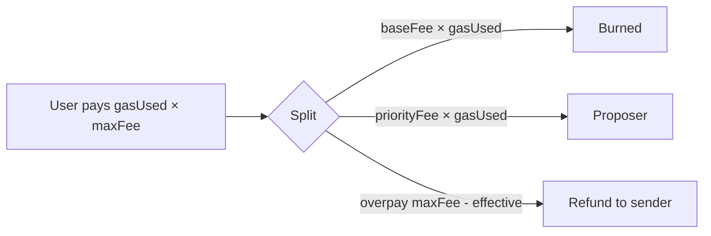

# Gas and Fees

Goals: **cheaper than Ethereum mainnet for users**, while retaining gas as the metering unit for EVM safety (halting problem / DoS).

## Gas metering

- Every EVM opcode consumes gas per the active schedule.
- Baseline: **Ethereum Cancun schedule**.
- Optional Dew storage discount remains _tentative_ (not part of public-testnet-v1 freeze): if introduced, must be a **fixed table**, not ad hoc.

Intrinsic gas for a simple transfer remains **21,000** unless a documented hardfork changes it.

## Block gas limit

| Parameter | public-testnet-v1 | Notes |
| :--- | :--- | :--- |
| `gasLimit` | `120_000_000` | `params.DefaultBlockGasLimit` / genesis |
| Reference base fee | 1 gwei | Genesis / freeze table |

## EIP-1559 fee market

$$
\text{txFee} = \text{gasUsed} \times (\text{baseFee} + \text{priorityFee})
$$

| Component | Behavior |
| :--- | :--- |
| **Base fee** | Protocol field on the header; burned from the sender’s prepay under the executor path |
| **Priority fee (tip)** | Paid to **block proposer** (`coinbase` / header `Proposer`) |

Base fee update elasticity follows Ethereum constants unless genesis sets Dew-specific config.

## Why cheaper than ETH (mechanism)

1. More block space per wall-clock second (~1s multiproc pace × high gas limit)
2. Flat state hot path (no MPT per opcode)
3. Parallel execution increases effective capacity when txs do not conflict
4. Dew-native micro-fees for non-EVM actions

## Dew-native fees

`DewTx` uses a **flat fee in wei** (not EVM gas):

| Parameter | Value | Notes |
| :--- | ---: | :--- |
| `DefaultDewTxFeeWei` | `2_100_000_000_000` (2100 gwei) | 10% of a 21_000 gas transfer at 1 gwei |
| `MinDewTxFeeWei` | same as default | Spam floor; `Fee=0` on wire still charges default |
| Domain tag | `DewTx:v1` | Mixed into signing hash |

$$
\text{DefaultDewTxFeeWei} = \Big\lfloor 21\,000 \times 10^{9} \times \frac{1}{10} \Big\rfloor
$$

Defined in Go: `params.DefaultDewTxFeeWei`, `params.TargetDewTxFeeWei(baseFee)`. Fee is paid to the block proposer (fee sink).

## Dew system precompile gas

| Address | Name | Gas |
| :--- | :--- | ---: |
| `0x100` | Native transfer | `3_000` |
| `0x102` | Staking bond | `50_000` |
| `0x102` | Staking unbond | `40_000` |
| `0x102` | Staking jail | `30_000` |
| `0x102` | Staking queries | `2_000` |

Rationale: `0x100` is a fixed-cost native balance move (no interpreter loop). It must stay well below 21_000 so contracts prefer it when bridging value. See [Precompiles](./precompiles.md).

## C1 mempool admission floors

Before inclusion, `mempool.Pool` rejects spam without stalling execution:

| Check | EVM | DewTx |
| :--- | :--- | :--- |
| Min gas price / fee cap | ≥ `MinGasPriceWei` (default 1 gwei) | — |
| Min tip (EIP-1559) | ≥ `MinTipWei` (default 1 wei) | — |
| Min flat fee | — | ≥ `params.MinDewTxFeeWei` |
| Max wire size | `MaxTxBytes` (default 128 KiB) | same |
| Global / per-sender caps | configurable | same pool |

Replace-by-fee: same sender+nonce requires ≥ `PriceBumpPercent` higher comparable price (default 10%). Set bump to 0 to disable RBF.

Multi-tx packing and nonce-gap queues: [Transactions](../protocol/transactions.md), [Phases C1](../build/phases.md#c1--mempool-admission--fee-policy).

## B4 fee tuning notes

Load tests (`go test ./tests/load/`) and benches inform the freezes:

| Observation | Decision |
| :--- | :--- |
| Native DewTx throughput ≫ EVM transfer for pure payments | Keep flat fee at **10%** of simple transfer reference — anti-spam |
| PE fork overhead can dominate for 21k gas transfers | PE is for **block capacity**, not micro-tx latency |
| `0x100` gas 3_000 | Unchanged; still ≪ ERC-20 transfer |
| Block gas limit 120M | Unchanged; PE increases effective fill rate when non-conflicting |

Re-tune only via an explicit hardfork / genesis parameter change — do not drift constants silently.

## Public testnet freeze (C6)

| Item | Frozen value |
| :--- | :--- |
| Reference base fee | 1 gwei |
| Block gas limit | 120M |
| DewTx fee / min | `2.1e12` wei (10% of simple transfer @ 1 gwei) |
| Mempool min gas price | 1 gwei |
| Mempool min tip | 1 wei |
| Max tx bytes | 128 KiB |
| `0x100` gas | 3_000 |

Canonical table: [Public testnet freeze](../ops/public-testnet.md).

## Header fields

`BaseFee`, `GasLimit`, `GasUsed` are first-class header fields. See [Blocks](../protocol/blocks.md).
