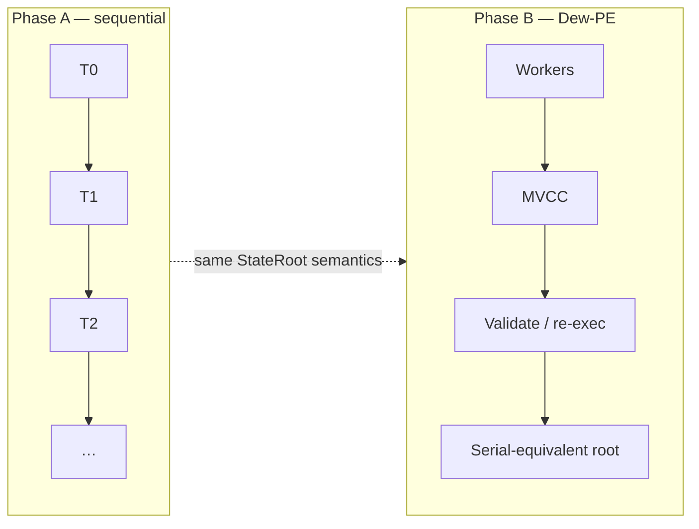
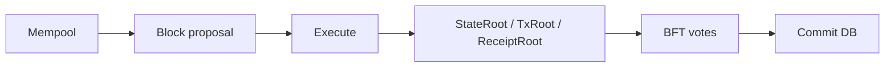

# Execution Overview

## State transition

For block \(B\) with transactions \(T_1, \ldots, T_n\):

$$
S_{i} = \gamma(S_{i-1}, T_i), \quad S_0 = S_{\text{parent}}, \quad S_n = S_{\text{final}}
$$

\(\gamma\) is the EVM (and later native) transition function. Nodes must obtain the same \(S_n\) and thus the same `StateRoot`.

## Phase A — sequential EVM (ship first)

```
for i, tx in block.Transactions:
    result = ApplyEVM(tx, state)
    receipts.append(result)
stateRoot = state.Commit()
```

Properties:

- Simple to implement and debug
- Easy equivalence testing vs geth on fixtures
- Enough for MetaMask / Solidity workflow

## Phase B — parallel EVM (Dew-PE)

Optimistic concurrency (Block-STM style):

- Execute non-conflicting txs on multiple goroutines
- Validate read sets; re-execute on conflict
- **Final state must equal sequential execution in tx index order**

Parallelism is a speedup, not a new semantic model.



## Phase B — Dew-native path

`DewTx` bypasses the EVM interpreter for fixed native operations (transfers, later modules). Explicit `AccessList` enables conflict-free scheduling.

## Pipeline position



Execution sits **before** final votes that include state roots. Failed execution of a proposed block → vote `nil` / reject proposal.
