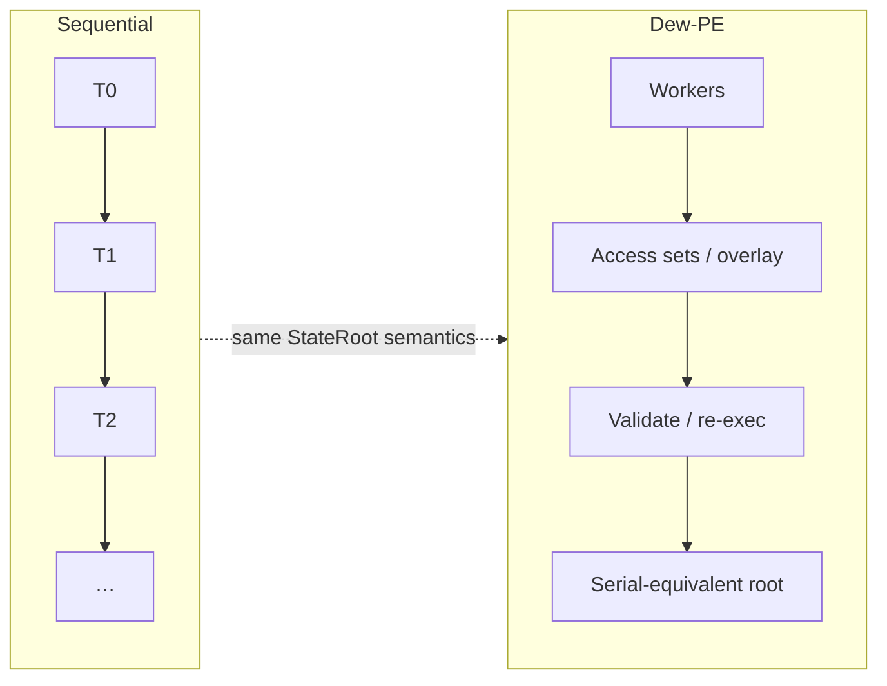
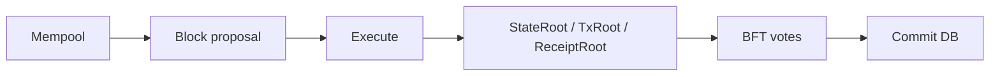

# Execution Overview

## State transition

For block \(B\) with transactions \(T_1, \ldots, T_n\):

$$
S_{i} = \gamma(S_{i-1}, T_i), \quad S_0 = S_{\text{parent}}, \quad S_n = S_{\text{final}}
$$

\(\gamma\) is the EVM (and optional native) transition function. Nodes must obtain the same \(S_n\) and thus the same `StateRoot`.

## Sequential EVM (shipped)

```
for i, tx in block.Transactions:
    result = ApplyEVM(tx, state)
    receipts.append(result)
stateRoot = SMT.Commit(state)
```

Properties:

- Simple to implement and debug
- Enough for MetaMask / Solidity workflow
- Canonical semantics for equivalence with parallel execution

## Parallel EVM (Dew-PE)

Optimistic concurrency (Block-STM **style**; current impl uses fork + overlay — see [Parallel execution](./parallel-execution.md)):

- Execute non-conflicting txs on multiple workers
- Validate read sets; re-execute on conflict
- **Final state must equal sequential execution in tx index order**

Parallelism is a speedup, not a new semantic model.



## Dew-native path

`DewTx` bypasses the EVM interpreter for fixed native operations (transfers, modules). Explicit `AccessList` enables conflict-free scheduling and fail-closed privilege bounds. See [Dew-native](./dew-native.md).

## Pipeline position



Execution sits **before** final votes that include state roots. Failed execution of a proposed block → vote `nil` / reject proposal.

Dev auto-mine (Path B) packs ready mempool txs and commits without a multi-validator vote path; multiproc BFT uses the same execution import path after commit.
