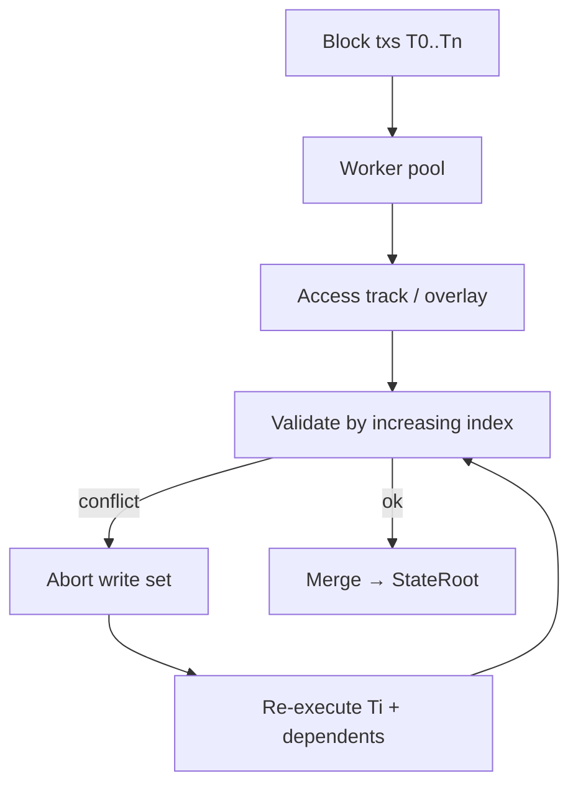

# Parallel Execution (Dew-PE)

> Normative semantics: **equivalent to sequential execution in transaction index order.**

## Motivation

Sequential EVM leaves CPU cores idle. Dew-PE runs non-conflicting transactions concurrently, then validates consistency.

## Model: optimistic concurrency

Dew does **not** require users to declare access lists for normal EVM txs (lists are often wrong for dynamic contracts). Instead:

1. Execute optimistically (workers / forks)
2. Record read/write sets
3. Validate; re-execute on conflict
4. Commit a final state identical to serial order \(T_0, T_1, \ldots\)

### Implementation note (public-testnet-v1)

The current Go path (`core/vm/parallel.go`) uses **fork + overlay** copies rather than a full multi-version Block-STM store. Higher memory and re-exec cost under heavy conflicts are known residuals (`agents/debt.md`). Semantics still require serial equivalence; upgrading the scheduler is post-testnet optimization, not a wire freeze item.

## Access tracking

For each tx index \(i\):

- **Read set**: keys observed during speculative execution
- **Write set**: pending account/storage updates

Read rule: value from the highest \(j < i\) that wrote the key, else committed parent state (via overlay).

## Validation

For each \(T_i\) in order:

- If any key in the read set was written by a later-than-observed version from some \(T_j\) with \(j < i\) → **invalid**
- On invalid: drop \(T_i\) writes; re-run dependents as needed

## Determinism

Given the same parent state and the same ordered tx list, Dew-PE MUST produce the same receipts (gas, status, logs) and `StateRoot` as sequential Apply.

## Relationship to access lists

| Tx kind | Scheduling |
| :--- | :--- |
| EVM tx | Optimistic (access list optional hint only) |
| DewTx | **Static** partition by declared `AccessList` — can skip abort path when lists are exact |

**Spec-level primary model for EVM = optimistic**; **DewTx = declared dependencies**.

## Complexity controls

- Cap worker count to `GOMAXPROCS` / config
- Bound re-execution attempts; fall back to sequential for pathological blocks
- Metrics: rollback rate, worker utilization (`dew_getExecutionStats`)

## Non-goals (current)

- Cross-block speculative execution
- GPU interpreters
- Breaking receipt order vs tx index
- Shipping full Block-STM as a freeze requirement
