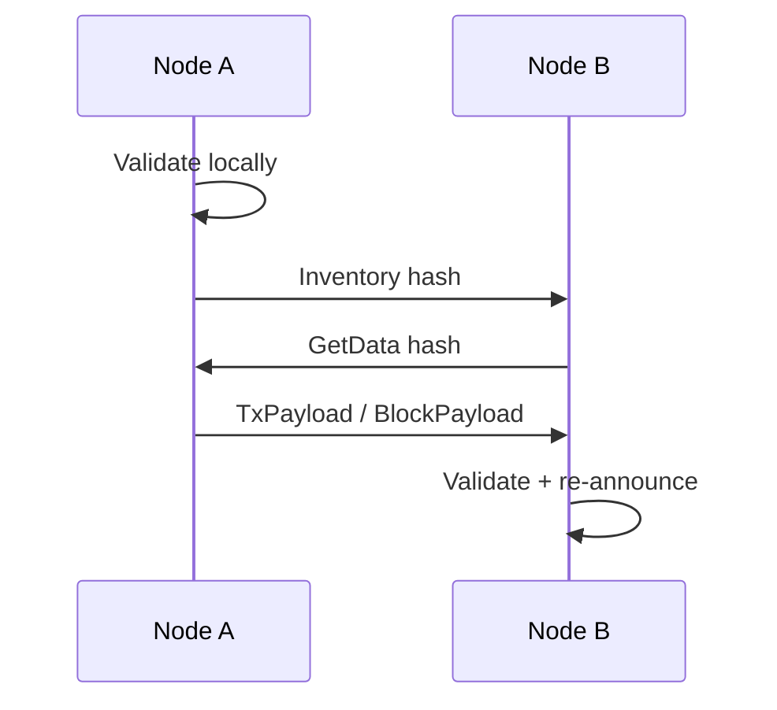
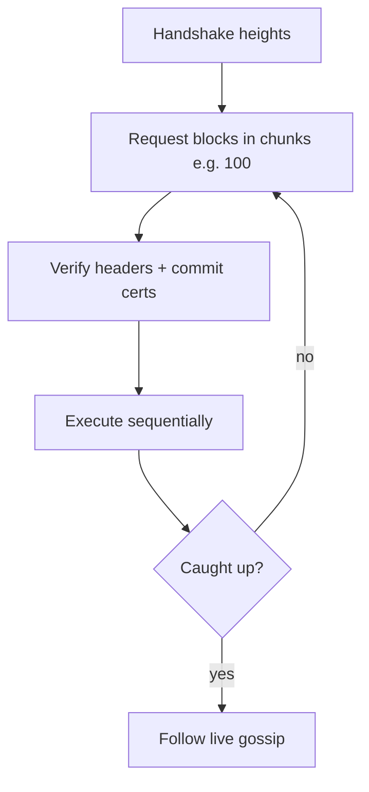

# Gossip and Sync

## Inventory gossip

Bandwidth-efficient propagation:

1. Validate locally
2. Announce hash via `Inventory`
3. Peers request missing items with `GetData`
4. Respond with `TxPayload` or `BlockPayload`
5. Recipients re-announce to their peers

### Transactions

Mempool admission before gossip. Do not relay invalid signatures or wrong chain ID.

### Blocks

- Same inventory pattern for full nodes
- **Validator fast path**: broadcast proposal/block body to the active set with priority (and consensus votes on the consensus channel) to meet 1s targets

## Chain synchronization

When `peer.Height > self.Height + threshold`:

### Rules

- Prefer peers with valid commit certificates for recent heights
- Execute sync path **sequentially** even if live execution is parallel (simpler, deterministic)
- Abort peer on invalid block

## Mempool sync

Optional: on connect, exchange a bounded set of recent tx hashes. Not required for Phase A correctness (blocks carry txs).

## Metrics

- Propagation latency (tx hash → peer count)
- Sync blocks/sec
- Orphan / unknown-parent rate
