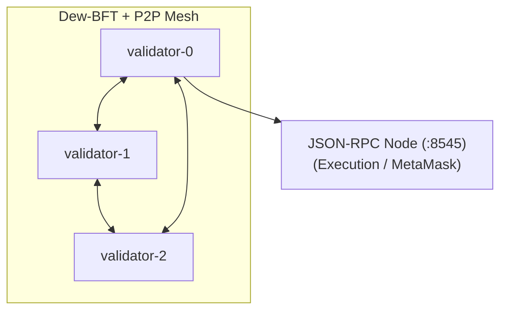

# Local Devnet (Phase A7)

End-to-end local network: **3 Dew-BFT validators**, loopback **P2P** mesh, and **1 JSON-RPC** execution node with a documented faucet.

## Quick start

```bash
# Generate / refresh genesis (3 validators + faucet alloc)
go run ./cmd/dew init --out genesis.json

# Start in-process devnet (RPC + BFT + P2P)
go run ./cmd/dew devnet --http.port 8545

# Or build first
go build -o bin/dew ./cmd/dew
./bin/dew devnet
```

Smoke checks:

```bash
node scripts/smoke-rpc.mjs http://127.0.0.1:8545
go test ./devnet/ -count=1 -v    # BFT + P2P + ERC-20 over RPC
```

## Network parameters

| Item | Value |
| :--- | :--- |
| **Chain ID** | `2205` (`0x89d`) |
| **JSON-RPC** | `http://127.0.0.1:8545` (override `--http.port`) |
| **P2P** | Loopback mesh (ephemeral ports; in-process hosts) |
| **Consensus** | Dew-BFT, 3 validators, equal voting power |
| **Block production (RPC txs)** | Dev auto-mine per `eth_sendRawTransaction` |
| **BFT** | LocalCluster commits empty heights (liveness demo) |

## Topology



All four roles run **in one `dew devnet` process** for local DX. P2P sessions use **encrypted transport by default** (Phase C2).

For multi-host private networks, chaos restart, and operator runbook stubs see [Private multi-host testnet](./private-testnet.md) (Phase C5).

## Faucet (Anvil-compatible)

Pre-funded in genesis (`alloc`). **Dev keys only — never use on mainnet.**

| Role | Address | Private key |
| :--- | :--- | :--- |
| **Faucet / deployer** (Anvil #0) | `0xf39Fd6e51aad88F6F4ce6aB8827279cffFb92266` | `ac0974bec39a17e36ba4a6b4d238ff944bacb478cbed5efcae784d7bf4f2ff80` |
| User #1 (Anvil #1) | `0x70997970C51812dc3A010C7d01b50e0d17dc79C8` | `59c6995e998f97a5a0044966f0945389dc9e86dae88c7a8412f4603b6b78690d` |
| User #2 (Anvil #2) | `0x3C44CdDdB6a900fa2b585dd299e03d12FA4293BC` | `5de4111afa1a4b94908f83103eb1f1706367c2e68ca870fc3fb9a804cdab365a` |

Balance per funded account: **1,000,000 DEW** (1e6 × 1e18 wei).

Validators for BFT are the same three accounts (#0–#2) with `votingPower: 1` in `initialValidators`.

## MetaMask

1. Add network: **Dew Local**, RPC `http://127.0.0.1:8545`, chain ID **2205**, symbol **DEW**
2. Import faucet private key (Anvil #0)
3. Confirm balance shows non-zero native DEW

## Foundry

```bash
export ETH_RPC_URL=http://127.0.0.1:8545
export PRIVATE_KEY=ac0974bec39a17e36ba4a6b4d238ff944bacb478cbed5efcae784d7bf4f2ff80

cast chain-id                          # 2205
cast balance 0xf39Fd6e51aad88F6F4ce6aB8827279cffFb92266

# Deploy any Solidity contract
forge create src/MyToken.sol:MyToken \
  --rpc-url $ETH_RPC_URL \
  --private-key $PRIVATE_KEY \
  --broadcast
```

## ERC-20 demo

In-process (no extra deps):

```bash
go test ./devnet/ -run ERC20 -v
```

With a running `dew devnet` and optional `ethers`:

```bash
pnpm add -D ethers   # once
node scripts/devnet-erc20.mjs http://127.0.0.1:8545
```

Fixture contract: `core/vm` `Token` (balanceOf / transfer / Transfer event).

## Init only (genesis file)

```bash
dew init --out genesis.json
# edit alloc / validators if needed
dew run --genesis genesis.json --http.port 8545   # single RPC node without full BFT mesh
```

## Related docs

- [Phases](../build/phases.md) — acceptance criteria
- [Dew-BFT](../consensus/dew-bft.md)
- [P2P](../networking/p2p.md)
- [JSON-RPC](../api/json-rpc.md)
- [Genesis schema](../economics/genesis.md)
