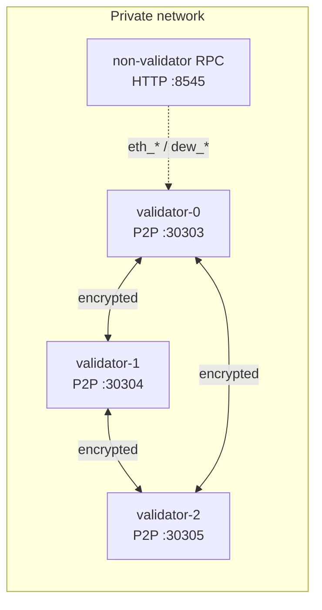

# Private multi-host testnet

Local `dew devnet` remains the fastest DX path (one process). **Private testnet** means operators run **separate hosts** (machines or containers) with **encrypted P2P by default**, restart discipline, and a short runbook.

## Topology



| Role | Count | Notes |
| :--- | ----: | :---- |
| Validators | ≥ 3 | Dew-BFT; share genesis `initialValidators` |
| Non-validator RPC | 0–1 | MetaMask / Foundry / faucet; no validator key required |
| P2P transport | all | **C2 encrypt default**; cleartext only with explicit flags |

### In-process stand-in

```bash
go run ./cmd/dew devnet --http.port 8545
# 3 BFT validators + encrypted loopback P2P mesh + JSON-RPC
```

### Multi-process / multi-host packaging

Samples live under [deploy/](../../deploy/) (Docker Compose + systemd). One-page ops path: [Launch checklist](./launch-checklist.md).

```bash
# Fast private soak (in-process 3-validator + RPC)
cp deploy/soak.env.example deploy/soak.env   # once
docker compose -f deploy/docker-compose.soak.yml --env-file deploy/soak.env up --build

# Multi-process layout: encrypted P2P mesh + per-node JSON-RPC (not with devnet)
docker compose -f deploy/docker-compose.soak.yml --profile multi up --build
```

Manual multi-process sketch (same genesis on every host):

1. `dew init --out genesis.json` once; distribute the same file.
2. On each host:

```bash
dew run --genesis genesis.json \
  --datadir ./data/node0 \
  --http.addr 0.0.0.0 --http.port 8545 \
  --p2p.listen 0.0.0.0:30303 \
  --p2p.key <32-byte-hex> \
  --p2p.bootnodes host1:30303,host2:30303
```

3. Point wallets at one RPC (`http://<rpc-host>:8545`).
4. Feature flags (native path, precompiles, staking) must match operator policy across hosts.

**Note:** Compose profile `multi` runs **3 BFT validators** (`--validator`) + **`node-rpc`** full node (`--no-auto-mine`) on a shared canonical chain (D3a). Default `dew run` without `--validator` remains dev auto-mine (path B compatible). ERC-20 smoke: `node scripts/devnet-erc20.mjs http://127.0.0.1:8548` after `docker compose … --profile multi up`. In-process BFT demo: `dew devnet`.

### Multi-process BFT soak (Compose `multi`)

Private multi-validator staging on **one machine** (pre–Path A):

1. From repo root: `docker compose -f deploy/node/docker-compose.soak.yml --profile multi up --build`
2. Smoke RPC on the full node: `node scripts/smoke-rpc.mjs http://127.0.0.1:8548` — confirm `eth_blockNumber` advances.
3. App smoke: `node scripts/devnet-erc20.mjs http://127.0.0.1:8548`
4. Chaos: stop one validator container (`docker stop dew-node-1`); within ~2 minutes peer count recovers via D3b redial and tip continues on survivors + RPC.
5. Pace: default empty-block interval is **1s** (`--bft.min-block-interval`); raise if load tests show P2P pressure.
6. In-process gate: `DEW_HEAVY_INTEGRATION=1 go test ./devnet/ -run MultiProcessBFT_LongEmpty -timeout 5m` (≥150 empty heights).

Manual multi-host uses the same flags with real hostnames in `--p2p.bootnodes` and unique `--datadir` / keys per host. Path A public publish is [D3d](../scale/d3-scale.md#d3d--path-a-multi-host-public).

### Data directory layout (D3b + durable chaindata)

| Path | Contents | Status |
| :--- | :------- | :----- |
| `<datadir>/peers.json` | Known P2P peers (id, addr, lastSeen, banScore); loaded on start, flushed on change/close | **Shipped** (D3b) |
| `<datadir>/chaindata/` | Pebble: headers, bodies, canonical, receipts, tx index, flat state, tip meta | **Shipped** — [Durable chaindata](./durable-chaindata.md) |
| `--p2p.bootnodes` | Always redialed; never TTL-evicted (not required to appear in the file) | Shipped |

When `--datadir` is set:

- Chain + state open from `chaindata/` (Pebble). Process restart recovers tip, balances, receipts, and tx lookups.
- P2P auto-redials last-known peers (exponential backoff, cap 5 minutes). Entries idle longer than **7 days** are dropped unless they are bootnodes or currently active.

Compose Path B and `multi` mount volumes at `/var/lib/dew` (the **default** `--datadir`; compose does not need to pass the flag). **Do not** put peer records inside `chaindata/` (separate lifecycle). Local override: `dew run --datadir ./data …`.

Minimum private bar (security principles): multi-validator + chaos restart — covered by `go test ./devnet/ -run Chaos`. Auto-redial without manual mesh helper: `go test ./p2p/ -run 'AutoRedial|ReloadAndRedial'`.

## Chaos expectations

| Event | Expected recovery |
| :---- | :---------------- |
| Process kill of one P2P host | Peer drops; after restart + re-dial, host syncs blocks from peers |
| Host restart (new listen port) | Update bootnode/peer addresses; encrypted handshake succeeds |
| RPC host restart | `eth_chainId` / ERC-20 deploy still work against fresh process with same genesis |

Smoke:

```bash
go test ./devnet/ -run Chaos -count=1 -v
go test ./devnet/ -run ERC20 -count=1 -v
node scripts/devnet-erc20.mjs http://127.0.0.1:8545
```

## Operator runbook stubs

### Key material

| Key | Location (convention) | Notes |
| :-- | :-------------------- | :---- |
| Validator consensus / P2P key | `keys/validator-N/priv.key` (operator-chosen path) | Devnet uses Anvil #0–#2 in-process — **never** reuse on public nets |
| Faucet / deployer | Documented Anvil #0 in [devnet](./devnet.md) | Dev only |
| Genesis | `genesis.json` | Same hash/chain ID on every host |

### Feature flags

| Flag / API | Default | Emergency |
| :--------- | :------ | :-------- |
| Native DewTx | on (`DefaultEnableNativePath`) | `Node.SetNativeEnabled(false)` |
| Dew precompiles 0x100+ | on | `SetPrecompilesEnabled(false)` |
| Staking 0x102 live methods | **off** | Keep off until ops opt in; `SetStakingEnabled(true)` to enable |
| P2P encrypt | **on** | Cleartext only with `AllowCleartext` (dev) |

### Emergency stop

1. Stop RPC listeners (SIGTERM on `dew` process) — stops user tx admission.
2. Disable native path + staking flags if a module bug is suspected.
3. Do **not** share validator keys across restarted processes without key hygiene.
4. Re-genesis is acceptable on private nets if state root / wire format drifts (e.g. pre-C3 flat root).

Full public faucet / incentive policy is in [Public testnet freeze](./public-testnet.md) (C6).

## Related

- [Launch checklist](./launch-checklist.md)
- [Local devnet](./devnet.md)
- [Public testnet freeze](./public-testnet.md)
- [deploy packaging](../../deploy/README.md)
- [P2P encrypted transport](../networking/p2p.md)
- [Security principles](../security/security-principles.md) — private testnet bar
- [Phases C5](../build/phases.md)
