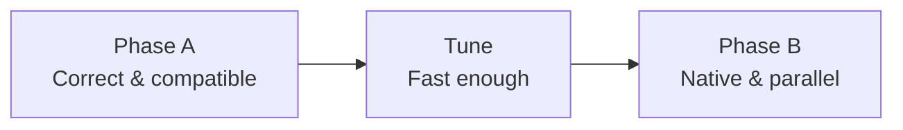
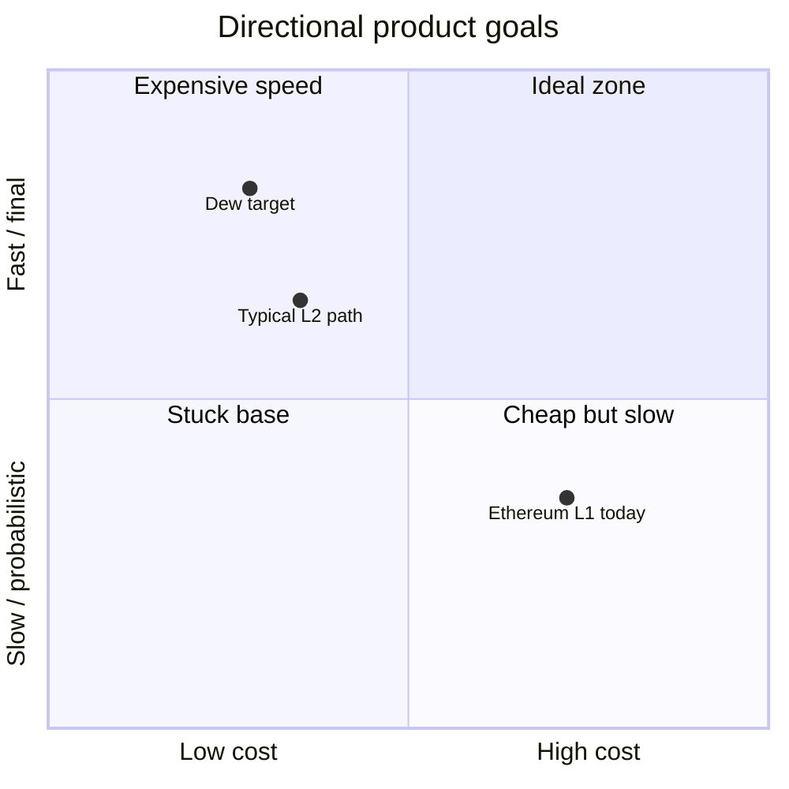

# Vision

## Problem

Ethereum is the smart-contract standard, but the base layer is constrained by:

- **Sequential execution** — one transaction at a time per block path
- **Heavy state access** — Merkle Patricia Trie latency on every read/write
- **Probabilistic finality** — reorg risk until enough confirmations
- **Fee pressure** — scarce block space and expensive storage ops

L2s help scale execution, but they introduce bridges, different security assumptions, and extra operational complexity. Many teams still need a **simple L1** that feels like Ethereum for developers, yet is engineered for higher throughput and lower cost.

## What Dew is

**Dew** is a Layer 1 blockchain written **from scratch** in a **Go + Node monorepo** (protocol in Go; **Node builds the docs website** and later tooling):

1. **EVM-compatible** — same accounts, signatures, Solidity contracts, and JSON-RPC surface for standard tooling.
2. **BFT finality** — Dew-BFT commits blocks with instant finality under the protocol’s honesty assumptions.
3. **Performance-oriented storage** — flat key-value state for execution; Merkle structure for commitments, not for every opcode.
4. **Phased sophistication** — ship Ethereum parity first; add Dew-native paths and parallel execution after the base chain is correct.

## Success criteria

| Dimension    | Target (direction)                                                                        |
| :----------- | :---------------------------------------------------------------------------------------- |
| **Speed**    | ~1s block time; multi-thousand TPS path after parallel execution                          |
| **Security** | Instant finality; slash double-sign; clear validator incentives                           |
| **Cost**     | Lower effective gas for common ops vs mainnet Ethereum; micro-fees for native txs later   |
| **DX**       | Deploy existing Solidity with MetaMask / Foundry / Hardhat against local and public nodes |

## Non-goals (near term)

- Replacing Ethereum as a settlement ecosystem
- Full app-chain / sovereign rollup framework in v1
- Novel VMs before EVM parity is solid
- Maximum decentralization of validator set on day one (start with a bounded active set, expand over time)

## Build philosophy

Every design choice should answer: _Does this make Dew faster, safer, or cheaper without breaking the Ethereum developer path?_

