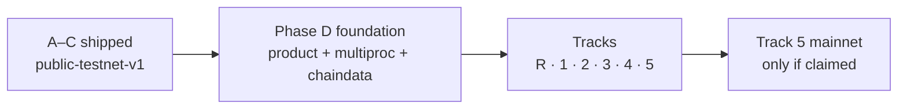
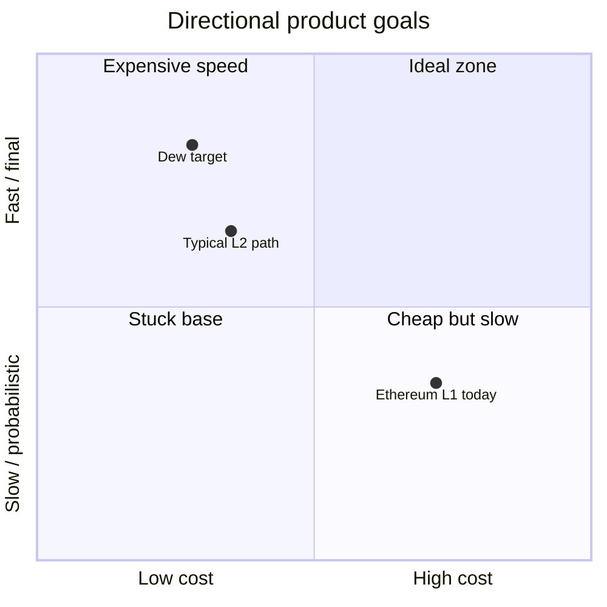

# Vision

## Problem

Ethereum is the smart-contract standard, but the base layer is constrained by:

- **Sequential execution** — one transaction at a time per block path
- **Heavy state access** — Merkle Patricia Trie latency on every read/write
- **Probabilistic finality** — reorg risk until enough confirmations
- **Fee pressure** — scarce block space and expensive storage ops

L2s help scale execution, but they introduce bridges, different security assumptions, and extra operational complexity. Many teams still need a **simple L1** that feels like Ethereum for developers, yet is engineered for higher throughput and lower cost.

## What Dew is

**Dew** is a Layer 1 blockchain written **from scratch** in a **Go + Node monorepo** (protocol in Go; Node builds docs, explorer, faucet UI, and DX demos):

1. **EVM-compatible** — same accounts, signatures, Solidity contracts, and JSON-RPC surface for standard tooling.
2. **BFT finality** — Dew-BFT commits blocks with instant finality under the protocol’s honesty assumptions.
3. **Performance-oriented storage** — flat key-value state for execution; Sparse Merkle Tree for `StateRoot`, not for every opcode.
4. **Phased sophistication** — Ethereum parity first; native path, parallel execution, and public-testnet freeze next; product surface and scale on demand.

**Today (public-testnet-v1):** chain ID **2205**, Path B RPC / explorer / faucet as an optional public lab. Phase D foundation is shipped; open work is **tracks** (research, product, protocol, ops, core, mainnet) — not an automatic mainnet. See [Try public](../ops/try-public.md) and [Roadmap — Tracks](../build/roadmap.md#tracks).

## Success criteria

| Dimension    | Target (direction)                                                                        |
| :----------- | :---------------------------------------------------------------------------------------- |
| **Speed**    | ~1s multiproc BFT pace; higher effective capacity via PE when txs do not conflict         |
| **Security** | Instant finality under BFT assumptions; slashing design; external audit before mainnet    |
| **Cost**     | High gas limit + flat state; DewTx flat micro-fee for native payments                     |
| **DX**       | MetaMask / Foundry / Hardhat / Guestbook against local and public nodes                   |

## Non-goals (near term)

- Replacing Ethereum as a settlement ecosystem
- Full app-chain / sovereign rollup framework in v1
- Novel VMs before EVM parity is solid
- Maximum decentralization of validator set on day one (start with a bounded active set, expand over time)

## Build philosophy

Phase bands A–D build a working L1 and lab surface. Open work is **track rows** (default: research + core features) — not automatic mainnet or real-user growth. See [Roadmap — Tracks](../build/roadmap.md#tracks).

Every design choice should answer: _Does this make Dew faster, safer, or cheaper without breaking the Ethereum developer path?_

