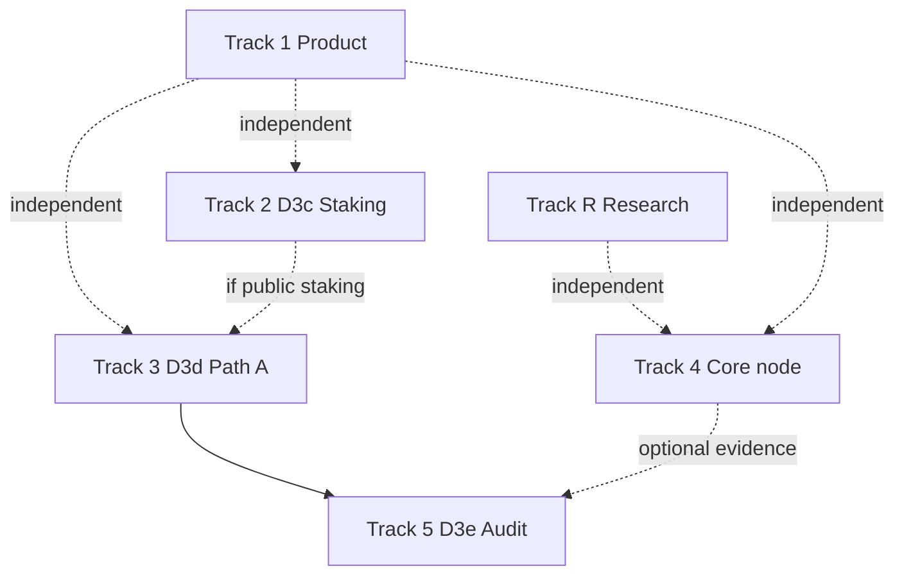

# Product & scale upgrades

**Status:** Phase D foundation + product-v1 **done** · `public-testnet-v1` freeze · Path B optional lab  
**Wire rule:** product work is **RPC/UI only** and must not change DewTx, fee floors, precompile ABIs, or SMT meaning. Protocol/ops tracks follow [D3 scale](../scale/d3-scale.md) and [phases](../build/phases.md). Residuals: [agents/debt.md](../../agents/debt.md).

This page is the **single map** of upgrade options. Implement **one track (or one product slice) at a time**.

**Tracks (one row each):** see [roadmap — Tracks](../build/roadmap.md#tracks) and [phases — Tracks](../build/phases.md#tracks). Track **R** (research) + Track **4** (core) are the research-friendly defaults. Track **5** (mainnet) is **not** required for research or most feature work.

---

## Track map

| Track | Theme | When | Spec / ownership |
| :--- | :--- | :--- | :--- |
| **R — Research lab** | Hypotheses, PE/BFT/state measurements | Research goal; no real mainnet users | [phases Track R](../build/phases.md#track-r--research-lab) |
| **1 — Product surface** | Explorer, faucet UI, Guestbook | Demo / DX depth; **v1–v1.2 shipped** — deferred slices optional | This page § Track 1 |
| **2 — Protocol (D3c)** | Staking residuals (C4) | When intentionally enabling staking (lab or product) | [d3-scale § D3c](../scale/d3-scale.md#d3c--staking-residuals-c4) |
| **3 — Ops scale (D3d)** | Path A multi-host public | When leaving single-host Path B for public multi-validator | [d3-scale § D3d](../scale/d3-scale.md#d3d--path-a-multi-host-public) |
| **4 — Core node** | PE upgrade, chaindata hydrate; mempool telemetry **done** | **Research-friendly default** for performance features | [durable-chaindata](../ops/durable-chaindata.md), [debt](../../agents/debt.md), [PE](../execution/parallel-execution.md), [dew_getMempoolStats](../api/dew-extensions.md#dew_getmempoolstats) |
| **5 — Mainnet gate (D3e)** | External audit pack | **Only** before mainnet / production claims | [d3-scale § D3e](../scale/d3-scale.md#d3e--external-audit-prep) |
| **Plan S0–S6** | Ordered path → Precompile slots | **Done** (Checkpoint C 2026-07-14) | [phases S0–S6](../build/phases.md#recommended-sequence--research-lab--precompile-slots) |

**Recommended rows (depends on goal):**

| Goal | Track rows |
| :--- | :--- |
| **Research (no real mainnet users)** | **R** + **4** (core/PE) → **2** only for staking lab → defer **3** + **5** |
| **Feature depth without launch** | One slice: **4** or **2**, or deferred **1** (P1e–f / P3c) |
| **Public multi-host ops** | **3** (Path A) when operators need it |
| **Mainnet claims** | **3** (if multi-host public) + **5** — last |
| **Ordered plan → Precompile slots** | [S0–S6](../build/phases.md#recommended-sequence--research-lab--precompile-slots) (R + 4 + 2) |

Product-v1 (Track 1 P1a–d / P2a–d / P3a–b) is **already shipped**. Remaining Track 1 items are **optional polish**, not a gate for core work.

---

## Track 1 — Product surface

Ops / DX web only. Freeze tag and chain ID stay **public-testnet-v1** / **2205**. MVP through product-v1.2 is **shipped**; remaining slices (P1e–f, P3c) are optional polish.

### 1.1 Block explorer (`explorer/`)

| Slice | Goal | Indexer? | Status |
| :--- | :--- | :--- | :--- |
| **P1a — Contract & ERC-20 metadata** | On address page: detect ERC-20 via `eth_call` (`name` / `symbol` / `decimals` / `totalSupply`); badge Token | No | **Shipped** (product-v1) |
| **P1b — Tx method & token transfers** | Human method labels (selector table); decode `Transfer` / `Approval` logs into readable rows | No | **Shipped** (product-v1) |
| **P1c — Search UX** | Recent searches chips; keep address / tx / block resolution | No | **Shipped** (product-v1) |
| **P1d — Token balance tab** | Optional known-token list + `balanceOf` for an address (`PUBLIC_KNOWN_TOKENS`) | No | **Shipped** (product-v1.1) |
| **P1e — Full history / volume** | Optional `dewindex` SQLite sidecar + `PUBLIC_INDEXER_URL` | Yes | **Shipped** (2026-07-14); internal txs still out of scope |
| **P1f — Verified source / ABI** | Source upload or IPFS — product phase after indexer | Optional | Deferred |

Acceptance (P1a–c):

- Contract address with ERC-20 bytecode shows symbol / decimals / total supply when calls succeed.
- Tx with ERC-20 `transfer` shows method name and Transfer row (from, to, amount).
- Search box shows up to 8 recent queries; click navigates.

Design bar remains in [Block explorer](./block-explorer.md).

### 1.2 Faucet UI (`faucet-web/`)

| Slice | Goal | Status |
| :--- | :--- | :--- |
| **P2a — Success actions** | Copy tx hash; explorer deep-link; address deep-link when explorer URL set | **Shipped** (product-v1) |
| **P2b — Rate-limit copy** | Friendlier errors for per-address / per-IP windows from API text | **Shipped** (product-v1) |
| **P2c — Wallet paste** | “Use connected wallet” via injected provider (`eth_requestAccounts`) | **Shipped** (product-v1.1) |
| **P2d — Balance preview** | `GET /info` includes `balanceWei`; UI chip + low-balance warn; refresh after drip | **Shipped** (product-v1.2) |

Backend (`faucet/` + `dewfaucet`) stays policy source of truth — see [Faucet](./faucet.md).

### 1.3 Guestbook demo (`examples/guestbook-web/`)

| Slice | Goal | Status |
| :--- | :--- | :--- |
| **P3a — Author filter** | Client-side filter by address substring; “Mine” when wallet connected | **Shipped** (product-v1) |
| **P3b — Share link** | Query param `?author=…` pre-filters feed; Share copies URL | **Shipped** (product-v1.1) |
| **P3c — Reactions / replies** | New contract methods — **re-deploy** + SPA; not freeze wire | Deferred unless demo demand |

See [Guestbook](./guestbook.md).

### Product-v1 definition of done

- [x] Docs backlog (this page) + sidebar / roadmap / debt links  
- [x] Explorer P1a–c  
- [x] Faucet P2a–b  
- [x] Guestbook P3a  
- [x] App docs + product pages note product-v1 slices  
- [x] product-v1.1: P1d known-token balances · P2c wallet paste · P3b `?author=` share  
- [x] product-v1.2: P2d funder `balanceWei` on `/info` + UI  
- [x] Deploy rebuild of live path B surfaces (operator) — verified live 2026-07-13: explorer P1a–d markers; faucet `/api/info` `balanceWei` + SPA P2c/P2d; Guestbook `URLSearchParams.get("author")` + Share/Mine/Burst (P3a–b). Acceptance is **public HTTPS smoke** only (no SSH). Host operator pinned GHCR / recreated stack for release version inject — **2026-07-14 (`v0.5.0`)**.

### Deferred product slices (post product-v1)

- [x] P1e — indexer / full history / volume (`dewindex` + explorer) — 2026-07-14; internal txs deferred  
- [ ] P1f — verified source / ABI  
- [ ] P3c — Guestbook reactions / replies  
- [x] Optional: pin live GHCR so `web3_clientVersion` matches release tag (host console) — operator deploy 2026-07-14 (`v0.5.0`)

---

## Track 2 — Protocol (D3c staking residuals)

Only when `--staking` is intentionally enabled. Public-testnet-v1 keeps staking **off** by default.

**Acceptance:**

- [x] Unbonding period before withdraw — queue + `0x08` withdraw
- [x] Double-sign evidence verification — dual-vote verify + jail
- [x] ActiveSet → BFT epoch rotation when staking on
- [x] Nested CALL bond credits value payer (Transfer hook)
- [ ] On-chain slash burn percentages (economics tentative) — S4 deferred with docs
- [x] Zero-value nested unbond/withdraw call-stack edge — S4 fail-closed (tx.origin) + tests
- [ ] Delegation / commission (deferred unless scoped)

Full acceptance: [phases D3c](../build/phases.md#d3c--staking-residuals-c4) · [d3-scale § D3c](../scale/d3-scale.md#d3c--staking-residuals-c4) · [debt C4](../../agents/debt.md#c4-residuals).

---

## Track 3 — Ops scale (D3d Path A)

Multi-host public BFT: ≥3 validators, new keys, published bootnodes, full-node RPC, existing faucet/explorer pointing at public RPC.

**Acceptance:**

- [ ] ≥3 validators on separate hosts with new keys
- [ ] Published public bootnode multiaddrs
- [ ] Full-node public RPC + faucet/explorer pointed at it
- [ ] Launch checklist Path A runbook complete

Detail: [phases D3d](../build/phases.md#d3d--path-a-multi-host-public-optional-ops) · [Launch — Path A](../ops/launch-checklist.md#path-a--multi-host-public-later) · [d3-scale § D3d](../scale/d3-scale.md#d3d--path-a-multi-host-public).

---

## Track 4 — Core node upgrades

**Acceptance:**

- [x] Mempool / fee telemetry RPC (optional DX; keep C6 abuse limits) — `dew_getMempoolStats` (2026-07-13)
- [x] Lazy hydrate / log index at large tip — tip-only Open + on-demand reads (2026-07-14)
- [x] Secondary log-index keys for O(range) `eth_getLogs` (2026-07-14)
- [x] WebSocket + `eth_subscribe` (`newHeads`, `logs`) on HTTP upgrade (2026-07-14)
- [x] HTTP Filter API (`eth_newFilter` / block / pending stub / changes / logs / uninstall) — max 128, 5m TTL (2026-07-15)
- [ ] PE upgrade toward full Block-STM / lower conflict cost (serial-equivalent)
- [ ] Tokenomics issuance numbers frozen only if mainnet economics are claimed — otherwise [tokenomics.md](../economics/tokenomics.md) stays draft

Also: [phases Track 4](../build/phases.md#track-4--core-node) · [debt](../../agents/debt.md).

---

## Track 5 — Mainnet gate (D3e)

Artifact pack: threat model, Phase B audit, consensus + VM + crypto scope, Path A soak logs. Not an implementation phase — only before production claims.

**Acceptance:**

- [ ] Scoped audit pack (consensus + VM bridge + crypto)
- [ ] Threat model + Phase B findings attached
- [ ] Path A or multiproc soak evidence retained
- [ ] Explicit decision recorded before any mainnet claim

Detail: [phases D3e](../build/phases.md#d3e--external-audit-prep-mainnet-claims-only) · [d3-scale § D3e](../scale/d3-scale.md#d3e--external-audit-prep).

---

## Non-goals under public-testnet-v1

- Changing chain ID, DewTx type, precompile addresses, or fee floors without a documented hardfork  
- Shipping a full Etherscan-class indexer as a silent dependency of “MVP explorer”  
- Mainnet economic claims while tokenomics remains draft  
- Treating Path A (Track 3) or external audit (Track 5) as the automatic next row when the goal is research or private lab features only

---

## Related

- [Roadmap](../build/roadmap.md)  
- [Phases](../build/phases.md)  
- [D3 scale](../scale/d3-scale.md)  
- [Block explorer](./block-explorer.md) · [Faucet](./faucet.md) · [Guestbook](./guestbook.md)  
- [agents/debt.md](../../agents/debt.md)  
