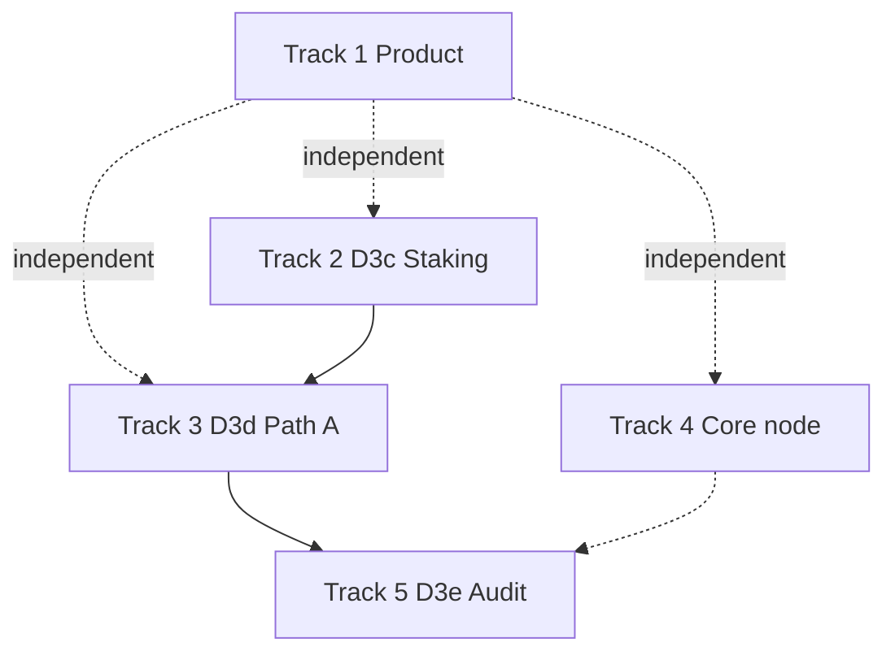

# Product & scale upgrades

**Status:** backlog after `public-testnet-v1` freeze · Path B live  
**Wire rule:** product work is **RPC/UI only** and must not change DewTx, fee floors, precompile ABIs, or SMT meaning. Protocol/ops tracks follow [D3 scale](../scale/d3-scale.md) and [phases](../build/phases.md). Residuals: [agents/debt.md](../../agents/debt.md).

This page is the **single map** of upgrade options discussed after D1–D2 and D3a/b + durable chaindata. Implement **one track (or one product slice) at a time**.

---

## Track map

| Track | Theme | When | Spec / ownership |
| :--- | :--- | :--- | :--- |
| **1 — Product surface** | Explorer, faucet UI, Guestbook | **First** — user-visible, no wire risk | This page § Track 1; per-app docs below |
| **2 — Protocol (D3c)** | Staking residuals (C4) | When operators intentionally enable staking | [d3-scale § D3c](../scale/d3-scale.md#d3c--staking-residuals-c4) |
| **3 — Ops scale (D3d)** | Path A multi-host public | When leaving single-host Path B | [d3-scale § D3d](../scale/d3-scale.md#d3d--path-a-multi-host-public) |
| **4 — Core node** | Chaindata hydrate, PE, RPC ergonomics | Ops pain or scale | [durable-chaindata](../ops/durable-chaindata.md), [debt](../../agents/debt.md) |
| **5 — Mainnet gate (D3e)** | External audit pack | Before mainnet claims | [d3-scale § D3e](../scale/d3-scale.md#d3e--external-audit-prep) |

**Recommended order:** Track **1** (product) in parallel with Path B ops → Track **3** when multi-host is required → Track **2** only if staking is on → Track **5** before mainnet. Track **4** as needed.

---

## Track 1 — Product surface (priority)

Ops / DX web only. Freeze tag and chain ID stay **public-testnet-v1** / **2205**.

### 1.1 Block explorer (`explorer/`)

| Slice | Goal | Indexer? | Status |
| :--- | :--- | :--- | :--- |
| **P1a — Contract & ERC-20 metadata** | On address page: detect ERC-20 via `eth_call` (`name` / `symbol` / `decimals` / `totalSupply`); badge Token | No | **Shipped** (product-v1) |
| **P1b — Tx method & token transfers** | Human method labels (selector table); decode `Transfer` / `Approval` logs into readable rows | No | **Shipped** (product-v1) |
| **P1c — Search UX** | Recent searches chips; keep address / tx / block resolution | No | **Shipped** (product-v1) |
| **P1d — Token balance tab** | Optional known-token list + `balanceOf` for an address (config or env) | No | Planned |
| **P1e — Internal txs / full history** | Requires log/tx indexer — **out of no-indexer MVP** | Yes | Deferred |
| **P1f — Verified source / ABI** | Source upload or IPFS — product phase after indexer | Optional | Deferred |

Acceptance (P1a–c):

- Contract address with ERC-20 bytecode shows symbol / decimals / total supply when calls succeed.
- Tx with ERC-20 `transfer` shows method name and Transfer row (from, to, amount).
- Search box shows up to 8 recent queries; click navigates.

Design bar remains in [Block explorer](./block-explorer.md).

### 1.2 Faucet UI (`faucet-web/`)

| Slice | Goal | Status |
| :--- | :--- | :--- |
| **P2a — Success actions** | Copy tx hash; explorer deep-link; address deep-link when explorer URL set | **Shipped** (product-v1) |
| **P2b — Rate-limit copy** | Friendlier errors for per-address / per-IP windows from API text | **Shipped** (product-v1) |
| **P2c — Wallet paste** | Optional “use connected wallet” via injected provider | Planned |
| **P2d — Balance preview** | Read faucet funding balance via public RPC (no keys) | Planned |

Backend (`faucet/` + `dewfaucet`) stays policy source of truth — see [Faucet](./faucet.md).

### 1.3 Guestbook demo (`examples/guestbook-web/`)

| Slice | Goal | Status |
| :--- | :--- | :--- |
| **P3a — Author filter** | Client-side filter by address substring; “Mine” when wallet connected | **Shipped** (product-v1) |
| **P3b — Share link** | Query param `?author=0x…` pre-filters feed | Planned |
| **P3c — Reactions / replies** | New contract methods — **re-deploy** + SPA; not freeze wire | Deferred unless demo demand |

See [Guestbook](./guestbook.md).

### Product-v1 definition of done

- [x] Docs backlog (this page) + sidebar / roadmap / debt links  
- [x] Explorer P1a–c  
- [x] Faucet P2a–b  
- [x] Guestbook P3a  
- [x] App docs + product pages note product-v1 slices  
- [ ] Deploy rebuild of live path B surfaces (operator)  

---

## Track 2 — Protocol (D3c staking residuals)

Only when `--staking` is intentionally enabled. Public-testnet-v1 keeps staking **off** by default.

| Item | Packages |
| :--- | :--- |
| Unbonding period before withdraw | `core/native`, `params` |
| Double-sign evidence verification | `consensus/`, `core/native` |
| ActiveSet → BFT epoch rotation | `consensus/`, `node/` |
| Nested CALL bond (`msg.sender`) | `core/vm` |
| Delegation / commission | Deferred unless scoped |

Full acceptance: [D3c](../scale/d3-scale.md#d3c--staking-residuals-c4) · [debt C4](../../agents/debt.md#c4-residuals).

---

## Track 3 — Ops scale (D3d Path A)

Multi-host public BFT: ≥3 validators, new keys, published bootnodes, full-node RPC, existing faucet/explorer pointing at public RPC.

Checklist: [Launch — Path A](../ops/launch-checklist.md#path-a--multi-host-public-later) · [D3d](../scale/d3-scale.md#d3d--path-a-multi-host-public).

C6 residual: publish real public bootnode multiaddrs (not in-repo secrets).

---

## Track 4 — Core node upgrades

| Item | Notes |
| :--- | :--- |
| Lazy hydrate / log index at large tip | Optional chaindata residual |
| PE fork+overlay vs full Block-STM | Deferred; memory/re-exec tradeoff |
| Mempool / fee telemetry RPC | Optional DX; keep C6 abuse limits |
| Tokenomics issuance numbers | [tokenomics.md](../economics/tokenomics.md) stays draft until freeze |

---

## Track 5 — Mainnet gate (D3e)

Artifact pack: threat model, Phase B audit, consensus + VM + crypto scope, Path A soak logs. Not an implementation phase — [D3e](../scale/d3-scale.md#d3e--external-audit-prep).

---

## Non-goals under public-testnet-v1

- Changing chain ID, DewTx type, precompile addresses, or fee floors without a documented hardfork  
- Shipping a full Etherscan-class indexer as a silent dependency of “MVP explorer”  
- Mainnet economic claims while tokenomics remains draft  

---

## Related

- [Roadmap](../build/roadmap.md)  
- [Phases](../build/phases.md)  
- [D3 scale](../scale/d3-scale.md)  
- [Block explorer](./block-explorer.md) · [Faucet](./faucet.md) · [Guestbook](./guestbook.md)  
- [agents/debt.md](../../agents/debt.md)  
