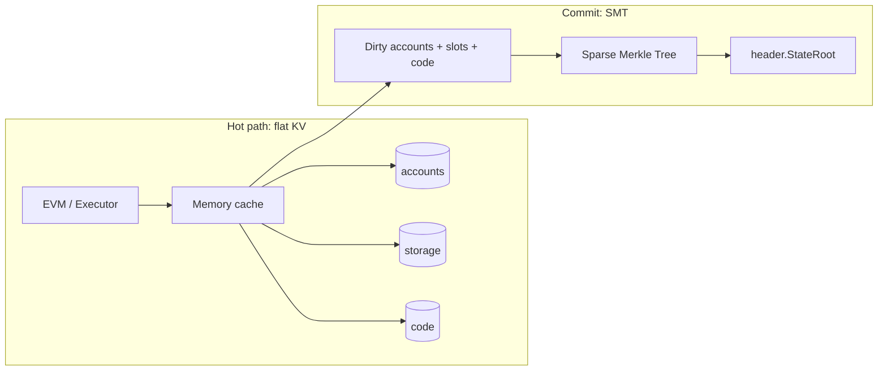

# State

## Account object

```go
type Account struct {
    Nonce    uint64
    Balance  *uint256.Int // wei
    CodeHash [32]byte     // empty code hash for EOAs
    // Storage is keyed separately, not embedded in the account blob
}
```

Post-state must be **deterministic** across nodes. Ethereum’s per-account `storageRoot` is not required on the hot path; Dew commits a **global SMT** over flat keys.

## Flat database model

| Logical store | Mapping |
| :--- | :--- |
| Accounts | `a ‖ address → account blob` |
| Storage | `s ‖ address ‖ slot → value` |
| Code | `c ‖ codeHash → bytecode` |

Execution reads/writes these KV stores (plus memory cache). No trie walk per opcode.



On disk (operator `--datadir`): Pebble under `<datadir>/chaindata` persists flat state with the chain tip. See [Durable chaindata](../ops/durable-chaindata.md).

## State root commitment

After all transactions in a block are applied:

1. Collect dirty accounts, storage slots, and code from the flat snapshot
2. Build a **Sparse Merkle Tree** (SMT) over those leaves
3. Set `header.StateRoot` to the SMT root
4. Validators re-execute and **require equal `StateRoot`**

### SMT algorithm (C3, frozen meaning of StateRoot)

Implemented in `core/state/smt.go` (commit-time only; hot path stays flat KV):

| Item | Spec |
| :--- | :--- |
| Leaf key path | `path = Keccak256(flatKey)` where flatKey is `a‖addr`, `s‖addr‖slot`, or `c‖codeHash` |
| Leaf hash | `Keccak256(0x00 ‖ value)` |
| Internal hash | `Keccak256(0x01 ‖ left ‖ right)` |
| Empty subtrees | Precomputed `emptyHashes[h]`; empty state root = `emptyHashes[256]` |
| Bit order | MSB of `path[0]` is the root branch bit |

Same pre-state + same txs ⇒ identical root on independent nodes. Parallel and sequential paths must still agree.

### Migration from provisional flat root

Early prototypes used a sorted-leaf provisional root. That commitment is **obsolete**. Dev / private nets with old roots should **wipe and re-genesis**. No historical migration path is required for public-testnet-v1.

### Async SMT?

Background construction is allowed **only as an optimization inside one process**. The root in the proposed header must match what validators recompute before precommit. Consensus never finalizes a block with a deferred root.

### Lab note (Track R H3)

`IntermediateRoot` currently rebuilds from the full durable flat snapshot (not dirty-only). Wall-clock therefore grows with tip state size; flat KV execution stays cheap. Measured matrix: [research-lab — H3](../ops/research-lab.md#hypothesis-h3--smt-commit-cost-vs-tip-state-size). Dirty/incremental SMT is an optional residual, not part of public-testnet-v1.

## Journaling and reverts

EVM calls need snapshot/revert (gas OOG, `REVERT`, failed subcalls). Journal / copy-on-write on the cache layer matches Ethereum semantics.

## Parallel execution (MVCC / overlay)

In-block concurrency adds access tracking and overlay commit:

- Read/write sets per tx index
- Final commit order preserves serial equivalence of sequential index order

See [Parallel execution](../execution/parallel-execution.md).

## Pruning and archive

Pruning policies are out of scope for public-testnet-v1. Full nodes may retain all heights; large-tip **lazy hydrate** (tip-only Open, on-demand history) is implemented — [durable-chaindata](../ops/durable-chaindata.md#lazy-hydrate-track-4).
