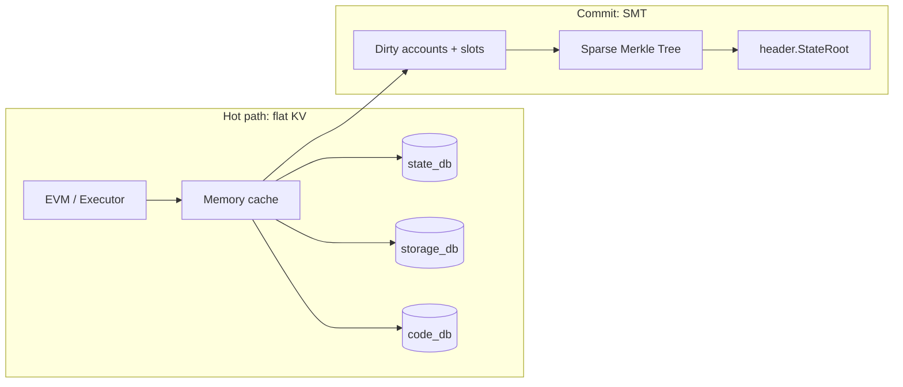

# State

## Account object

```go
type Account struct {
    Nonce    uint64
    Balance  *uint256.Int // wei
    CodeHash [32]byte     // empty code hash for EOAs
    // Storage is keyed separately, not embedded in the account blob
}
```

Ethereum’s `storageRoot` may be retained for compatibility hashes or replaced by a global SMT layout — implementation choice, but **post-state must be deterministic** across nodes.

## Flat database model

Ethereum’s bottleneck is often MPT on the hot path. Dew uses:

| DB           | Mapping                                |
| :----------- | :------------------------------------- |
| `state_db`   | `address → account`                    |
| `storage_db` | `(address, slot) → value`              |
| `code_db`    | `codeHash → bytecode` (optional split) |

Execution reads/writes these KV stores (plus memory cache). No trie walk per opcode.



## State root commitment

After all transactions in a block are applied:

1. Collect dirty accounts and storage slots
2. Build / update a **Sparse Merkle Tree** (SMT)
3. Set `header.StateRoot` to the SMT root
4. Validators re-execute (or verify execution proof path) and **require equal `StateRoot`**

### Async SMT?

Background construction is allowed **only as an optimization inside one process**. The root that appears in the proposed header must match what validators recompute before precommit. Consensus never finalizes a block with an “unknown” or deferred root.

## Journaling and reverts

EVM calls need snapshot/revert (gas OOG, `REVERT`, failed subcalls). Implement via journal or copy-on-write on the cache layer, same semantics as Ethereum.

## Phase B: MVCC cache

Parallel execution adds an in-block multi-version cache:

- Read/write sets per tx index
- Commit order preserves **serializable equivalent** of sequential index order

See [Parallel execution](../execution/parallel-execution.md).

## Pruning and archive (later)

Phase A full nodes may keep all blocks. Pruning policies are out of scope until after first multi-validator devnet.
