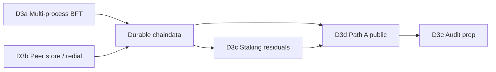
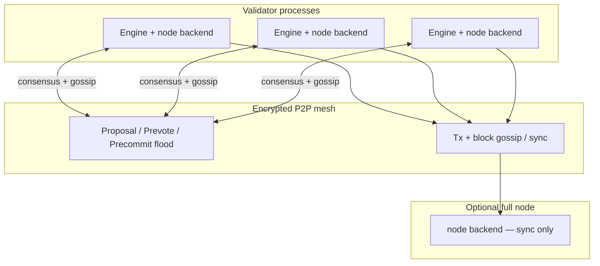
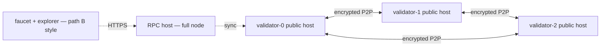

# D3 scale (design spec)

**Status:** D3a + D3b + D3a residual (pace + bulk backpressure) implemented (July 2026); **durable chaindata** implemented (July 2026); D3c–D3e pending.  
**Freeze:** `public-testnet-v1` wire formats stay frozen — D3 changes **packaging, ops, and consensus wiring**, not DewTx / fee floors / precompile addresses. See [Public testnet freeze](../ops/public-testnet.md).

**Context:** Path B is live (single-host controlled RPC). Bands A–C and D1–D2 are done. This document is the **implementation spec** for Phase D3. Acceptance summaries remain in [Phases](../build/phases.md#d3--scale-when-needed-path-a--c4--audit); residuals are tracked in [agents/debt.md](../../agents/debt.md).

**Product surface upgrades** (explorer / faucet / Guestbook, independent of D3c–e) live in [Product & scale upgrades](../product/upgrades.md) Track 1.

**Durable chaindata:** with `--datadir`, chain + state live under `<datadir>/chaindata` (Pebble); peers remain in `peers.json`. Spec: [Durable chaindata](../ops/durable-chaindata.md).

---

## Workstream map

Pick **one** workstream at a time. Dependencies:



| ID | Workstream | Owns | Blocks |
| :--- | :--- | :--- | :--- |
| **D3a** | C5 multi-process BFT | Shared block production across `dew run` processes | Path A |
| **D3b** | C5 peer persistence | Auto-redial + durable peer store (`peers.json` only) | Path A ops comfort |
| **Durable chaindata** | Disk chain + state | Pebble `chaindata/`; restart keeps tip (**done** July 2026) | Path A / long-lived Path B |
| **D3c** | C4 staking residuals | Unbonding, evidence, ActiveSet → BFT rotation | Public staking |
| **D3d** | Path A multi-host public | ≥3 validators, bootnodes, publish template | Decentralized public net |
| **D3e** | External audit prep | Scope pack for consensus + VM + crypto | Mainnet claims |

**Recommended order:** D3a → D3b (done) → **durable chaindata** → D3d when ops ready → D3c when staking is intentionally enabled → D3e before mainnet.

---

## Status: implemented vs remaining

| Surface | Today (July 2026) | Notes |
| :--- | :--- | :--- |
| `dew devnet` | In-process `LocalCluster` + loopback P2P + RPC | Fastest local DX; not multiproc |
| `dew run --validator` | Multi-process Dew-BFT via `node.Stack` | Shared canonical chain (**D3a done**) |
| `ImportCommittedBlock` | Single apply path for BFT commits + sync | Used by validators and full nodes |
| Peer store | `<datadir>/peers.json` + Host auto-redial | **D3b done** |
| Chain + state | Pebble `<datadir>/chaindata` (default `/var/lib/dew`) | **Durable chaindata done** |
| Compose `multi` | ≥3 validators + optional RPC | Single chain; see [private testnet](../ops/private-testnet.md) |
| Path B | Single-host auto-mine + public RPC | Still valid until operators migrate to Path A |
| D3c–D3e | Staking residuals / Path A public / audit prep | **Pending** — sections below |

Path B (`deploy/node/docker-compose.yml`) keeps **auto-mine** on one host unless operators opt into validator mode.

---

## D3a — Multi-process Dew-BFT

### Goals

1. ≥3 `dew run` validator processes on the **same** genesis commit the **same** block hash at each height.
2. Optional non-validator RPC node serves `eth_*` / `dew_*` by **syncing** committed blocks (no local seal).
3. ERC-20 deploy + transfer smoke passes through the non-validator RPC against the BFT chain.
4. Encrypted P2P (C2) remains default; consensus messages use existing `0x10`–`0x12` types.

### Non-goals (D3a)

- Epoch / stake-weighted validator set rotation (D3c).
- Multi-tx blocks with fee auction ordering (C1 residual).
- Replacing path B single-host deployment.
- Wire-format or fee-floor changes under `public-testnet-v1`.

### Node roles

| Role | Seals blocks | JSON-RPC | P2P | Typical deployment |
| :--- | :---: | :---: | :---: | :--- |
| **Validator** | yes (BFT) | optional, **no auto-mine** | yes | Private / Path A hosts |
| **Full (RPC)** | no | yes | yes (sync + gossip) | Public or private RPC |
| **Dev auto-mine** | yes (pack ready pending, ≤64 txs) | yes | optional | Path B, local DX |

Role is selected by CLI flags (see below). Default for `dew run` without validator flags remains **dev auto-mine** (path B compatible).

### Target architecture



**Per validator process**

1. `node.Node` holds canonical state (same as today).
2. `consensus.Engine` is constructed from genesis `initialValidators` + local validator key.
3. `p2p.Host` uses `node` as `ChainBackend` + `TxBackend` (replaces static `MemoryChain` snapshot).
4. A thin `p2pBroadcaster` implements `consensus.Broadcaster` → `Host.BroadcastProposal` / `BroadcastVote`.
5. `AppHandlers.OnProposal` / `OnVote` decode wire messages → `Engine.OnProposal` / `OnVote` (signature + valset checks in engine).
6. On `CommitEvent`, engine calls `node.ImportCommittedBlock(block)` then gossips the block.

**Per full (RPC) node**

1. No `consensus.Engine`.
2. `SendRawTransaction` / `SendDewRawTransaction` → **mempool admit + gossip only** (no auto-mine).
3. `OnBlock` from sync applies blocks via the same `ImportCommittedBlock` path as validators.
4. JSON-RPC reads local `node` state after sync.

### CLI / config

| Flag | Role | Notes |
| :--- | :--- | :--- |
| `--validator` | validator | Enable BFT engine; disable auto-mine |
| `--validator.key <hex>` | validator | secp256k1 key; must match an `initialValidators` entry |
| `--no-auto-mine` | validator or full | Explicit guard; implied by `--validator` |
| `--p2p.listen`, `--p2p.key`, `--p2p.bootnodes` | all P2P roles | Same as today |
| `--p2p.encrypt` (default true) | all | C2 default |

Validator key may later be loaded from encrypted keystore (`dewcli`); hex flag is enough for D3a private nets.

Genesis `initialValidators` supplies the **static** validator set for D3a (voting power from `votingPower` field). Stake-weighted rotation is D3c.

### `node` API additions

```text
ImportCommittedBlock(block *Block) error
  - Idempotent at height H: if head >= H and hash matches, no-op.
  - Reject if parent hash / number mismatch vs local head.
  - Execute all txs in block order (EVM + DewTx), commit state, update indexes.
  - Update head; do not re-enter BFT.

SetAutoMine(enabled bool)
  - When false, SendRawTransaction* only admit + return tx hash (mempool pending).
```

`ImportCommittedBlock` is the **single** apply path for BFT commits and P2P block sync.

### Block production

| Component | D3a implementation |
| :--- | :--- |
| `BlockBuilder` | `MempoolBlockBuilder` — drain up to `MaxTxs` (default **64**, fee auction over continuous nonce chains) from unified mempool, execute sequentially, set `StateRoot` / `TxRoot` / `ReceiptRoot` |
| `ProposalValidator` | `ExecutionValidator` — re-execute proposed txs against parent state; prevote nil on root mismatch or execution failure |
| Proposer | Stake-weighted round-robin from static genesis valset (`consensus.ValidatorSet`) |

Multi-tx packing (C1) is implemented for EVM and DewTx auto-mine: `node.DefaultMaxTxsPerBlock = 64`, nonce-gap queue, auto-mine pack on admit when the next nonce is ready (DewTx still empty body + receipt index under public-testnet-v1).

### P2P bridge

| Direction | Path |
| :--- | :--- |
| Engine → network | `p2pBroadcaster` encodes `Proposal` / `Vote` → `WireProposal` / `WireVote` |
| Network → engine | `handlers.go` already decodes; forward to engine after peer handshake chain-ID check |
| Commit → followers | `GossipBlock` + `BlockPayload` on inventory miss (existing sync) |

Consensus messages use a **dedicated queue** priority over bulk sync (see [P2P](../networking/p2p.md) DoS note).

### Mempool interaction

| Event | Validator | Full RPC |
| :--- | :--- | :--- |
| `eth_sendRawTransaction` | Admit → gossip tx → proposer may include | Same |
| Block committed | Remove included txs from pool | Same |
| Auto-mine | **off** | **off** |

### Failure modes

| Failure | Expected behavior |
| :--- | :--- |
| Minority validator offline | BFT liveness if \(>2/3\) power remains |
| Partition | Stall at height; no conflicting commits (BFT safety) |
| Bad proposal | Nil prevote; round advance |
| RPC ahead of validators | `eth_blockNumber` lags until sync catches up |
| Process restart | Rejoin from persisted **chaindata** ([durable chaindata](../ops/durable-chaindata.md); peers via D3b `peers.json`); dial bootnodes |

### Tests & acceptance (D3a)

| Test | Command / location |
| :--- | :--- |
| In-process regression | Existing `go test ./consensus/...` |
| 3-process BFT integration | New `go test ./devnet/ -run MultiProcessBFT` (hosts on loopback ports) |
| Compose smoke | `docker compose -f deploy/node/docker-compose.soak.yml --profile multi` + shared head hash across containers |
| Application smoke | `node scripts/devnet-erc20.mjs` against non-validator RPC in multi layout |
| Chaos | Extend `go test ./devnet/ -run Chaos` for multi-process redial (depends on D3b for full auto-recovery) |

**Done when:** compose `multi` processes report identical `eth_blockHash` at height ≥ N after shared txs, and ERC-20 smoke passes via RPC-only container.

### Implementation slices (PR plan)

| PR | Scope | Packages |
| :-: | :--- | :--- |
| 1 | `ImportCommittedBlock`, `SetAutoMine`, unit tests | `node/` |
| 2 | `MempoolBlockBuilder`, `ExecutionValidator` | `consensus/`, `node/` |
| 3 | `p2pBroadcaster` + engine wiring; `node` as P2P backend | `p2p/`, `cmd/dew/` |
| 4 | `--validator` flags; disable auto-mine on validator/full | `cmd/dew/` |
| 5 | Compose `multi` profile → validator layout + optional RPC service | `deploy/node/` |
| 6 | Integration tests + doc status → stable | `devnet/`, this doc |

---

## D3b — Peer store and auto-redial

**Status:** implemented (July 2026).

### Goals

After validator/RPC process restart, nodes **reconnect** to last-known peers without manual `RedialMesh` (chaos helper in `devnet/` remains for ephemeral-port tests).

### Design (shipped)

| Piece | Spec |
| :--- | :--- |
| Storage | `<datadir>/peers.json` — id, addr, lastSeen, banScore (`p2p.PeerStore` load/save) |
| Load on start | Merge with `--p2p.bootnodes`; bootnodes always retried |
| On disconnect | Host maintain loop; exponential backoff 1s…5 min |
| PEX | `GetPeers` / `Peers` still enrich store |
| Eviction | Drop known entries older than 7d unless bootnode or active |
| CLI | `dew run --datadir DIR` → `DIR/peers.json` |

### Acceptance

- `go test ./p2p/ -run 'AutoRedial|ReloadAndRedial|PeerStore_'` — disconnect/reload redial without helper.
- Kill one container in compose `multi` (fixed ports + volume); within 2 min without operator action, peer count recovers and sync resumes.
- Data dir layout: [Private testnet](../ops/private-testnet.md#data-directory-layout-d3b).

---

## D3c — Staking residuals (C4)

Only required when operators enable `--staking` on a network. Public-testnet-v1 keeps staking **off** by default.

### Items

| Item | Spec | Packages |
| :--- | :--- | :--- |
| **Unbonding period** | **Done** — unbond queue + `0x08` withdraw | `core/native`, `core/vm` |
| **Double-sign evidence** | **Done** — dual-vote wire verify + jail (`0x06`); burn % still tentative | `consensus/evidence.go`, `core/vm` |
| **ActiveSet → BFT** | **Done** — epoch boundary rotation when staking on + non-empty ActiveSet | `consensus/activeset.go`, `node/stack.go` |
| **Nested CALL bond** | **Done** — bond credits immediate CALL value-payer via Transfer hook | `core/vm/precompiles.go`, `executor.go` |
| **Delegation / commission** | Deferred unless scoped | — |

### Acceptance

- Unit tests: unbond cannot withdraw early; evidence jails validator; epoch tick changes proposer weights.
- Integration: 3-validator net with staking enabled reaches new epoch without manual valset edit.

---

## D3d — Path A multi-host public

**Prerequisite:** D3a done (shared BFT); D3b done (peer store / auto-redial).

### Topology

Same as [Private multi-host testnet](../ops/private-testnet.md), but on **public** hosts with **new keys** (never Anvil).



### Operator checklist (delta from path B)

| Step | Action |
| :--- | :--- |
| Keys | Fresh validator, bootnode, and faucet keys; record in secure store |
| Genesis | One frozen `genesis.json`; `chainId` **2205**; same `initialValidators` on every validator |
| Validators | ≥3 processes with `--validator` + `--p2p.*`; staking off unless agreed |
| Bootnodes | Publish 2+ stable `host:port` or `dew://` multiaddrs (not in-repo secrets) |
| RPC | Full node behind TLS proxy; emergency stop proxy first |
| Faucet | Existing `dewfaucet` service; captcha + rate limits |
| Explorer | Points at public RPC URL |
| Publish | Update [launch checklist](../ops/launch-checklist.md) template: RPC, bootnodes, faucet, explorer |

Full step table: [Launch checklist — Path A](../ops/launch-checklist.md#path-a--multi-host-public-later).

### Acceptance

- External client adds network with published bootnodes and reaches same `chainId` + advancing `eth_blockNumber`.
- Monitor: peer count, round stalls, RPC error rate documented.

---

## D3e — External audit prep

Not an implementation phase — artifact collection before mainnet.

| Artifact | Source |
| :--- | :--- |
| Threat model | [Threat model](../security/threat-model.md) |
| Phase B internal audit | [Phase B audit](../security/phase-b-audit.md) |
| Consensus spec | [Dew-BFT](../consensus/dew-bft.md), this doc § D3a |
| VM bridge | `core/vm`, `core/state`, PE notes in [Parallel execution](../execution/parallel-execution.md) |
| Crypto | [Cryptography](../protocol/cryptography.md), `crypto/` |
| Test nets | Path A soak logs, chaos + ERC-20 smoke, RPC abuse suite |

**Done when:** audit scope signed off; findings tracked in `agents/debt.md` with severity.

---

## Wire freeze guardrails

Under `public-testnet-v1`, D3 MUST NOT change without a documented re-genesis / hardfork:

- DewTx wire (`0xdf`), domain tag, fee floors
- Precompile addresses `0x100`, `0x102` ABI entrypoints
- Mempool / RPC abuse limits in `params/freeze.go`
- `header.StateRoot` SMT meaning

Allowed: CLI flags, process layout, peer persistence, BFT wiring, staking **behavior** behind `--staking`, genesis `initialValidators` for **new** networks (not mutating live path B chain).

---

## Related

- [Phases — D3](../build/phases.md#d3--scale-when-needed-path-a--c4--audit)
- [Roadmap](../build/roadmap.md)
- [Private multi-host testnet](../ops/private-testnet.md)
- [Launch checklist](../ops/launch-checklist.md)
- [Deploy packaging](../../deploy/README.md)
- [agents/debt.md](../../agents/debt.md)