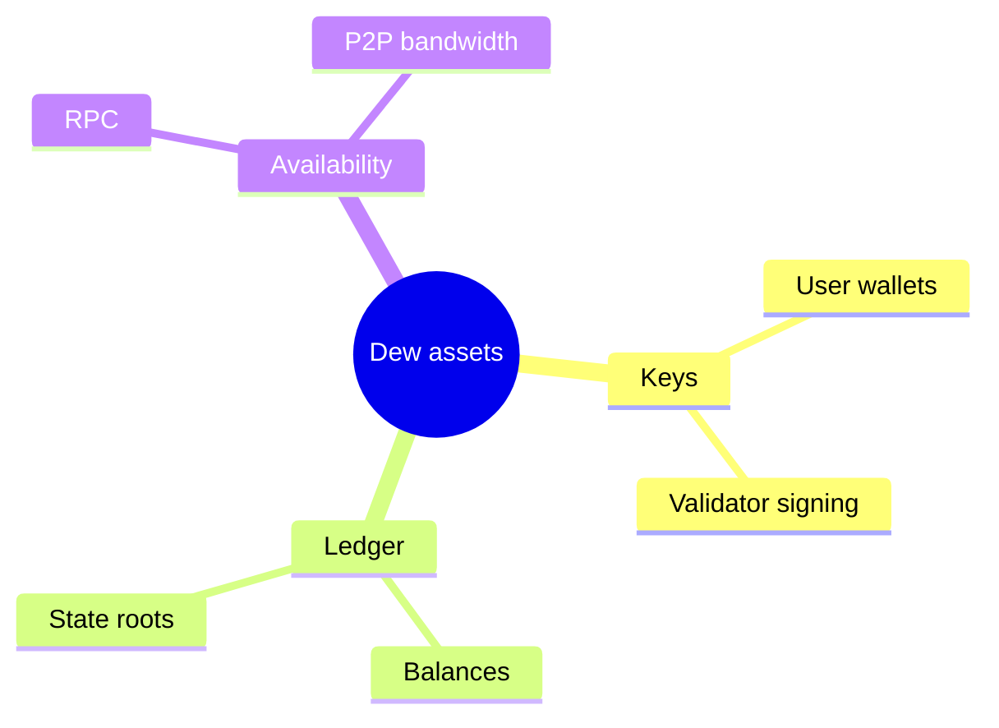
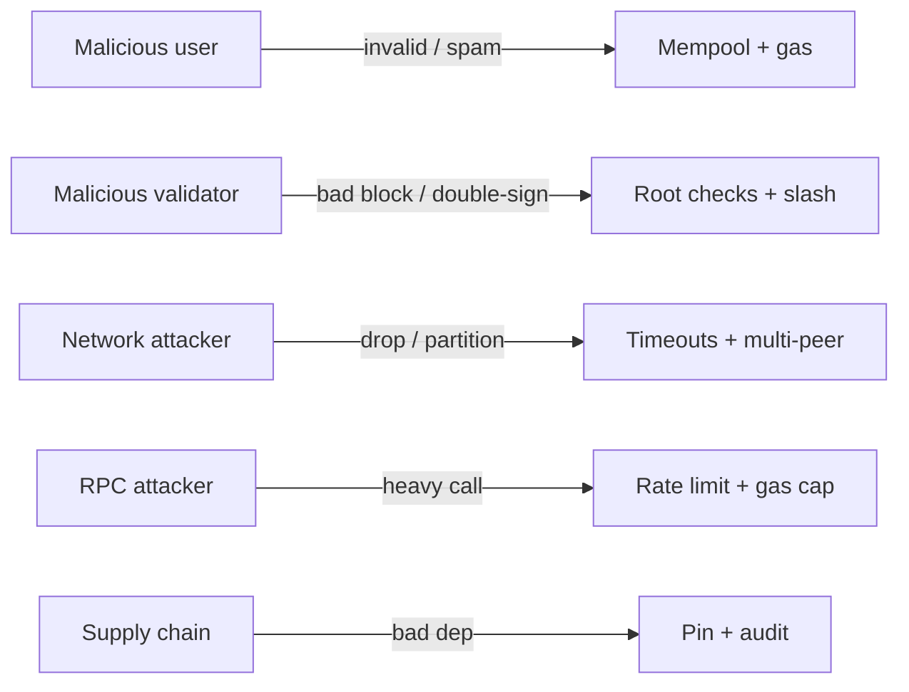

# Threat Model

## Assets

| Asset             | Impact if lost                     |
| :---------------- | :--------------------------------- |
| User private keys | Direct fund theft                  |
| Validator keys    | Liveness / safety faults, slashing |
| Ledger integrity  | Wrong balances, double spend       |
| RPC availability  | App outage                         |
| P2P bandwidth/CPU | Network DoS                        |

## Trust assumptions (Dew-BFT)

- Safety holds if **&lt; 1/3** of voting power is Byzantine
- Liveness requires enough honest validators online and network partial synchrony after GST (standard BFT assumption)
- Genesis validator set and software binary are trusted at bootstrap

## Adversaries

| Adversary           | Capabilities                        | Mitigations                                     |
| :------------------ | :---------------------------------- | :---------------------------------------------- |
| Malicious user      | Invalid txs, spam                   | Signature checks, gas, mempool limits           |
| Malicious validator | Bad blocks, double-sign, censorship | Root checks, slashing, proposer rotation        |
| Network attacker    | Drop/delay/partition                | Timeouts, peer scoring, multi-peer sync         |
| RPC attacker        | Crafted JSON, heavy `eth_call`      | Auth (optional), rate limits, gas caps on calls |
| Supply chain        | Malicious deps                      | Pin modules, audit crypto deps                  |

## Explicit non-goals (early testnet)

- Full light-client security proofs
- MEV auction fairness
- Quantum resistance

## Phase-related risks

| Phase                    | Extra risk                                     |
| :----------------------- | :--------------------------------------------- |
| Parallel execution       | Non-determinism if STM buggy → consensus split |
| Dew-native modules       | Privilege bugs in precompiles                  |
| Cleartext P2P (dev only) | Traffic injection on public nets               |

**Rule:** Parallel and native features must not weaken the sequential safety baseline. Feature-flag them until tested.
