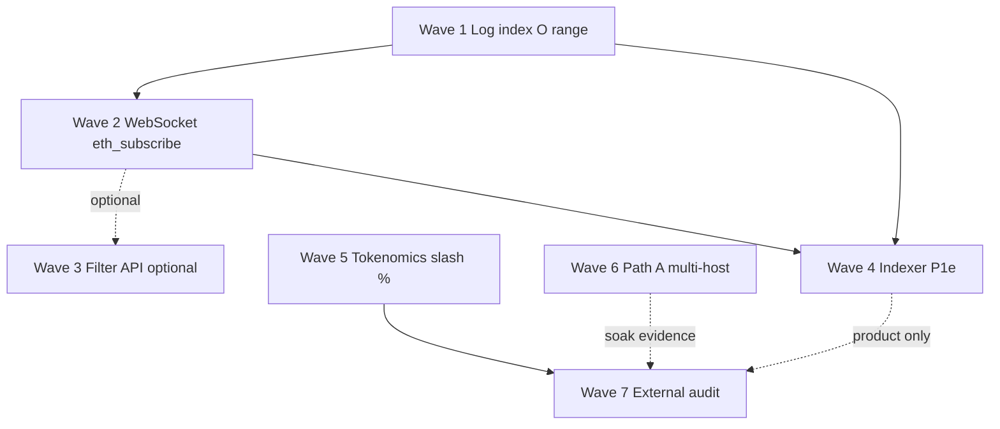

# Gap Closure Plan — Realtime RPC, Indexer, Production Gates

> **For agentic workers:** REQUIRED SUB-SKILL: Use `superpowers:subagent-driven-development` (recommended) or `superpowers:executing-plans` to implement **one wave at a time**. Steps use checkbox (`- [ ]`) syntax for tracking. Do **not** start Wave 5–7 without explicit human approval (production claims).

**Goal:** Close the open residual gaps that block better UX (poll → push), explorer history/charts, and eventually production L1 claims — without breaking `public-testnet-v1` wire freeze.

**Architecture:** Work is ordered by dependency and goal. Node-side storage/RPC foundations (log index → WebSocket subscribe) land first so product indexer and UI stop paying O(history) poll cost. Path A, tokenomics freeze, and external audit are **gates**, not default next work for a swap app / Path B lab.

**Tech stack:** Go core (`node/`, `rpc/`, `db/`), React explorer (`explorer/`), existing Path B compose/ops docs, optional multi-host Path A ops.

**Source gap table:**

| Gap | Impact today | Track | Wave |
| :--- | :--- | :--- | :--- |
| WebSocket / `eth_subscribe` | UI/indexer must poll HTTP | 4 (core) + API | **2** |
| Filter API (`eth_newFilter`…) | Docs: optional stretch | 4 + API | **3** (optional) |
| Indexer / full history (P1e) | Explorer no full history; volume chart / leaderboard hard | 1 (product) | **4** |
| Log index O(range) | `eth_getLogs` residual full receipt scan | 4 (core) | **1** |
| External audit (Track 5) | Required before mainnet / real TVL claims | 5 | **7** |
| Path A multi-host public | Optional; Path B = single-operator lab | 3 (ops) | **6** |
| Tokenomics / slash % | Draft — does not block swap app; blocks “production L1” | 2 (protocol) + economics | **5** |

**Freeze guardrails** ([d3-scale wire freeze](../../scale/d3-scale.md#wire-freeze-guardrails)): no change to DewTx wire, fee floors, precompile ABIs, SMT meaning, or chain ID without a hardfork doc. Allowed: RPC transport, chaindata secondary keys, explorer/indexer services, genesis/economics numbers when deliberately frozen, ops topology.

---

## Two product goals (pick before executing)

| Goal | Execute waves | Defer |
| :--- | :--- | :--- |
| **A — Swap app / Path B lab** (recommended default) | **1 → 2 → 4**; Wave 3 only if tooling needs filters without WS | 5, 6, 7 |
| **B — Production L1 claims** | All of A, then **5 → 6 → 7** (economics freeze → multi-host if claimed → audit pack) | Nothing if claiming mainnet + multi-host |

**Recommended default:** Goal **A**. Do not invent slash % or hire audit theater without Goal B intent.



---

## File map (by wave)

| Wave | Create | Modify | Docs |
| :--- | :--- | :--- | :--- |
| 1 | `node/logindex.go` (or helpers in `store.go`) | `node/store.go`, `node/persist.go`, `node/node.go` (`FilterLogs`), tests | `docs/ops/durable-chaindata.md`, `agents/debt.md` |
| 2 | `rpc/ws.go`, `rpc/subscription.go` | `rpc/server.go`, `rpc/api.go`, `cmd/dew` listen flags, nginx/compose if public | `docs/api/json-rpc.md`, `docs/ops/public-testnet.md` |
| 3 | filter store in `rpc/` | `rpc/api.go` | `docs/api/json-rpc.md` |
| 4 | optional `indexer/` service **or** explorer worker package | `explorer/src/**`, compose | `docs/product/block-explorer.md`, `docs/product/upgrades.md` |
| 5 | — | `core/native` / `core/vm` slash burn, genesis params | `docs/economics/tokenomics.md`, `docs/consensus/slashing.md` (**human freezes numbers first**) |
| 6 | operator runbooks only | `deploy/`, launch checklist values (out-of-repo secrets) | `docs/scale/d3-scale.md` D3d, `docs/ops/launch-checklist.md` |
| 7 | audit pack folder or checklist artifacts | — | `docs/security/*`, `agents/debt.md` |

---

## Wave 1 — Log index O(range) for `eth_getLogs` (Track 4)

**Why first:** Today `FilterLogs` iterates **all** durable receipts (`prefixReceipt` = `'R'`) and filters by block range in Go ([`node/node.go`](../../../node/node.go)). Secondary keys make historical log queries scale with **matched range**, not chain length — required before serious indexer / pool-event load.

**Description:** On seal/import, write secondary index keys that allow iterating logs by block number (and optionally address). `FilterLogs` uses the index for durable history; keep `allLogs` for in-process recent seals.

### Design (locked for this plan — change only with human OK)

| Decision | Choice | Rationale |
| :--- | :--- | :--- |
| Primary key | `L` + `blockNum u64 BE` + `txIndex u32 BE` + `logIndex u32 BE` → payload (addr, topics, data refs or full log) | Contiguous range scan by block |
| Optional address secondary | `A` + `addr20` + `blockNum` + … | Defer if v1 range index is enough; add when address-only queries dominate |
| Backfill | On Open, if tip > 0 and index missing/incomplete, rebuild from receipts once (versioned meta key) | Existing Path B datadirs must work |
| Wire freeze | Index is local storage only | No consensus change |

### Tasks

#### Task 1.1 — Schema + write path

**Status:** **Done** 2026-07-14

**Files:**
- Modify: `node/store.go` (prefix `L`, encode/decode, `meta/logIndexVersion`)
- Modify: `node/persist.go` (batch put log-index keys with receipts on seal/import + genesis marker)
- Test: `node/logindex_test.go`

- [x] **Step 1:** Add prefix `prefixLogIndex byte = 'L'` and meta `meta/logIndexVersion`.
- [x] **Step 2:** On each receipt write in the seal/import batch, also write one key per log with block/tx/log ordering.
- [x] **Step 3:** Unit test: seal with ERC-20 logs → keys exist; restart Open → keys still present.
- [ ] **Step 4:** Commit: `feat(node): write secondary log-index keys on seal` (batch with 1.2)

**Acceptance:**
- [x] Sealed blocks with ERC-20-style logs produce `L…` keys in the same batch as receipts
- [x] Restart preserves keys (Pebble)

#### Task 1.2 — Query path + backfill

**Status:** **Done** 2026-07-14

**Files:**
- Modify: `node/node.go` `FilterLogs`
- Create: `node/logindex.go` (ensure/rebuild/range walk)
- Modify: `node/open.go` (ensure on Open)
- Docs: `docs/ops/durable-chaindata.md`, `agents/debt.md`, `docs/product/upgrades.md`

- [x] **Step 1:** Implement range iterate `L` from `fromBlock` to `toBlock`; apply address/topic filters on candidates.
- [x] **Step 2:** Merge with in-memory `allLogs` (dedupe as today).
- [x] **Step 3:** Backfill: if meta missing, rebuild from receipts once; set version.
- [x] **Step 4:** Unit: many no-log receipts + tip deploy logs; index keys ≪ receipts; tip-range FilterLogs works.
- [x] **Step 5:** Docs + debt residual closed.
- [ ] **Step 6:** Commit when human requests

**Verification:**
```bash
go test ./node/ -run LogIndex -count=1
go test ./node/ ./rpc/ -count=1
```

**Dependencies:** None  
**Estimated scope:** Medium (3–5 files)

### Checkpoint Wave 1
- [x] `eth_getLogs` / `FilterLogs` via log index + allLogs
- [x] Docs + `agents/debt.md` residual for log-index keys closed
- [ ] Human review before Wave 2

---

## Wave 2 — WebSocket / `eth_subscribe` (Track 4 + API)

**Why:** Docs already mark `eth_subscribe` (`newHeads`, `logs`) as strongly recommended; HTTP-only forces poll ([`docs/api/json-rpc.md`](../../api/json-rpc.md)).

### Design decisions (need human confirm if changing)

| Topic | Recommended default |
| :--- | :--- |
| Transport | WebSocket on **same HTTP server** upgrade path (`GET` Upgrade) **and/or** optional dedicated listen `--rpc.ws` / port **8546** |
| Methods | `eth_subscribe` / `eth_unsubscribe`; notifications JSON-RPC without `id` (Ethereum style) |
| Subscriptions v1 | `newHeads`, `logs` (address + topics filter) |
| Out of scope v1 | `newPendingTransactions`, `syncing` |
| Limits | Max subs per conn; max conns; reuse C6 body limits where applicable |
| Public Path B | Nginx must proxy WS (`Upgrade`, `Connection`) for `rpc-dew` if exposed |

### Tasks

#### Task 2.1–2.2 — Server upgrade + subscriptions

**Status:** **Done** 2026-07-14

**Files:** `rpc/ws.go`, `rpc/server.go`, `rpc/api.go`, `rpc/ws_test.go`, `node/events.go`, `node/import.go`, `cmd/dew/bft.go`, `devnet/*`, nginx configs, `docs/api/json-rpc.md`

- [x] WebSocket upgrade on same HTTP port (`/`)
- [x] `eth_subscribe` / `eth_unsubscribe`: `newHeads`, `logs`
- [x] Node `SubscribeChainEvents` on seal/import
- [x] HTTP path returns clear error for subscribe
- [x] nginx Upgrade headers + GET allowed
- [x] Tests: HTTP rejected; WS newHeads notification

**Verification:**
```bash
go test ./rpc/ ./node/ -count=1
```

### Checkpoint Wave 2
- [x] Docs no longer say WS “Not implemented”
- [ ] Human review before Wave 3 or 4
- [ ] Operator: reload nginx on Path B for public WS

---

## Wave 3 — Filter API stretch (optional)

**Why low priority:** After Wave 2, most UIs use WS. HTTP polling filters help older tooling (`eth_newFilter` + `eth_getFilterChanges`).

### Tasks

#### Task 3.1 — In-memory filter store

**Files:** `rpc/filter.go`, `rpc/api.go`, tests

- [ ] Implement `eth_newFilter`, `eth_newBlockFilter`, `eth_newPendingTransactionFilter` (pending optional / stub), `eth_getFilterChanges`, `eth_getFilterLogs`, `eth_uninstallFilter`.
- [ ] TTL + max filters (abuse); document.
- [ ] Commit only if a consumer needs it; else **skip** and leave docs as “optional stretch”.

**Dependencies:** Wave 2 preferred (share filter matching code with log subs)  
**Estimated scope:** Medium  
**Decision:** Default **skip** under Goal A unless Hardhat/ethers poll path requires it.

---

## Wave 4 — Indexer / full history P1e (Track 1)

**Why:** Explorer is no-indexer MVP ([`docs/product/upgrades.md`](../../product/upgrades.md)); volume chart / leaderboard / address full history need durable indexed views.

### Design decisions (need human confirm)

| Option | Pros | Cons | Recommendation |
| :--- | :--- | :--- | :--- |
| **4A — Node-only** | No new service; improve RPC | Heavy RPC; not good for complex joins | Not enough alone |
| **4B — Sidecar indexer** | Clean; scale; SQLite/Postgres | Ops surface | **Recommended** for real charts |
| **4C — Explorer-embedded worker** | Simple deploy | Browser cannot index full chain; needs server | Only if SSR/BFF exists |

**Recommended 4B:** small Go or Node service:
- Poll or **WS subscribe** (Wave 2) for heads
- Backfill via `eth_getLogs` / receipts (Wave 1)
- Store: SQLite first (single-host Path B friendly)
- Explorer reads indexer HTTP API for history/charts; falls back to RPC for tip

### Tasks

#### Task 4.1 — Indexer MVP service

**Files (proposed):**
- Create: `indexer/` (Go module package under monorepo) or `cmd/dewindex`
- Schema: blocks, txs, logs (addr, topic0), optional ERC-20 transfers table
- Config: `RPC_URL`, `DATABASE_URL`/`SQLITE_PATH`, start block

- [ ] **Step 1:** Spec API: `GET /v1/address/:addr/txs`, `GET /v1/stats/volume?from&to`, `GET /v1/tokens/:addr/transfers`.
- [ ] **Step 2:** Ingest loop: head subscription or poll; decode receipts/logs into SQLite.
- [ ] **Step 3:** Backfill from genesis or configured height; checkpoint cursor.
- [ ] **Step 4:** Integration test against `devnet` or `node.OpenTest` + local RPC.
- [ ] **Step 5:** Compose service + docs.

#### Task 4.2 — Explorer P1e consumption

**Files:** `explorer/src/**`, `docs/product/block-explorer.md`, `upgrades.md`

- [ ] Address page: paginated tx/transfer history from indexer.
- [ ] Home/chart: volume over time from indexer (replace or extend recent-only `tx-history-chart`).
- [ ] Env: `PUBLIC_INDEXER_URL` optional; graceful degrade if unset.
- [ ] Mark P1e shipped in upgrades + debt when DoD met.

**Acceptance (P1e):**
- [ ] Address with many historical txs shows more than “recent tip poll” window
- [ ] Volume chart uses multi-day (or multi-block) series when indexer caught up
- [ ] No wire/consensus change

**Dependencies:** Wave 1 required for scale; Wave 2 strongly recommended  
**Estimated scope:** Large — own mini-plan if scope expands to leaderboard + internal txs

### Checkpoint Wave 4
- [ ] Live Path B can run indexer beside RPC (operator)
- [ ] Product docs updated; debt P1e checkbox progress
- [ ] Stop here for Goal A unless Goal B requested

---

## Wave 5 — Tokenomics / slash % freeze (Track 2) — production L1 gate

**Why:** Slash burn % intentionally deferred (S4); jail-only on-chain. Blocks honest “production L1 / real stake risk” narrative, **not** Uniswap-style swap demos on Path B.

### Human decisions required first (do not invent in code)

Freeze in `docs/economics/tokenomics.md` + `docs/consensus/slashing.md`:

| Parameter | Current | Need |
| :--- | :--- | :--- |
| Double-sign self-stake burn | tentative up to 100% | Exact % |
| Double-sign delegator penalty | tentative 5% | Exact % (or N/A until delegation) |
| Downtime burn | tentative 0.01% | Exact % + window |
| Issuance / inflation | draft 5% → 1% | Freeze or explicitly “testnet only” |
| Reward split | 90/10 draft | Freeze or defer rewards entirely |

### Tasks (after numbers approved)

#### Task 5.1 — Docs freeze

- [ ] Promote agreed numbers from tentative → frozen; set tokenomics `status` when issuance freezes.
- [ ] Record decision date + “applies to networks with staking on / mainnet genesis X”.

#### Task 5.2 — On-chain burn on evidence

**Files:** staking/`0x102` slash path, `core/native`, tests in `node/staking_lab_test.go`

- [ ] On accepted double-sign evidence: burn configured % of self-stake (not only jail).
- [ ] Genesis/config params for percentages (not magic numbers only in prose).
- [ ] Tests: evidence reduces balance; jail still applied.
- [ ] Update D3c / debt / phases checkboxes.

**Dependencies:** Explicit human number approval  
**Out of scope unless scoped:** delegation / commission

---

## Wave 6 — Path A multi-host public (Track 3) — optional ops

**Why:** Path B single-operator is enough for lab/swap demos. Path A needed for **decentralized public** claims.

**Prerequisite:** D3a/D3b done (already).

### Tasks

#### Task 6.1 — Operator launch (mostly out-of-repo)

- [ ] ≥3 public hosts, fresh keys, shared genesis `chainId` 2205
- [ ] Publish bootnode multiaddrs (not secrets in git)
- [ ] Full-node RPC + TLS; point faucet/explorer at public RPC
- [ ] Complete [Launch checklist Path A](../../ops/launch-checklist.md#path-a--multi-host-public-later)
- [ ] Soak: peer count, round stalls, RPC error rate retained for audit pack

**Code only if missing:** compose samples / docs clarity — no consensus change.

**Dependencies:** None for Goal A; required before multi-host decentralization claims

---

## Wave 7 — External audit Track 5 (D3e) — last gate

**Why:** Required before mainnet / real TVL claims. Not an implementation phase — artifact pack + engagement.

### Tasks

#### Task 7.1 — Audit pack

| Artifact | Source |
| :--- | :--- |
| Threat model | `docs/security/threat-model.md` |
| Phase B internal audit | `docs/security/phase-b-audit.md` |
| Consensus | Dew-BFT + D3a notes |
| VM bridge | `core/vm`, PE notes |
| Crypto | `docs/protocol/cryptography.md`, `crypto/` |
| Soak | Path A or multiproc logs |
| RPC surface | WS + limits + abuse notes after Wave 2 |

- [ ] Scope written and signed off (human + auditor)
- [ ] Findings → `agents/debt.md` with severity
- [ ] Explicit “no mainnet claim until …” decision log

**Dependencies:** Wave 5 if claiming economic security; Wave 6 if claiming multi-host; Waves 1–2 preferred so audit targets realistic RPC surface

---

## Explicit non-goals (this plan)

- Live `0x101` orderbook (separate design + hardfork)
- Full Block-STM PE upgrade (only if load contradicts H1)
- Delegation / commission (unless Wave 5 expands)
- P1f verified source, P3c Guestbook reactions
- Re-opening C6 wire formats without hardfork doc
- Audit theater without Goal B

---

## Risks and mitigations

| Risk | Impact | Mitigation |
| :--- | :--- | :--- |
| Log-index backfill locks Open on large tip | Med | Versioned rebuild async or progress logs; optional offline rebuild tool |
| WS proxy misconfig on Path B | Med | Document nginx Upgrade; smoke script for WS |
| Indexer schema churn | Med | SQLite v1 minimal; version migrations |
| Invented slash % | High | Block Wave 5 code until docs freeze |
| Scope creep “full Etherscan” | High | P1e MVP APIs only; leaderboard later |

---

## Open questions (human)

1. **Goal A or B** for the next 2–4 weeks?
2. Wave 2: WS **upgrade on same port** vs dedicated **8546** (or both)?
3. Wave 3 Filter API: **skip** or **must** for a specific tool?
4. Wave 4 indexer: confirm **sidecar + SQLite (4B)** vs explorer-only?
5. Wave 5: timeline for freezing slash/issuance numbers (or keep draft indefinitely)?

---

## Execution order summary

```text
Goal A (swap / lab):   W1 log-index → W2 eth_subscribe → W4 P1e indexer
                       (W3 filters optional)

Goal B (production):   Goal A → W5 tokenomics/slash (doc freeze first)
                       → W6 Path A if multi-host claimed
                       → W7 external audit
```

**Suggested first commit series after approval:** Wave 1 only.

---

## Related docs

- [Roadmap — Tracks](../../build/roadmap.md#tracks)
- [Phases — Tracks](../../build/phases.md#tracks)
- [Product upgrades](../../product/upgrades.md)
- [Durable chaindata](../../ops/durable-chaindata.md)
- [JSON-RPC](../../api/json-rpc.md)
- [D3 scale](../../scale/d3-scale.md)
- [agents/debt.md](../../../agents/debt.md)
