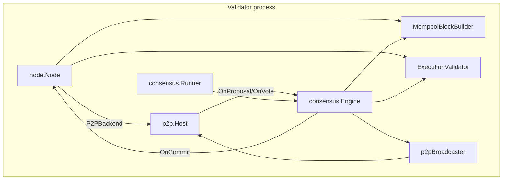

# D3a — Multi-process Dew-BFT Design

**Date:** 2026-07-12  
**Status:** approved (2026-07-12)  
**Scope:** Full D3a (acceptance criteria in [d3-scale.md](../../development/d3-scale.md#d3a--multi-process-dew-bft))  
**Wire freeze:** `public-testnet-v1` — no DewTx / fee / precompile changes

---

## Problem

Today:

- `dew devnet` runs BFT (`LocalCluster`) and JSON-RPC execution **independently** — commits do not drive the RPC chain.
- `dew run --p2p.*` uses a static `MemoryChain` snapshot; each process **auto-mines** its own chain.
- `consensus.Broadcaster` is only implemented for in-process `LocalCluster`.

D3a wires **≥3 separate processes** to one canonical chain via encrypted P2P + Dew-BFT.

---

## Goals (acceptance)

1. ≥3 `dew run --validator` processes on the same genesis commit the **same block hash** at each height.
2. Optional **full RPC node** serves `eth_*` / `dew_*` by syncing committed blocks (no local seal).
3. ERC-20 deploy + transfer smoke passes through the non-validator RPC against the BFT chain.
4. Encrypted P2P (C2) remains default; consensus messages use existing `0x10`–`0x12` types.
5. Path B default (`dew run` without `--validator`) stays **dev auto-mine**.

---

## Non-goals

- Epoch / stake-weighted validator set rotation (D3c).
- Multi-tx blocks with fee auction (C1 residual) — phase 1 ships **1 tx/block**.
- D3b peer persistence / auto-redial (manual redial OK in chaos; D3b follow-up).
- Replacing path B single-host deployment.

---

## Approaches considered

### A — Layered wiring in existing packages (recommended)

Add `node.ImportCommittedBlock`, P2P bridge, and CLI flags; reuse `consensus.Engine` and `p2p.Host` unchanged.

| Pros | Cons |
| :--- | :--- |
| Matches [d3-scale.md](../../development/d3-scale.md) PR slices | Touches several packages |
| Testable incrementally (unit → integration → compose) | Requires block wire encoding |
| Path B unchanged (default auto-mine) | Round timeout needed for async P2P |

### B — Subprocess-based integration tests only

Spawn 3 `dew run` OS processes from `go test`, assert RPC equality.

| Pros | Cons |
| :--- | :--- |
| Tests real process boundary | Flaky, slow, hard to debug |
| | Does not structure production code |

### C — Fix `dew devnet` in-process first, defer multi-process

Wire `LocalCluster` commits → `ImportCommittedBlock` on the RPC node; extend to multi-process later.

| Pros | Cons |
| :--- | :--- |
| Fixes known devnet gap | Does **not** satisfy D3a acceptance |
| Smaller first PR | Still needs full multi-process work |

**Decision:** **Approach A.**

---

## Architecture



### Node roles & CLI

| Role | Flags | Seals | Auto-mine | P2P |
| :--- | :--- | :---: | :---: | :---: |
| Dev (default) | `dew run` | per-tx | on | optional |
| Validator | `--validator --validator.key <hex> --p2p.listen …` | BFT | **off** | required |
| Full RPC | `--no-auto-mine --p2p.listen …` (no `--validator`) | no | **off** | required |

`--validator` implies `--no-auto-mine`. Validator key must match a genesis `initialValidators` entry (Anvil #0–#2 for private nets).

### Per-validator process

1. `node.NewFromGenesis` — canonical state.
2. `consensus.ValidatorSetFromGenesis(g)` — static valset from `initialValidators`.
3. `consensus.NewEngine` with `MempoolBlockBuilder` + `ExecutionValidator` backed by `node`.
4. `p2p.NewHost` with `node.P2PBackend` (implements `ChainBackend` + `TxBackend`).
5. `p2pBroadcaster` implements `consensus.Broadcaster`.
6. `AppHandlers` forward `OnProposal` / `OnVote` → `Engine.HandleProposal` / `HandleVote` (wire ↔ consensus conversion in `p2p/bft.go`).
7. `consensus.Runner` drives `StartRound` after each commit; optional **3s round timeout** calls `ForceTimeoutRound` + `StartRound` when stuck at `StepPropose` (liveness when proposer offline).
8. On commit: `node.ImportCommittedBlock(block)` → `host.GossipBlock` with encoded payload.

### Per full RPC node

1. No `consensus.Engine` / `Runner`.
2. `SetAutoMine(false)` — `SendRawTransaction*` admits + gossips only.
3. `OnBlock` / sync → `ImportCommittedBlock`.
4. JSON-RPC reads local state after sync.

---

## Core APIs

### `node.Node`

```go
// ImportCommittedBlock applies a BFT-committed or synced block (single apply path).
// Idempotent: same height + hash → no-op.
func (n *Node) ImportCommittedBlock(block *types.Block) error

// SetAutoMine toggles dev per-tx sealing (default true).
func (n *Node) SetAutoMine(enabled bool)

// AutoMine reports current mode.
func (n *Node) AutoMine() bool

// BuildBlockFromPool builds a proposal block (max 1 tx in D3a phase 1).
func (n *Node) BuildBlockFromPool(height uint64, parent *types.Header, proposer crypto.Address, maxTxs int) (*types.Block, error)

// ValidateAndExecuteBlock re-executes block txs against parent state; returns post root.
func (n *Node) ValidateAndExecuteBlock(parent *types.Header, block *types.Block) (types.Hash, error)
```

**ImportCommittedBlock** extracts execution/indexing from `SendRawTransaction` into shared helpers (`applyBlockTxs`). Does not re-enter BFT.

**SetAutoMine(false):** `SendRawTransaction` / `SendDewRawTransaction` admit via mempool, return tx hash, **do not** remove from pool until included in a committed block.

### Block wire encoding (`core/types/block_wire.go`)

```go
func (b *Block) MarshalBinary() ([]byte, error)   // RLP: [header fields, [tx raw bytes...]]
func UnmarshalBlockBinary(raw []byte) (*Block, error)
```

Used by P2P `BlockPayload.Raw`, proposal `WireProposal.BlockRaw`, and `node.P2PBackend.BlockByNumber`.

### `consensus` additions

| Type | Responsibility |
| :--- | :--- |
| `MempoolBlockBuilder` | Delegates to `node.BuildBlockFromPool` (max 1 tx) |
| `ExecutionValidator` | Delegates to `node.ValidateAndExecuteBlock`; prevote nil on root mismatch |
| `ValidatorSetFromGenesis` | Maps `config.Genesis.InitialValidators` → `ValidatorSet` |
| `Runner` | `OnCommit` hook + `StartRound` loop; optional round timeout ticker |
| `p2pBroadcaster` (in `p2p/bft.go`) | `Proposal`/`Vote` ↔ `WireProposal`/`WireVote` + flood |

### `p2p/bft.go`

- `NewBroadcaster(host *Host) consensus.Broadcaster`
- `WireToProposal` / `WireToVote` / `ProposalToWire` / `VoteToWire`
- Proposal wire includes `BlockRaw` when body present (required for `ExecutionValidator`).

### `node/p2p.go` — `P2PBackend`

Implements `p2p.ChainBackend` and `p2p.TxBackend` by reading `node` head, encoded blocks, and mempool pending txs.

---

## Block production (phase 1)

| Component | Behavior |
| :--- | :--- |
| `MaxTxsPerBlock` | **1** (parity with dev auto-mine; config constant in `consensus` or `node`) |
| Proposer | Stake-weighted round-robin from genesis valset |
| `ProposalValidator` | Full re-execution; nil prevote on failure |
| Timestamp | `max(parent.Timestamp+1, now)` — same rule as auto-mine |

---

## Mempool interaction

| Event | Validator | Full RPC |
| :--- | :--- | :--- |
| `eth_sendRawTransaction` | Admit → gossip → proposer may include | Same |
| Block committed | `pool.Remove` for included txs | Same |
| Auto-mine | off | off |

---

## Failure modes

| Failure | Behavior |
| :--- | :--- |
| Minority validator offline | BFT continues if >2/3 power |
| Proposer offline (round) | 3s timeout → next round |
| Partition | Stall; no conflicting commits |
| Bad proposal | Nil prevote; round advance |
| RPC behind validators | `eth_blockNumber` lags until sync |
| Restart | Rejoin from in-memory chain (D3b: persistent DB) |

---

## Testing plan

| Test | Location | What it proves |
| :--- | :--- | :--- |
| `ImportCommittedBlock` idempotency / mismatch | `node/import_test.go` | Apply path correct |
| `SetAutoMine` admit-only | `node/import_test.go` | No local seal |
| `MempoolBlockBuilder` + `ExecutionValidator` | `consensus/builder_test.go` | Block build + validate |
| Wire round-trip | `p2p/bft_test.go` | Proposal/vote encoding |
| **MultiProcessBFT** | `devnet/multiprocess_bft_test.go` | 3 loopback hosts, same hash ≥ height 3, tx via full RPC |
| Compose smoke | manual / CI optional | `docker compose --profile multi` identical heads |
| ERC-20 smoke | `scripts/devnet-erc20.mjs` against RPC-only port | App path on BFT chain |

### `MultiProcessBFT` harness

Package `devnet` exports `StartMultiProcessBFT(cfg)`:

- 3 validator stacks (node + engine + host) on `127.0.0.1:0` ports.
- 1 full RPC stack (`no-auto-mine`, no engine).
- Mesh via bootnode-style dials (same as compose).
- Submit one EVM tx via full RPC HTTP; poll until height advances; assert all 4 nodes share `eth_blockHash` at height N.

---

## Deploy changes (`deploy/node/docker-compose.soak.yml`)

Profile `multi`:

| Service | Role | Change |
| :--- | :--- | :--- |
| `node-0` … `node-2` | Validator | Add `--validator --validator.key <anvil>`; remove implicit auto-mine |
| `node-rpc` (new) | Full RPC | `--no-auto-mine --p2p.bootnodes node-0:30303,…`; host port `8548` |

Validators may keep HTTP for ops smoke but **must not** auto-mine.

---

## Documentation sync

After implementation, update:

- [d3-scale.md](../../development/d3-scale.md) — status draft → stable for D3a section
- [private-testnet.md](../../development/private-testnet.md) — multi profile uses BFT
- [phases.md](../../development/phases.md) — D3a acceptance checkbox when done
- [agents/debt.md](../../../agents/debt.md) — mark D3a residual done

---

## PR plan (6 slices)

| PR | Scope | Packages |
| :-: | :--- | :--- |
| 1 | `ImportCommittedBlock`, `SetAutoMine`, block wire encode, unit tests | `node/`, `core/types/` |
| 2 | `MempoolBlockBuilder`, `ExecutionValidator`, `ValidatorSetFromGenesis` | `consensus/`, `node/` |
| 3 | `p2p/bft.go` bridge + `P2PBackend` + `Runner` | `p2p/`, `node/`, `consensus/` |
| 4 | `--validator` / `--no-auto-mine` CLI wiring | `cmd/dew/` |
| 5 | Compose `multi` + `node-rpc` | `deploy/node/` |
| 6 | `MultiProcessBFT` test + ERC-20 smoke + docs | `devnet/`, `docs/` |

---

## Open decisions (resolved in this spec)

| Question | Decision |
| :--- | :--- |
| Max txs per block (phase 1) | 1 |
| Round timeout | 3s ticker in `Runner` (required for async P2P liveness) |
| Full RPC flag | `--no-auto-mine` without `--validator` |
| Block encoding | New `Block.MarshalBinary` in `core/types` |
| Path B default | Unchanged — no flags = auto-mine |