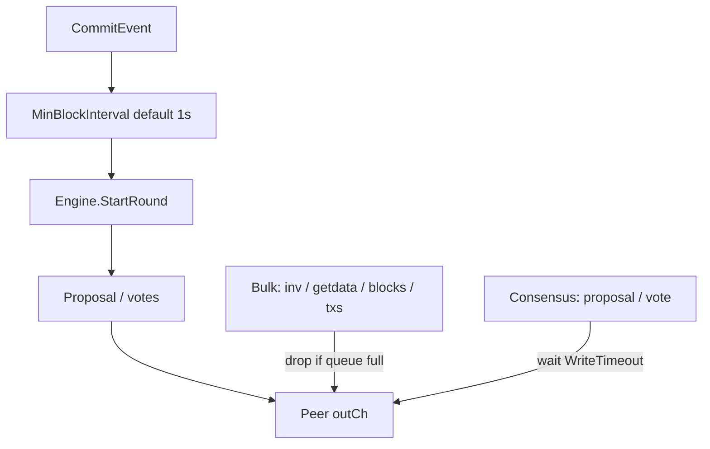

# D3a residual + private multi-host staging Design

**Date:** 2026-07-12  
**Status:** approved (2026-07-12)  
**Scope:** Close D3a multiproc long-run stall residual; harden private Compose `multi` staging (pre–Path A).  
**Freeze:** `public-testnet-v1` wire formats unchanged — consensus pacing + P2P queue behavior + ops docs only.

**Parent:** [D3 scale](../../development/d3-scale.md) (D3a residual; Path A = D3d later).  
**Debt:** [agents/debt.md](../../../agents/debt.md) — D3a residual line.

## Goals

1. Multi-process Dew-BFT (3 validators + full RPC) advances **≥150 empty heights** without stall under vote/proposal load.
2. Operators can run **private multi-host staging on one machine** via Compose profile `multi` with a clear runbook.
3. Document deploy packaging accurately (D3a is already wired; README must not claim otherwise).
4. Close the D3a residual checkbox in debt / phases notes once acceptance tests pass.

## Non-goals

- Public Path A (new keys, published bootnodes, multi-host public DNS) — **D3d**, later.
- D3c staking residuals / epoch rotation.
- Full dual priority channels, stale-height coalesce, or fee-auction multi-tx blocks.
- Wire-format, fee-floor, or precompile ABI changes.

## Current gaps

| Surface | Today | Gap |
| :--- | :--- | :--- |
| `consensus.Runner.MinBlockInterval` | Default **200ms** when zero | Empty-block storms flood P2P; residual notes stall ~100+ heights |
| CLI | No flag for block interval | Operators cannot pace without rebuild |
| `p2p.Peer.Send` | All message types block up to `WriteTimeout` on full `outCh` | Bulk inventory/sync can delay consensus frames |
| `deploy/README.md` multi section | Still says D3a “not fully wired” / auto-mine per node | Stale after D3a land |
| Long-run multiproc test | Shared-chain + ERC-20 exist; no empty-block soak to 150 | Residual not regression-gated |

## Architecture

Two independent levers (both required for residual close):

1. **Pace** — fewer empty rounds per wall-clock second.
2. **Backpressure** — bulk traffic yields when the outbound queue is full so consensus can still enqueue.

## Spec — block pacing

| Item | Value |
| :--- | :--- |
| Default `MinBlockInterval` when field is `0` | **1 second** |
| Explicit positive duration | Use as-is |
| Negative duration | Disable pacing (immediate next round) — unit tests use `-1` |
| Wire location | `consensus/runner.go` constant `defaultMinBlockInterval` |
| CLI | `dew run --bft.min-block-interval <duration>` (Go `time.ParseDuration` syntax: `1s`, `200ms`, `0` = use default) |
| Wiring | `cmd/dew` → `node.Stack` / `consensus.Runner.MinBlockInterval` |

Comment on `Runner` currently says “default 50ms if zero”; implementation and comment must both say **1s**.

## Spec — P2P outbound backpressure

Message classes:

| Class | Wire types | Full `outCh` behavior |
| :--- | :--- | :--- |
| **Consensus** | `MsgProposal` (`0x10`), `MsgPrevote` / `MsgPrecommit` (vote types used by `BroadcastVote`) | **Blocking** wait up to `WriteTimeout` (current behavior) — do not drop |
| **Bulk** | All other types (inventory, get/data, blocks, txs, peers, etc.) | **Non-blocking**: if `outCh` cannot accept immediately, **drop** the frame and return `nil` (or a soft error that callers ignore). Never block consensus path |

Implementation sketch (keep in `p2p/peer.go`):

- Prefer a single `Send` with a `blocking bool` or split `Send` / `trySend`.
- `Host.Broadcast` / gossip paths for bulk use non-blocking; consensus broadcast paths use blocking.
- Do **not** implement dual-priority channels or stale-height coalesce in this slice.

## Spec — tests

| Test | Location | Expect |
| :--- | :--- | :--- |
| Runner default interval constant | `consensus/runner_test.go` | Documented/assertable default path; unit tests keep `MinBlockInterval: -1` |
| CLI parse (optional) | if cheap | Invalid duration fails flag parse |
| Bulk drop when queue full | `p2p/` | Fill `outCh`; bulk send returns without waiting full `WriteTimeout`; consensus send still succeeds or waits |
| Multi-process empty soak | `devnet/multiprocess_bft_test.go` | `TestMultiProcessBFT_LongEmpty` (name flexible): 3 validators + full; advance **≥150** heights; uniform tip hash; timeout generous for 1s interval (~4–5 min max) |

Existing `TestMultiProcessBFT_SharedChain` and ERC-20 heavy test must still pass (may be slightly slower).

## Spec — ops / docs

| Doc | Change |
| :--- | :--- |
| `agents/debt.md` | Mark D3a residual done after tests pass; note long-run test command |
| `docs/development/private-testnet.md` | Multi profile: smoke tips, ERC-20 on `:8548`, kill/restart one node + redial expectation, mention `--bft.min-block-interval` |
| `docs/development/d3-scale.md` / `phases.md` | Note residual closed when done |
| `deploy/README.md` | Correct multi table: validators use `--validator` (shared BFT), `node-rpc` is full `--no-auto-mine`; remove “D3a not wired / auto-mine per node” language |
| `deploy/node/docker-compose.soak.yml` | Optional: pass explicit `--bft.min-block-interval 1s` for clarity (default already 1s) |

Private keys remain **Anvil #0–#2** for compose packaging only — never public Path A.

## Acceptance

- [ ] `go test ./consensus/ ./p2p/ ./devnet/ -count=1` relevant packages pass
- [ ] Long empty multiproc test reaches height ≥150 with shared tip
- [ ] Compose multi runbook smoke: `eth_blockNumber` advances on `node-rpc`; `node scripts/devnet-erc20.mjs http://127.0.0.1:8548`
- [ ] Debt residual D3a line checked off; deploy README honest

## Implementation order

1. Pacing default + CLI + unit tests  
2. Peer bulk non-blocking drop + unit tests  
3. `MultiProcessBFT` long empty-run test  
4. Docs / debt / deploy README  

## Out of scope follow-ups

- D3d Path A public multi-host + real keys/bootnodes  
- Stale consensus coalesce if long-run still fails after this slice  
- Raising `MaxTxsPerBlock` / fee auction (C1 residual)
