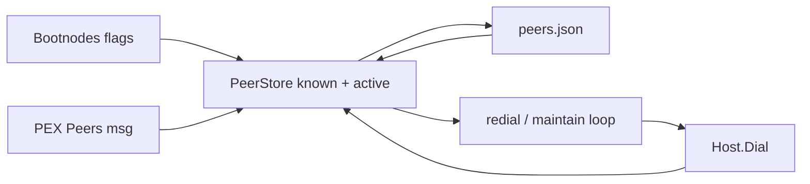

# D3b — Peer store and auto-redial Design

**Date:** 2026-07-12  
**Status:** approved (2026-07-12)  
**Scope:** Full D3b (acceptance in [d3-scale.md](../../development/d3-scale.md#d3b--peer-store-and-auto-redial))  
**Freeze:** `public-testnet-v1` wire formats unchanged — packaging/ops only.

## Goals

1. After process restart, a node **reloads last-known peers** from disk and dials them without operator `RedialMesh`.
2. After disconnect, the host **background-redials** with exponential backoff (cap 5 min).
3. `--p2p.bootnodes` always remain in the dial set (never evicted).
4. PEX continues to enrich the store; entries older than **7 days** are dropped (unless bootnode / active).
5. Document data-dir layout in private-testnet docs.

## Non-goals

- New discovery protocol / DHT.
- Full ban/scoring policy beyond a skip threshold field.
- Wire-format or consensus changes.
- Path A multi-host public deploy (D3d).

## Current gaps

| Surface | Today | Gap |
| :--- | :--- | :--- |
| `p2p.PeerStore` | In-memory only | Lost on restart |
| `dialBootnode` / `dialWithRetry` | ~15 attempts at start | No ongoing redial |
| `onPeerClosed` | `RemoveActive` only | No re-schedule dial |
| Chaos test | Manual `RedialHost` | Expect auto-recovery for fixed ports |

## Architecture



### Storage — `peers.json`

Path: `Config.PeerStorePath` (operator: `<datadir>/peers.json`). Empty path = memory-only (tests / ephemeral).

```json
{
  "version": 1,
  "peers": [
    {
      "id": "0x…20-byte hex…",
      "addr": "host:port",
      "lastSeen": "2026-07-12T00:00:00Z",
      "banScore": 0
    }
  ]
}
```

- Write after `Remember` / successful connect (debounced ~1s).
- Load on `Host.Start` (or immediately after `NewHost` before Start).
- Evict on load and on periodic maintain tick: `now - lastSeen > 7d` and not bootnode.

### KnownPeer fields

| Field | Role |
| :--- | :--- |
| `ID`, `Addr`, `LastSeen` | Existing |
| `BanScore` | Persist; skip dial if `>= BanDialThreshold` (100) |
| Bootnode set | Separate `map[addr]struct{}` on Host (not necessarily in file) — always dialable |

### Redial loop (owned by `Host`)

1. **Seed** bootnodes + loaded known peers into dial candidates.
2. **Ticker** (e.g. 1s): for each candidate not in `Active`, if `time.Now() >= nextAttempt`, call `Dial`.
3. **Backoff** per address: start 1s, double on failure, cap **5 min**; reset on success.
4. **`onPeerClosed`**: mark peer for redial at `now + 1s` (keeps LastSeen; does not Forget).
5. **Skip** self, already-active ID, banScore ≥ threshold, empty addr.
6. **Close**: stop loop, flush peer file once.

### Config additions (`p2p.Config`)

| Field | Meaning |
| :--- | :--- |
| `PeerStorePath` | JSON path; empty = no disk |
| `Bootnodes` | `[]string` host:port always retried |
| `Redial` | If true (default when Bootnodes or PeerStorePath set, or explicit), start maintain loop |

### Wiring

| Caller | Behavior |
| :--- | :--- |
| `node.Stack` | `PeerStorePath` + `Bootnodes` on `p2p.Config`; drop one-shot-only dial helper or keep as no-op wrapper |
| `dew run` | `--datadir` (default empty); when set, `PeerStorePath = <datadir>/peers.json`; pass bootnodes into Host |
| Devnet / tests | Optional temp path for persistence tests; chaos can rely on auto-redial when ports fixed |

### Ban score (minimal)

- Field + load/save + dial skip at 100.
- `AddBanScore(id, delta)` API for future misuse; no automatic scoring in D3b beyond optional future hooks.

## Failure modes

| Failure | Behavior |
| :--- | :--- |
| Corrupt `peers.json` | Log/return error on load; start with empty known + bootnodes only |
| Peer listen port changed | Redial fails until PEX/bootnode path yields new addr |
| All peers down | Backoff to 5 min; keep trying |
| Process kill mid-write | Debounced full rewrite; best-effort (atomic write via temp+rename) |

## Tests & acceptance

| Test | Location |
| :--- | :--- |
| Load/save/evict/ban skip | `p2p` unit |
| Disconnect → auto-redial without helper | `p2p` integration (fixed listen ports) |
| Restart host loads file + dials | `p2p` or `devnet` |
| Docs | `docs/development/private-testnet.md` data dir; debt/phases D3b done |

**Done when:** kill one process in a multi-node layout with fixed ports; within **2 minutes** without manual redial, peer count recovers and sync can resume.

## Implementation slices

| Slice | Scope |
| :---: | :--- |
| 1 | Persist `PeerStore` JSON + eviction + ban field |
| 2 | Host redial loop + bootnode merge + Close flush |
| 3 | Wire Stack / `dew run --datadir` |
| 4 | Tests + docs + debt/phases |
