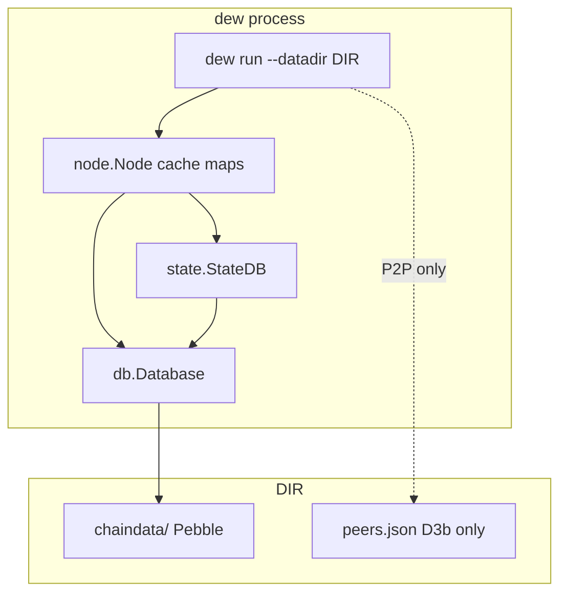
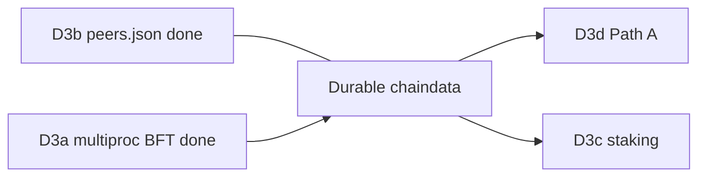

# Durable chaindata (disk persistence) — Design

**Date:** 2026-07-12  
**Status:** implemented (July 2026)  
**Scope:** Persist canonical chain + flat state across process restarts; keep peer store separate.  
**Freeze:** `public-testnet-v1` wire formats, fee floors, precompile addresses unchanged. Storage layout is **local** (not consensus-critical).  
**Related:** [Implementation plan](../plans/2026-07-12-durable-chaindata.md), [Development overview](../../development/durable-chaindata.md), [D3 scale](../../development/d3-scale.md), [Private testnet datadir](../../development/private-testnet.md), [State](../../protocol/state.md).

---

## Goals

1. After process kill / container recreate with the same `--datadir`, a node **reopens** last tip: `eth_blockNumber`, balances, receipts, and tx lookups match pre-restart.
2. Every sealed or imported block is **atomically** durable (one batch: state + chain indexes + tip).
3. Operators use a single `--datadir` layout; Path B compose can volume-mount it.
4. Tests keep using `MemoryDB` (no disk required for unit suite).
5. Peer data **stays** in `<datadir>/peers.json` (D3b) — not inside chaindata.

## Non-goals

| Out of scope | Reason |
| :--- | :--- |
| Custom LSM / WAL / storage engine | Use off-the-shelf Pebble |
| Moving `peers.json` into chaindata | Different lifecycle; ops-readable file stays |
| Full archival pruning / ancient freezer | Not needed for testnet scale |
| State sync / snap sync protocol | Separate networking epic |
| Full multi-version PE store redesign | Deferred mainnet debt |
| Changing SMT algorithm or state key layout (`a`/`s`/`c`) | Already frozen for C3/C6 |
| Path A multi-host public (D3d) | Depends on this for meaningful restarts, but not part of this epic |

---

## Current gaps (code-backed)

| Surface | Today | Gap |
| :--- | :--- | :--- |
| `db` package | `Database` + `MemoryDB` only | No disk backend |
| `node.NewFromGenesis` | Always `db.NewMemoryDB()` | Restart loses everything |
| `node.Node` | `blocks`, `blockNum`, `txIndex`, `receipts`, `allLogs` in RAM maps | Not written to KV |
| `core/state` | Flat keys `a`/`s`/`c` + `Commit` to `db.Database` | Works once DB is durable |
| `--datadir` | Only `peers.json` (D3b) | No `chaindata/` |
| Path B compose | `dew run` without volume for chain | Container recreate = re-genesis tip |

---

## Decisions

| Decision | Choice | Rationale |
| :--- | :--- | :--- |
| Storage engine | **[cockroachdb/pebble](https://github.com/cockroachdb/pebble)** behind `db.Database` | Already pulled transitively via go-ethereum; production-proven; batch + prefix iterate |
| Schema / codecs | **Dew-owned** prefixes and RLP (or existing type codecs) | Flat state model ≠ geth MPT/pathdb |
| Peers | **Keep `peers.json`** outside Pebble | Independent wipe/reset; no hot-path coupling |
| Chain + state | **One Pebble instance** under `chaindata/` | Single open/close; one atomic batch per block |
| Empty datadir | Init from genesis (same as today) | |
| Non-empty datadir | Open DB, verify genesis hash / chain ID meta, load tip | Refuse mismatch |
| In-memory maps | Keep as cache; **write-through** on commit; **hydrate** on open | Minimal rewrite of RPC paths |
| Default without `--datadir` | Remain MemoryDB (dev / Path B ephemeral OK until operators pass datadir) | Backward compatible CLI |

---

## Architecture



### Open path

```text
if datadir empty:
  MemoryDB (current behavior)
else:
  open DIR/chaindata (Pebble)
  if meta missing:
    Commit genesis into DB + write meta + tip=0
  else:
    verify meta.genesisHash / chainId vs --genesis file
    load tip → hydrate block/receipt/tx caches (or lazy-load policy below)
    open StateDB on same Database (flat keys already on disk)
```

### Commit path (seal auto-mine **or** `ImportCommittedBlock`)

One `Batch` (require `db.Batcher`):

1. State dirty flush (`StateDB.Commit` keys `a`/`s`/`c`) — either fold into same batch or order: state commit then chain keys in one batch if StateDB gains batch-aware API  
2. Header / body for block hash  
3. Canonical `height → hash`  
4. Receipts + tx lookup entries  
5. Tip meta (`height`, `hash`, `stateRoot`)  
6. `batch.Write()`

Failure mid-batch: Pebble atomicity ⇒ prior tip remains valid.

**Preferred implementation detail:** extend `StateDB.Commit` to accept optional `db.Batch`, or buffer state puts and apply inside node-owned batch so chain+state are one Write. If that is too large for slice 1, **document ordered fsync risk** and close it in slice 2 (must land before calling Path B “durable”).

---

## Key schema (`chaindata/`)

All keys are opaque bytes. **Do not collide** with state prefixes `a`, `s`, `c` (see [State](../../protocol/state.md)).

### Meta

| Key | Value |
| :--- | :--- |
| `meta/version` | uint32 BE schema version (`1` for this design) |
| `meta/chainId` | RLP or big-endian minimal encoding of chain ID |
| `meta/genesisHash` | 32-byte genesis block hash |
| `meta/tip` | RLP(`height` uint64, `hash` 32) |

### Chain

| Key | Value |
| :--- | :--- |
| `H` \|\| `hash32` | Header RLP (existing header codec) |
| `B` \|\| `hash32` | Body: RLP list of raw tx bytes (same shape as wire body half) **or** full `Block.MarshalBinary` payload — pick one in impl; prefer **header+body split** for `eth_getBlockByHash` light paths |
| `N` \|\| `uint64 BE` | Canonical block hash at height (32 bytes) |
| `R` \|\| `txHash32` | Receipt RLP (existing receipt type) |
| `T` \|\| `txHash32` | RLP(`blockHash`, `index` uint) for tx lookup |
| `L` \|\| `uint64 BE` \|\| `uint32 BE` | Optional: log index stream for `eth_getLogs` rebuild; **v1 may rebuild `allLogs` by scanning receipts 0..tip** if log volume is small |

### State (unchanged)

| Key | Value |
| :--- | :--- |
| `a` \|\| `addr20` | Account RLP |
| `s` \|\| `addr20` \|\| `slot32` | Storage value 32 bytes |
| `c` \|\| `codeHash32` | Bytecode |

### Explicitly not in chaindata

- P2P peers → `<datadir>/peers.json`  
- Validator / P2P private keys → operator-managed files (not this epic)  
- Mempool pending txs → memory only (lost on restart; acceptable)

---

## Datadir layout (target)

```text
<datadir>/
  chaindata/          # Pebble directory (this epic)
  peers.json          # D3b — unchanged ownership (p2p)
```

CLI:

| Flag | Behavior |
| :--- | :--- |
| `--datadir DIR` | `PeerStorePath = DIR/peers.json` (existing); **also** `ChainDataDir = DIR/chaindata` (new) |
| no `--datadir` | MemoryDB + no peer file (existing) |
| `--genesis` | Required for genesis hash check on open; mismatch ⇒ refuse start |

Optional later (not v1): `--db.engine=memory|pebble` override for tests.

---

## Node behavior changes

| API / path | Change |
| :--- | :--- |
| `NewFromGenesis` | Keep for tests (MemoryDB). Add `Open(genesis, chainDataDir string) (*Node, error)`. |
| `dew run` | If `--datadir` set → `Open`; else `NewFromGenesis`. |
| Auto-mine seal / `ImportCommittedBlock` | After successful apply, persist batch + update tip. |
| `GetBlock` / receipt / tx | Serve from cache; on miss (if lazy), read `H`/`B`/`R`/`T`. |
| Graceful shutdown | `Close()` flushes Pebble; peer file already flushed by Host. |

### Hydration policy (v1)

**Full hydrate** of canonical chain `0..tip` into existing maps at startup.

- Simple; matches current RPC code paths.  
- Acceptable while testnet height is modest (Path B / private soak).  
- **Follow-up (not blocking):** lazy block load + LRU if tip grows large.

Logs: rebuild `allLogs` by iterating receipts during hydrate (v1).

---

## Package map

| Package | Work |
| :--- | :--- |
| `db/` | `PebbleDB` implementing `Database`, `Batcher`, `IteratePrefix`; open/close helpers |
| `node/` | Chain key helpers; `Open`; persist on seal/import; hydrate; wire Close |
| `core/state` | Optional batch-aware `Commit` for atomicity with chain keys |
| `cmd/dew` | Pass datadir into node open; document flag |
| `deploy/` | Path B + multi: volume `chaindata` (and existing peers) |
| `devnet/` | Restart test: mine/import → kill → reopen same dir → assert tip + balance |
| `docs/` | This design + plan + private-testnet layout + debt/phases pointers |

**Dependency:** direct `require github.com/cockroachdb/pebble` in `go.mod` (today only transitive).

---

## Failure modes

| Failure | Behavior |
| :--- | :--- |
| Corrupt / unopenable Pebble | Fail start (do not silent re-genesis) |
| `meta/genesisHash` ≠ loaded genesis file | Fail start with clear error |
| Schema `meta/version` newer than binary | Fail start (“upgrade client”) |
| Schema older | Support only version `1` in v1; later migrations explicit |
| Kill mid-batch | Prior tip remains; no half-applied tip |
| Disk full | Write error surfaces; process should not advance tip in memory if batch fails |
| Operator deletes `chaindata` keeps `peers.json` | Fresh chain from genesis; peers still redial (intentional) |
| Operator deletes `peers.json` keeps `chaindata` | Chain intact; rebootstrap peers via bootnodes |

---

## Tests & acceptance

| Test | Expectation |
| :--- | :--- |
| `db` unit | Pebble Put/Get/Delete/Batch/IteratePrefix; close/reopen |
| `node` unit | Seal N blocks on temp dir → `Close` → `Open` → same tip, block hash, balance, receipt, tx-by-hash |
| Import path | `ImportCommittedBlock` then reopen (BFT/full node path) |
| `devnet` / integration | Optional: multiproc or single process restart with shared datadir |
| Regression | `go test ./...` without datadir still MemoryDB; no mandatory disk in default CI unit path |
| Deploy smoke | Compose with volume; `docker restart dew-node` → tip not reset |

**Done when:**

1. `dew run --datadir /tmp/dew --genesis genesis.json` mines or imports ≥1 block, process exit, same command again → `eth_blockNumber` ≥ previous tip and state reads match.  
2. Peers remain solely in `peers.json`.  
3. Docs + debt reflect the layout; Path B compose example mounts `chaindata`.

---

## Implementation slices

| Slice | Scope | Exit criteria |
| :---: | :--- | :--- |
| **1** | `db.PebbleDB` + tests | Disk KV round-trip |
| **2** | Chain key codec + `node` persist on seal/import (batch with state) | Write path durable |
| **3** | `Open` + hydrate + `dew run --datadir` chain open | Restart recovery |
| **4** | Deploy volumes + restart smoke; docs/debt/phases/private-testnet | Ops-ready |
| **5** (optional) | Lazy load / log index keys if hydrate cost hurts | Scale polish |

---

## Ordering vs D3



- **D3b** already persists peers; this epic completes “process restart keeps **chain**”.  
- **D3d / D3c** should assume durable chaindata; do not schedule public multi-host without it.  
- Does **not** reopen C6 wire freeze.

---

## Risks

| Risk | Mitigation |
| :--- | :--- |
| State commit and chain tip not one batch | Slice 2 must use single `Write` before ops claims durability |
| Full hydrate slow at high tip | Document; slice 5 lazy load |
| Pebble CGO/platform issues | Pure-Go Pebble; CI on target deploy arch |
| Operators assume MemoryDB default is durable | Docs: durability **requires** `--datadir` |
